# 📚 Attendance Management System (AMS)

> A modern NFC-based attendance and fee management solution for educational institutes

[](./CHANGELOG.md)
[](./LICENSE)

## 🎯 Overview

The Attendance Management System (AMS) is a comprehensive solution designed to modernize the traditional paper-based attendance and fee management systems in educational institutes. By leveraging NFC technology, AMS provides a seamless, efficient, and secure way to manage student attendance and class fees.

## 🌟 Key Features

| Feature | Description |
|---------|-------------|
| **Multi-Institute Support** | Single platform supporting multiple educational institutes |
| **NFC Card Integration** | Unique NFC cards for student identification |
| **Mobile PWA** | Progressive Web App for card checking and validation |
| **Attendance Tracking** | Real-time class-wise attendance management |
| **Fee Management** | Class-wise fee collection and tracking |
| **Notifications** | SMS and Email notifications for payments |
| **Admin Portal** | Institute-specific administration |
| **Super Admin** | Developer-level system management |

## 📖 Documentation Index

### Architecture & Design
- [System Architecture](./architecture/system-architecture.md)
- [Class & ER Diagrams](./architecture/class-er-diagrams.md)
- [Database Design](./architecture/database-design.md)
- [API Design](./architecture/api-design.md)
- [Security Architecture](./architecture/security-architecture.md)

### Modules
- [User Management](./modules/user-management.md)
- [Institute Management](./modules/institute-management.md)
- [NFC Card Management](./modules/nfc-card-management.md)
- [Attendance Module](./modules/attendance-module.md)
- [Fee Management](./modules/fee-management.md)
- [Notification Service](./modules/notification-service.md)

### User Guides
- [Student Guide](./guides/student-guide.md)
- [Card Checker Guide](./guides/card-checker-guide.md)
- [Admin Guide](./guides/admin-guide.md)
- [Super Admin Guide](./guides/super-admin-guide.md)

### Technical Documentation
- [Technology Stack](./technical/technology-stack.md)
- [Deployment Guide](./technical/deployment-guide.md)
- [PWA Implementation](./technical/pwa-implementation.md)
- [NFC Integration](./technical/nfc-integration.md)

## 🚀 Quick Start

```bash
# Clone the repository
git clone https://github.com/your-org/ams.git

# Navigate to the project
cd ams

# Install dependencies
npm install

# Start development server
npm run dev
```

## 📊 System Overview Diagram

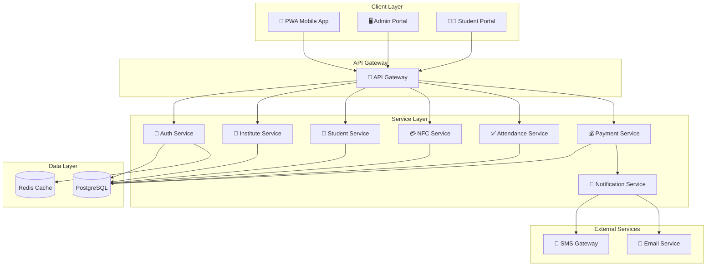

## 👥 User Roles

| Role | Description | Access Level |
|------|-------------|--------------|
| **Super Admin** | System-wide administration for developers | Full system access |
| **Institute Admin** | Institute-specific management | Institute-level access |
| **Card Checker** | Attendance and payment processing | Class-level access |
| **Student** | View personal records | Personal data only |

## 📞 Support

For support and queries, please contact:
- 📧 Email: support@ams.com
- 📚 Documentation: [Wiki Home](./README.md)

---

© 2026 Attendance Management System. All rights reserved.


<div style="page-break-after: always;"></div>

# 🔌 API Design

> RESTful API specification for the Attendance Management System

## 1. API Overview

The AMS API follows REST principles with JSON as the data exchange format. All endpoints are versioned and require authentication unless specified otherwise.

### Base URL
```
Production: https://api.ams.com/v1
Staging: https://api-staging.ams.com/v1
Development: http://localhost:3000/api/v1
```

### Common Headers
```http
Content-Type: application/json
Accept: application/json
Authorization: Bearer <jwt_token>
X-Institute-ID: <institute_uuid>  # Required for institute-scoped operations
X-Request-ID: <unique_request_id>  # For request tracing
```

## 2. API Architecture

```mermaid
graph TB
    subgraph "Client Applications"
        PWA[PWA App]
        Admin[Admin Portal]
        Student[Student Portal]
    end
    
    subgraph "API Gateway"
        Gateway[API Gateway]
        RateLimit[Rate Limiter]
        Auth[Auth Middleware]
        Validator[Request Validator]
    end
    
    subgraph "API Routes"
        AuthAPI[/auth/*]
        InstitutesAPI[/institutes/*]
        StudentsAPI[/students/*]
        ClassesAPI[/classes/*]
        CardsAPI[/cards/*]
        AttendanceAPI[/attendance/*]
        PaymentsAPI[/payments/*]
        NotificationsAPI[/notifications/*]
        ReportsAPI[/reports/*]
    end
    
    PWA --> Gateway
    Admin --> Gateway
    Student --> Gateway
    
    Gateway --> RateLimit
    RateLimit --> Auth
    Auth --> Validator
    
    Validator --> AuthAPI
    Validator --> InstitutesAPI
    Validator --> StudentsAPI
    Validator --> ClassesAPI
    Validator --> CardsAPI
    Validator --> AttendanceAPI
    Validator --> PaymentsAPI
    Validator --> NotificationsAPI
    Validator --> ReportsAPI
```

## 3. Authentication API

### 3.1 Login

```http
POST /auth/login
```

**Request Body:**
```json
{
  "email": "user@example.com",
  "password": "securePassword123"
}
```

**Success Response (200):**
```json
{
  "success": true,
  "data": {
    "user": {
      "id": "uuid",
      "email": "user@example.com",
      "firstName": "John",
      "lastName": "Doe",
      "role": "institute_admin",
      "institutes": [
        {
          "id": "uuid",
          "name": "ABC Institute",
          "role": "admin"
        }
      ]
    },
    "tokens": {
      "accessToken": "eyJhbGciOiJIUzI1NiIs...",
      "refreshToken": "eyJhbGciOiJIUzI1NiIs...",
      "expiresIn": 3600
    }
  }
}
```

### 3.2 Refresh Token

```http
POST /auth/refresh
```

**Request Body:**
```json
{
  "refreshToken": "eyJhbGciOiJIUzI1NiIs..."
}
```

### 3.3 Logout

```http
POST /auth/logout
```

### 3.4 Password Reset Request

```http
POST /auth/password/reset-request
```

**Request Body:**
```json
{
  "email": "user@example.com"
}
```

### 3.5 Password Reset Confirm

```http
POST /auth/password/reset-confirm
```

**Request Body:**
```json
{
  "token": "reset_token_from_email",
  "newPassword": "newSecurePassword123"
}
```

## 4. Institute API

### 4.1 List Institutes (Super Admin Only)

```http
GET /institutes
```

**Query Parameters:**
| Parameter | Type | Description |
|-----------|------|-------------|
| page | integer | Page number (default: 1) |
| limit | integer | Items per page (default: 20) |
| search | string | Search by name or code |
| isActive | boolean | Filter by active status |

**Response:**
```json
{
  "success": true,
  "data": {
    "institutes": [
      {
        "id": "uuid",
        "name": "ABC Institute",
        "code": "ABC001",
        "email": "info@abc.edu",
        "phone": "+1234567890",
        "isActive": true,
        "studentCount": 150,
        "classCount": 12,
        "createdAt": "2026-01-15T10:30:00Z"
      }
    ],
    "pagination": {
      "page": 1,
      "limit": 20,
      "totalPages": 5,
      "totalItems": 95
    }
  }
}
```

### 4.2 Create Institute

```http
POST /institutes
```

**Request Body:**
```json
{
  "name": "ABC Institute",
  "code": "ABC001",
  "address": "123 Education St",
  "phone": "+1234567890",
  "email": "info@abc.edu",
  "settings": {
    "timezone": "Asia/Colombo",
    "notificationPreferences": {
      "smsEnabled": true,
      "emailEnabled": true
    }
  }
}
```

### 4.3 Get Institute Details

```http
GET /institutes/:instituteId
```

### 4.4 Update Institute

```http
PUT /institutes/:instituteId
```

### 4.5 Get Institute Statistics

```http
GET /institutes/:instituteId/stats
```

**Response:**
```json
{
  "success": true,
  "data": {
    "totalStudents": 150,
    "activeStudents": 142,
    "totalClasses": 12,
    "activeClasses": 10,
    "totalCards": 148,
    "attendanceToday": 89,
    "paymentsThisMonth": {
      "total": 125000.00,
      "count": 85
    }
  }
}
```

## 5. Student API

### 5.1 Register Student

```http
POST /students/register
```

**Request Body:**
```json
{
  "instituteId": "uuid",
  "firstName": "Jane",
  "lastName": "Smith",
  "email": "jane@example.com",
  "phone": "+1234567890",
  "dateOfBirth": "2005-03-15",
  "guardianName": "John Smith",
  "guardianPhone": "+0987654321",
  "guardianEmail": "john.smith@example.com",
  "address": "456 Student Lane",
  "classIds": ["uuid1", "uuid2"]
}
```

**Response (201):**
```json
{
  "success": true,
  "data": {
    "student": {
      "id": "uuid",
      "studentCode": "STU-2026-001",
      "enrollmentNumber": "ABC-2026-0001",
      "firstName": "Jane",
      "lastName": "Smith",
      "email": "jane@example.com"
    },
    "nfcCard": {
      "id": "uuid",
      "cardUid": "04:A2:B3:C4:D5:E6:F7",
      "status": "pending_activation"
    },
    "message": "Student registered successfully. NFC card pending activation."
  }
}
```

### 5.2 List Students

```http
GET /students
```

**Query Parameters:**
| Parameter | Type | Description |
|-----------|------|-------------|
| instituteId | uuid | Filter by institute |
| classId | uuid | Filter by class |
| status | string | Filter by enrollment status |
| search | string | Search by name, code, email |
| page | integer | Page number |
| limit | integer | Items per page |

### 5.3 Get Student Details

```http
GET /students/:studentId
```

**Response:**
```json
{
  "success": true,
  "data": {
    "id": "uuid",
    "studentCode": "STU-2026-001",
    "firstName": "Jane",
    "lastName": "Smith",
    "email": "jane@example.com",
    "phone": "+1234567890",
    "dateOfBirth": "2005-03-15",
    "guardian": {
      "name": "John Smith",
      "phone": "+0987654321",
      "email": "john.smith@example.com"
    },
    "institutes": [
      {
        "id": "uuid",
        "name": "ABC Institute",
        "enrollmentNumber": "ABC-2026-0001",
        "enrollmentDate": "2026-01-15",
        "status": "active",
        "nfcCard": {
          "id": "uuid",
          "cardUid": "04:A2:B3:C4:D5:E6:F7",
          "status": "active"
        }
      }
    ],
    "classes": [
      {
        "id": "uuid",
        "name": "Mathematics Grade 10",
        "status": "enrolled"
      }
    ]
  }
}
```

### 5.4 Update Student

```http
PUT /students/:studentId
```

### 5.5 Get Student Attendance History

```http
GET /students/:studentId/attendance
```

**Query Parameters:**
| Parameter | Type | Description |
|-----------|------|-------------|
| classId | uuid | Filter by class |
| startDate | date | Start date (YYYY-MM-DD) |
| endDate | date | End date (YYYY-MM-DD) |

### 5.6 Get Student Payment History

```http
GET /students/:studentId/payments
```

## 6. Class API

### 6.1 List Classes

```http
GET /classes
```

### 6.2 Create Class

```http
POST /classes
```

**Request Body:**
```json
{
  "instituteId": "uuid",
  "name": "Mathematics Grade 10",
  "code": "MATH-10",
  "description": "Advanced mathematics for grade 10 students",
  "instructorId": "uuid",
  "schedule": [
    {
      "day": "monday",
      "startTime": "09:00",
      "endTime": "10:30"
    },
    {
      "day": "wednesday",
      "startTime": "09:00",
      "endTime": "10:30"
    }
  ],
  "room": "Room 101",
  "capacity": 30,
  "fee": {
    "name": "Monthly Tuition",
    "amount": 5000.00,
    "frequency": "monthly",
    "dueDay": 5
  }
}
```

### 6.3 Get Class Details

```http
GET /classes/:classId
```

### 6.4 Update Class

```http
PUT /classes/:classId
```

### 6.5 Get Class Students

```http
GET /classes/:classId/students
```

### 6.6 Enroll Student in Class

```http
POST /classes/:classId/students
```

**Request Body:**
```json
{
  "studentId": "uuid"
}
```

### 6.7 Remove Student from Class

```http
DELETE /classes/:classId/students/:studentId
```

### 6.8 Get Class Attendance

```http
GET /classes/:classId/attendance
```

**Query Parameters:**
| Parameter | Type | Description |
|-----------|------|-------------|
| date | date | Specific date (YYYY-MM-DD) |
| startDate | date | Start date range |
| endDate | date | End date range |

## 7. NFC Card API

### 7.1 Validate Card (PWA Check-in)

```http
POST /cards/validate
```

**Request Body:**
```json
{
  "cardUid": "04:A2:B3:C4:D5:E6:F7",
  "classId": "uuid"
}
```

**Response:**
```json
{
  "success": true,
  "data": {
    "valid": true,
    "student": {
      "id": "uuid",
      "studentCode": "STU-2026-001",
      "firstName": "Jane",
      "lastName": "Smith",
      "photoUrl": "https://..."
    },
    "card": {
      "id": "uuid",
      "status": "active"
    },
    "enrollment": {
      "status": "enrolled",
      "classId": "uuid",
      "className": "Mathematics Grade 10"
    },
    "paymentStatus": {
      "currentMonthPaid": true,
      "dueAmount": 0
    }
  }
}
```

### 7.2 Issue Card

```http
POST /cards
```

**Request Body:**
```json
{
  "studentId": "uuid",
  "instituteId": "uuid",
  "cardUid": "04:A2:B3:C4:D5:E6:F7"
}
```

### 7.3 Get Card Details

```http
GET /cards/:cardId
```

### 7.4 Update Card Status

```http
PATCH /cards/:cardId/status
```

**Request Body:**
```json
{
  "status": "blocked",
  "reason": "Lost card reported"
}
```

### 7.5 Replace Card

```http
POST /cards/:cardId/replace
```

**Request Body:**
```json
{
  "newCardUid": "04:B2:C3:D4:E5:F6:G7",
  "reason": "Card damaged"
}
```

### 7.6 Get Card Transaction History

```http
GET /cards/:cardId/transactions
```

## 8. Attendance API

### 8.1 Record Attendance (Check-in)

```http
POST /attendance/checkin
```

**Request Body:**
```json
{
  "cardUid": "04:A2:B3:C4:D5:E6:F7",
  "classId": "uuid",
  "deviceInfo": {
    "type": "mobile",
    "browser": "Chrome",
    "platform": "Android"
  }
}
```

**Response:**
```json
{
  "success": true,
  "data": {
    "attendance": {
      "id": "uuid",
      "studentId": "uuid",
      "studentName": "Jane Smith",
      "studentPhoto": "https://...",
      "classId": "uuid",
      "className": "Mathematics Grade 10",
      "checkInTime": "2026-02-14T09:05:23Z",
      "status": "present"
    },
    "message": "Attendance recorded successfully"
  }
}
```

### 8.2 Get Today's Attendance for Class

```http
GET /attendance/class/:classId/today
```

**Response:**
```json
{
  "success": true,
  "data": {
    "class": {
      "id": "uuid",
      "name": "Mathematics Grade 10"
    },
    "date": "2026-02-14",
    "summary": {
      "total": 25,
      "present": 20,
      "late": 3,
      "absent": 2
    },
    "records": [
      {
        "studentId": "uuid",
        "studentCode": "STU-2026-001",
        "studentName": "Jane Smith",
        "checkInTime": "2026-02-14T09:05:23Z",
        "status": "present"
      }
    ]
  }
}
```

### 8.3 Update Attendance Status

```http
PATCH /attendance/:attendanceId
```

**Request Body:**
```json
{
  "status": "excused",
  "notes": "Medical leave"
}
```

### 8.4 Get Attendance Report

```http
GET /attendance/report
```

**Query Parameters:**
| Parameter | Type | Description |
|-----------|------|-------------|
| instituteId | uuid | Institute ID |
| classId | uuid | Class ID (optional) |
| studentId | uuid | Student ID (optional) |
| startDate | date | Start date |
| endDate | date | End date |
| format | string | Response format (json/csv) |

## 9. Payment API

### 9.1 Get Payment Dues

```http
GET /payments/dues/:studentId
```

**Query Parameters:**
| Parameter | Type | Description |
|-----------|------|-------------|
| classId | uuid | Filter by class |
| month | integer | Month (1-12) |
| year | integer | Year |

**Response:**
```json
{
  "success": true,
  "data": {
    "student": {
      "id": "uuid",
      "name": "Jane Smith"
    },
    "dues": [
      {
        "classId": "uuid",
        "className": "Mathematics Grade 10",
        "feeId": "uuid",
        "feeName": "Monthly Tuition",
        "amount": 5000.00,
        "paidAmount": 0,
        "dueAmount": 5000.00,
        "dueDate": "2026-02-05",
        "status": "overdue"
      }
    ],
    "totalDue": 5000.00
  }
}
```

### 9.2 Record Payment

```http
POST /payments
```

**Request Body:**
```json
{
  "studentId": "uuid",
  "classId": "uuid",
  "classFeeId": "uuid",
  "amount": 5000.00,
  "paymentMethod": "cash",
  "forMonth": 2,
  "forYear": 2026,
  "notes": "Paid in full"
}
```

**Response:**
```json
{
  "success": true,
  "data": {
    "payment": {
      "id": "uuid",
      "referenceNumber": "PAY-2026-0001234",
      "amount": 5000.00,
      "paymentMethod": "cash",
      "paymentDate": "2026-02-14",
      "status": "completed"
    },
    "notifications": {
      "smsSent": true,
      "emailSent": true
    },
    "message": "Payment recorded successfully"
  }
}
```

### 9.3 Get Payment History

```http
GET /payments
```

**Query Parameters:**
| Parameter | Type | Description |
|-----------|------|-------------|
| studentId | uuid | Filter by student |
| classId | uuid | Filter by class |
| startDate | date | Start date |
| endDate | date | End date |
| status | string | Filter by status |

### 9.4 Get Payment Receipt

```http
GET /payments/:paymentId/receipt
```

### 9.5 Refund Payment

```http
POST /payments/:paymentId/refund
```

**Request Body:**
```json
{
  "amount": 5000.00,
  "reason": "Class cancelled"
}
```

## 10. Notification API

### 10.1 Get User Notifications

```http
GET /notifications
```

### 10.2 Send Notification (Admin)

```http
POST /notifications/send
```

**Request Body:**
```json
{
  "recipients": ["uuid1", "uuid2"],
  "channels": ["sms", "email"],
  "subject": "Payment Reminder",
  "content": "Your class fee for February is due.",
  "type": "payment_reminder"
}
```

### 10.3 Get Notification Status

```http
GET /notifications/:notificationId
```

## 11. Reports API

### 11.1 Attendance Summary Report

```http
GET /reports/attendance/summary
```

### 11.2 Payment Summary Report

```http
GET /reports/payments/summary
```

### 11.3 Student Report

```http
GET /reports/students/:studentId
```

### 11.4 Class Report

```http
GET /reports/classes/:classId
```

### 11.5 Export Report

```http
POST /reports/export
```

**Request Body:**
```json
{
  "reportType": "attendance",
  "format": "csv",
  "filters": {
    "instituteId": "uuid",
    "startDate": "2026-01-01",
    "endDate": "2026-02-14"
  }
}
```

## 12. Error Responses

### Standard Error Format

```json
{
  "success": false,
  "error": {
    "code": "VALIDATION_ERROR",
    "message": "Validation failed",
    "details": [
      {
        "field": "email",
        "message": "Invalid email format"
      }
    ]
  },
  "requestId": "req_abc123"
}
```

### Error Codes

| Code | HTTP Status | Description |
|------|-------------|-------------|
| VALIDATION_ERROR | 400 | Request validation failed |
| UNAUTHORIZED | 401 | Authentication required |
| FORBIDDEN | 403 | Insufficient permissions |
| NOT_FOUND | 404 | Resource not found |
| CONFLICT | 409 | Resource conflict (e.g., duplicate) |
| RATE_LIMITED | 429 | Too many requests |
| INTERNAL_ERROR | 500 | Server error |

## 13. Rate Limiting

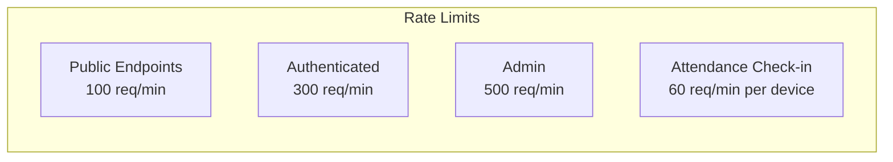

**Rate Limit Headers:**
```http
X-RateLimit-Limit: 300
X-RateLimit-Remaining: 295
X-RateLimit-Reset: 1644847260
```

## 14. WebSocket Events (Real-time)

### Connection

```javascript
const socket = io('wss://api.ams.com', {
  auth: { token: 'jwt_token' },
  query: { instituteId: 'uuid', classId: 'uuid' }
});
```

### Events

| Event | Direction | Description |
|-------|-----------|-------------|
| `attendance:checkin` | Server → Client | New check-in recorded |
| `payment:received` | Server → Client | Payment recorded |
| `card:status` | Server → Client | Card status changed |
| `class:join` | Client → Server | Join class room |
| `class:leave` | Client → Server | Leave class room |

### Event Payload Example

```json
{
  "event": "attendance:checkin",
  "data": {
    "attendanceId": "uuid",
    "studentId": "uuid",
    "studentName": "Jane Smith",
    "classId": "uuid",
    "timestamp": "2026-02-14T09:05:23Z"
  }
}
```

---

**Previous:** [Database Design](./database-design.md) | **Next:** [Security Architecture](./security-architecture.md)


<div style="page-break-after: always;"></div>

# 📊 System Diagrams

> Class Diagram and Entity Relationship Diagram for the Attendance Management System

## 1. Class Diagram

The class diagram shows the object-oriented design of the AMS system, including all entities, their attributes, methods, and relationships.

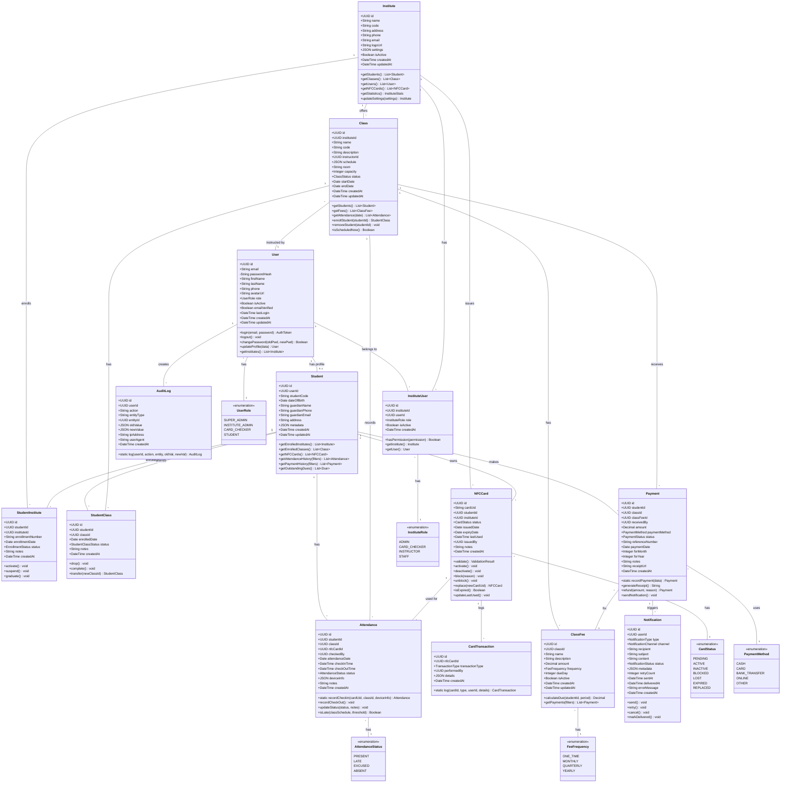

## 2. Detailed Class Diagram (Core Entities)

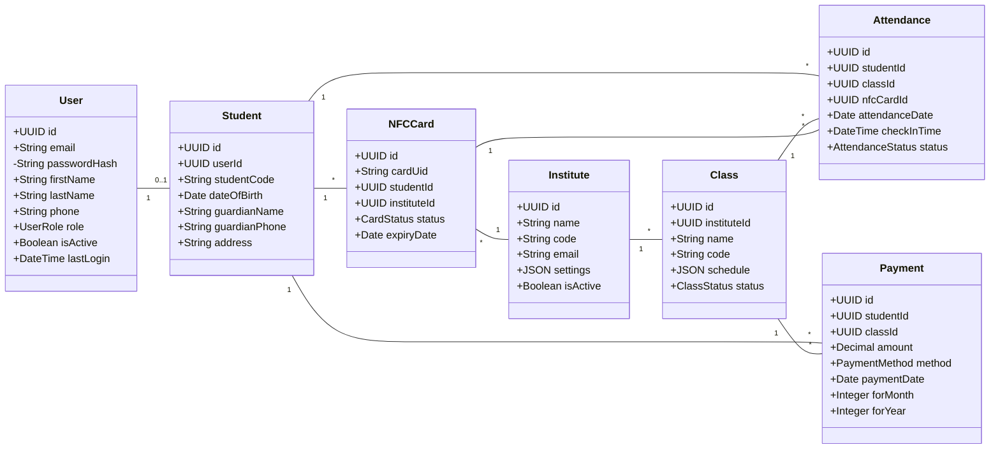

## 3. Entity Relationship Diagram (Chen Notation)

```mermaid
erDiagram
    %% ==================== CORE ENTITIES ====================
    
    USERS {
        uuid id PK "Primary Key"
        varchar email UK "Unique email address"
        varchar password_hash "Bcrypt hashed password"
        varchar first_name "User's first name"
        varchar last_name "User's last name"
        varchar phone "Contact phone"
        varchar avatar_url "Profile picture URL"
        enum role "super_admin|institute_admin|card_checker|student"
        boolean is_active "Account active status"
        boolean email_verified "Email verification status"
        timestamp last_login "Last login timestamp"
        timestamp created_at "Record creation time"
        timestamp updated_at "Last update time"
    }
    
    INSTITUTES {
        uuid id PK "Primary Key"
        varchar name "Institute name"
        varchar code UK "Unique institute code"
        text address "Physical address"
        varchar phone "Contact phone"
        varchar email "Contact email"
        varchar logo_url "Logo image URL"
        jsonb settings "Configuration settings"
        boolean is_active "Active status"
        timestamp created_at "Record creation time"
        timestamp updated_at "Last update time"
    }
    
    STUDENTS {
        uuid id PK "Primary Key"
        uuid user_id FK,UK "References users.id"
        varchar student_code UK "Unique student identifier"
        date date_of_birth "Student DOB"
        varchar guardian_name "Parent/Guardian name"
        varchar guardian_phone "Guardian contact"
        varchar guardian_email "Guardian email"
        text address "Student address"
        jsonb metadata "Additional info JSON"
        timestamp created_at "Record creation time"
        timestamp updated_at "Last update time"
    }
    
    CLASSES {
        uuid id PK "Primary Key"
        uuid institute_id FK "References institutes.id"
        varchar name "Class name"
        varchar code "Class code within institute"
        text description "Class description"
        uuid instructor_id FK "References users.id"
        jsonb schedule "Schedule JSON array"
        varchar room "Room/Location"
        integer capacity "Max students"
        enum status "active|inactive|completed|cancelled"
        date start_date "Class start date"
        date end_date "Class end date"
        timestamp created_at "Record creation time"
        timestamp updated_at "Last update time"
    }
    
    NFC_CARDS {
        uuid id PK "Primary Key"
        varchar card_uid UK "Physical card UID"
        uuid student_id FK "References students.id"
        uuid institute_id FK "References institutes.id"
        enum status "active|inactive|lost|expired|blocked"
        date issued_date "Card issue date"
        date expiry_date "Card expiration"
        timestamp last_used "Last card tap time"
        uuid issued_by FK "References users.id"
        text notes "Admin notes"
        timestamp created_at "Record creation time"
    }
    
    %% ==================== JUNCTION/BRIDGE TABLES ====================
    
    INSTITUTE_USERS {
        uuid id PK "Primary Key"
        uuid institute_id FK "References institutes.id"
        uuid user_id FK "References users.id"
        enum role "admin|card_checker|instructor|staff"
        boolean is_active "Membership active"
        timestamp created_at "Record creation time"
    }
    
    STUDENT_INSTITUTES {
        uuid id PK "Primary Key"
        uuid student_id FK "References students.id"
        uuid institute_id FK "References institutes.id"
        varchar enrollment_number UK "Institute enrollment number"
        date enrollment_date "Enrollment date"
        enum status "active|inactive|suspended|graduated"
        text notes "Enrollment notes"
        timestamp created_at "Record creation time"
    }
    
    STUDENT_CLASSES {
        uuid id PK "Primary Key"
        uuid student_id FK "References students.id"
        uuid class_id FK "References classes.id"
        date enrolled_date "Class enrollment date"
        enum status "enrolled|dropped|completed|transferred"
        text notes "Enrollment notes"
        timestamp created_at "Record creation time"
    }
    
    %% ==================== TRANSACTION TABLES ====================
    
    ATTENDANCE {
        uuid id PK "Primary Key"
        uuid student_id FK "References students.id"
        uuid class_id FK "References classes.id"
        uuid nfc_card_id FK "References nfc_cards.id"
        uuid checked_by FK "References users.id"
        date attendance_date "Attendance date"
        timestamp check_in_time "Check-in timestamp"
        timestamp check_out_time "Check-out timestamp"
        enum status "present|late|excused|absent"
        jsonb device_info "Device metadata"
        text notes "Attendance notes"
        timestamp created_at "Record creation time"
    }
    
    CLASS_FEES {
        uuid id PK "Primary Key"
        uuid class_id FK "References classes.id"
        varchar name "Fee name"
        text description "Fee description"
        decimal amount "Fee amount"
        enum frequency "one_time|monthly|quarterly|yearly"
        integer due_day "Day of month due (1-31)"
        boolean is_active "Fee active status"
        timestamp created_at "Record creation time"
        timestamp updated_at "Last update time"
    }
    
    PAYMENTS {
        uuid id PK "Primary Key"
        uuid student_id FK "References students.id"
        uuid class_id FK "References classes.id"
        uuid class_fee_id FK "References class_fees.id"
        uuid received_by FK "References users.id"
        decimal amount "Payment amount"
        enum payment_method "cash|card|bank_transfer|online|other"
        enum status "pending|completed|failed|refunded"
        varchar reference_number "Receipt number"
        date payment_date "Payment date"
        integer for_month "Payment period month"
        integer for_year "Payment period year"
        text notes "Payment notes"
        varchar receipt_url "Receipt file URL"
        timestamp created_at "Record creation time"
    }
    
    %% ==================== AUDIT/LOG TABLES ====================
    
    CARD_TRANSACTIONS {
        uuid id PK "Primary Key"
        uuid nfc_card_id FK "References nfc_cards.id"
        enum transaction_type "issued|activated|deactivated|blocked|unblocked|replaced|expired"
        uuid performed_by FK "References users.id"
        jsonb details "Transaction details JSON"
        timestamp created_at "Record creation time"
    }
    
    NOTIFICATIONS {
        uuid id PK "Primary Key"
        uuid user_id FK "References users.id"
        enum type "payment_confirmation|payment_reminder|attendance|general|alert"
        enum channel "sms|email|push|in_app"
        varchar recipient "Phone or email"
        varchar subject "Notification subject"
        text content "Notification body"
        enum status "pending|sent|delivered|failed|cancelled"
        jsonb metadata "Additional metadata"
        integer retry_count "Delivery attempts"
        timestamp sent_at "Send timestamp"
        timestamp delivered_at "Delivery timestamp"
        text error_message "Error if failed"
        timestamp created_at "Record creation time"
    }
    
    AUDIT_LOGS {
        uuid id PK "Primary Key"
        uuid user_id FK "References users.id"
        varchar action "Action performed"
        varchar entity_type "Entity type modified"
        uuid entity_id "Entity ID modified"
        jsonb old_value "Previous state"
        jsonb new_value "New state"
        inet ip_address "Client IP"
        text user_agent "Browser/client info"
        timestamp created_at "Record creation time"
    }
    
    %% ==================== RELATIONSHIPS ====================
    
    %% User to Student (1:1)
    USERS ||--o| STUDENTS : "has profile"
    
    %% User to Institute (M:N via INSTITUTE_USERS)
    USERS ||--o{ INSTITUTE_USERS : "belongs to"
    INSTITUTES ||--o{ INSTITUTE_USERS : "has"
    
    %% Student to Institute (M:N via STUDENT_INSTITUTES)
    STUDENTS ||--o{ STUDENT_INSTITUTES : "enrolled in"
    INSTITUTES ||--o{ STUDENT_INSTITUTES : "enrolls"
    
    %% Institute to Class (1:N)
    INSTITUTES ||--o{ CLASSES : "offers"
    
    %% Class Instructor
    USERS ||--o{ CLASSES : "instructs"
    
    %% Student to Class (M:N via STUDENT_CLASSES)
    STUDENTS ||--o{ STUDENT_CLASSES : "attends"
    CLASSES ||--o{ STUDENT_CLASSES : "has"
    
    %% NFC Cards
    STUDENTS ||--o{ NFC_CARDS : "owns"
    INSTITUTES ||--o{ NFC_CARDS : "issues"
    USERS ||--o{ NFC_CARDS : "issued by"
    
    %% Card Transactions
    NFC_CARDS ||--o{ CARD_TRANSACTIONS : "logs"
    USERS ||--o{ CARD_TRANSACTIONS : "performed by"
    
    %% Class Fees
    CLASSES ||--o{ CLASS_FEES : "has"
    
    %% Attendance
    STUDENTS ||--o{ ATTENDANCE : "has"
    CLASSES ||--o{ ATTENDANCE : "records"
    NFC_CARDS ||--o{ ATTENDANCE : "used for"
    USERS ||--o{ ATTENDANCE : "checked by"
    
    %% Payments
    STUDENTS ||--o{ PAYMENTS : "makes"
    CLASSES ||--o{ PAYMENTS : "receives"
    CLASS_FEES ||--o{ PAYMENTS : "for"
    USERS ||--o{ PAYMENTS : "received by"
    
    %% Notifications
    USERS ||--o{ NOTIFICATIONS : "receives"
    
    %% Audit Logs
    USERS ||--o{ AUDIT_LOGS : "creates"
```

## 4. Simplified ER Diagram (Core Business Entities)

```mermaid
erDiagram
    INSTITUTE ||--o{ CLASS : offers
    INSTITUTE ||--o{ STUDENT_ENROLLMENT : has
    INSTITUTE ||--o{ NFC_CARD : issues
    
    STUDENT ||--o{ STUDENT_ENROLLMENT : "enrolled in"
    STUDENT ||--o{ CLASS_ENROLLMENT : attends
    STUDENT ||--o{ NFC_CARD : owns
    STUDENT ||--o{ ATTENDANCE : has
    STUDENT ||--o{ PAYMENT : makes
    
    CLASS ||--o{ CLASS_ENROLLMENT : has
    CLASS ||--o{ CLASS_FEE : charges
    CLASS ||--o{ ATTENDANCE : records
    CLASS ||--o{ PAYMENT : receives
    
    NFC_CARD ||--o{ ATTENDANCE : "used for"
    
    CLASS_FEE ||--o{ PAYMENT : for
    
    INSTITUTE {
        uuid id PK
        string name
        string code UK
        boolean is_active
    }
    
    STUDENT {
        uuid id PK
        string student_code UK
        string guardian_phone
    }
    
    CLASS {
        uuid id PK
        uuid institute_id FK
        string name
        string code
    }
    
    NFC_CARD {
        uuid id PK
        string card_uid UK
        uuid student_id FK
        uuid institute_id FK
        enum status
    }
    
    STUDENT_ENROLLMENT {
        uuid id PK
        uuid student_id FK
        uuid institute_id FK
        string enrollment_number UK
        enum status
    }
    
    CLASS_ENROLLMENT {
        uuid id PK
        uuid student_id FK
        uuid class_id FK
        enum status
    }
    
    ATTENDANCE {
        uuid id PK
        uuid student_id FK
        uuid class_id FK
        uuid nfc_card_id FK
        date attendance_date
        enum status
    }
    
    CLASS_FEE {
        uuid id PK
        uuid class_id FK
        decimal amount
        enum frequency
    }
    
    PAYMENT {
        uuid id PK
        uuid student_id FK
        uuid class_id FK
        uuid class_fee_id FK
        decimal amount
        date payment_date
    }
```

## 5. Domain Model Diagram

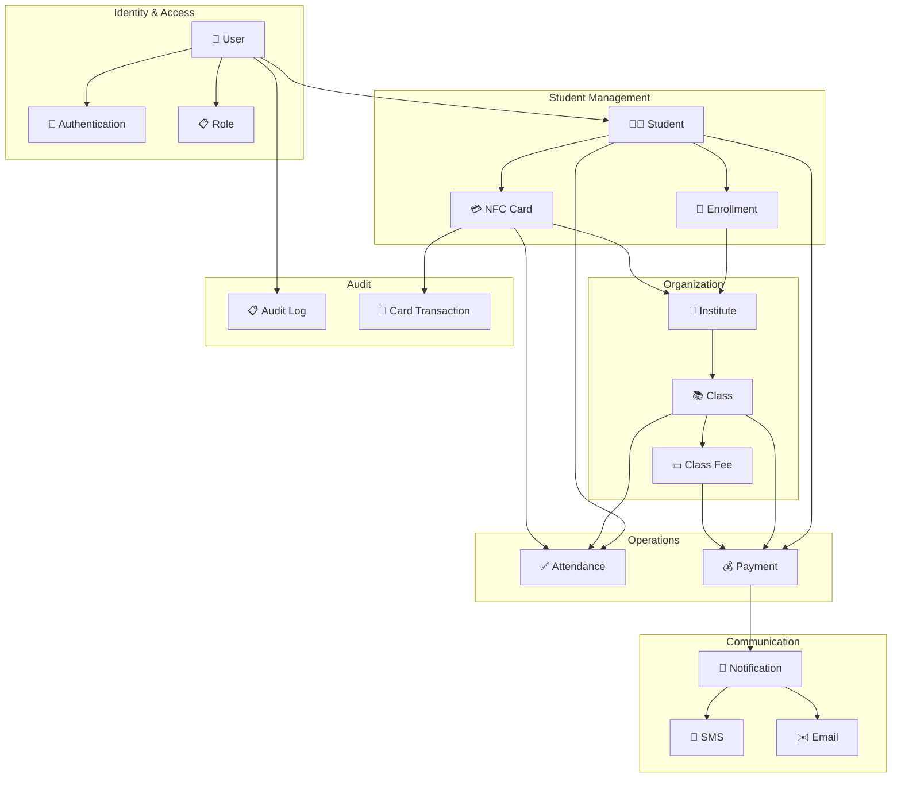

## 6. Cardinality Summary

| Relationship | Type | Description |
|--------------|------|-------------|
| User → Student | 1:0..1 | A user may optionally be a student |
| Institute → Class | 1:N | One institute has many classes |
| Institute → NFC Card | 1:N | One institute issues many cards |
| Student → NFC Card | 1:N | One student can have multiple cards (one per institute) |
| Student → Institute | M:N | Students can enroll in multiple institutes |
| Student → Class | M:N | Students can enroll in multiple classes |
| Class → Class Fee | 1:N | One class can have multiple fee types |
| Student + Class → Attendance | Many records per combination |
| Student + Class + Fee → Payment | Many records per combination |

---

**Related Documentation:**
- [Database Design](./database-design.md) - SQL Schema definitions
- [System Architecture](./system-architecture.md) - Overall system design
- [API Design](./api-design.md) - RESTful API endpoints


<div style="page-break-after: always;"></div>

# 🗄️ Database Design

> Comprehensive database schema design for the Attendance Management System

## 1. Database Overview

The AMS uses **PostgreSQL** as its primary database, chosen for its:
- Strong ACID compliance
- Excellent JSON support for flexible data
- Advanced indexing capabilities
- Built-in full-text search
- Robust security features

## 2. Entity Relationship Diagram

```mermaid
erDiagram
    INSTITUTE ||--o{ INSTITUTE_USER : has
    INSTITUTE ||--o{ CLASS : offers
    INSTITUTE ||--o{ NFC_CARD : issues
    INSTITUTE ||--o{ STUDENT_INSTITUTE : enrolls
    
    USER ||--o{ INSTITUTE_USER : belongs_to
    USER ||--o{ STUDENT : is
    USER ||--o{ AUDIT_LOG : creates
    
    STUDENT ||--o{ STUDENT_INSTITUTE : enrolled_in
    STUDENT ||--o{ NFC_CARD : owns
    STUDENT ||--o{ STUDENT_CLASS : attends
    STUDENT ||--o{ ATTENDANCE : has
    STUDENT ||--o{ PAYMENT : makes
    
    CLASS ||--o{ STUDENT_CLASS : has
    CLASS ||--o{ ATTENDANCE : records
    CLASS ||--o{ CLASS_FEE : has
    CLASS ||--o{ PAYMENT : receives
    
    NFC_CARD ||--o{ ATTENDANCE : used_for
    NFC_CARD ||--o{ CARD_TRANSACTION : logs
    
    CLASS_FEE ||--o{ PAYMENT : for
    
    PAYMENT ||--o{ NOTIFICATION : triggers
    ATTENDANCE ||--o{ NOTIFICATION : triggers

    INSTITUTE {
        uuid id PK
        string name
        string code UK
        string address
        string phone
        string email
        jsonb settings
        boolean is_active
        timestamp created_at
        timestamp updated_at
    }
    
    USER {
        uuid id PK
        string email UK
        string password_hash
        string first_name
        string last_name
        string phone
        enum role
        boolean is_active
        timestamp last_login
        timestamp created_at
        timestamp updated_at
    }
    
    INSTITUTE_USER {
        uuid id PK
        uuid institute_id FK
        uuid user_id FK
        enum role
        boolean is_active
        timestamp created_at
    }
    
    STUDENT {
        uuid id PK
        uuid user_id FK
        string student_code UK
        date date_of_birth
        string guardian_name
        string guardian_phone
        string address
        jsonb metadata
        timestamp created_at
        timestamp updated_at
    }
    
    STUDENT_INSTITUTE {
        uuid id PK
        uuid student_id FK
        uuid institute_id FK
        string enrollment_number UK
        date enrollment_date
        enum status
        timestamp created_at
    }
    
    NFC_CARD {
        uuid id PK
        string card_uid UK
        uuid student_id FK
        uuid institute_id FK
        enum status
        date issued_date
        date expiry_date
        timestamp last_used
        timestamp created_at
    }
    
    CLASS {
        uuid id PK
        uuid institute_id FK
        string name
        string code
        string description
        uuid instructor_id FK
        jsonb schedule
        enum status
        timestamp created_at
        timestamp updated_at
    }
    
    STUDENT_CLASS {
        uuid id PK
        uuid student_id FK
        uuid class_id FK
        date enrolled_date
        enum status
        timestamp created_at
    }
    
    ATTENDANCE {
        uuid id PK
        uuid student_id FK
        uuid class_id FK
        uuid nfc_card_id FK
        uuid checked_by FK
        timestamp check_in_time
        enum status
        string device_info
        timestamp created_at
    }
    
    CLASS_FEE {
        uuid id PK
        uuid class_id FK
        string name
        decimal amount
        enum frequency
        integer due_day
        boolean is_active
        timestamp created_at
    }
    
    PAYMENT {
        uuid id PK
        uuid student_id FK
        uuid class_id FK
        uuid class_fee_id FK
        uuid received_by FK
        decimal amount
        enum payment_method
        string reference_number
        date payment_date
        integer for_month
        integer for_year
        string notes
        timestamp created_at
    }
    
    NOTIFICATION {
        uuid id PK
        uuid user_id FK
        enum type
        string channel
        string recipient
        string subject
        text content
        enum status
        jsonb metadata
        timestamp sent_at
        timestamp created_at
    }
    
    AUDIT_LOG {
        uuid id PK
        uuid user_id FK
        string action
        string entity_type
        uuid entity_id
        jsonb old_value
        jsonb new_value
        string ip_address
        timestamp created_at
    }
    
    CARD_TRANSACTION {
        uuid id PK
        uuid nfc_card_id FK
        enum transaction_type
        jsonb details
        timestamp created_at
    }
```

## 3. Detailed Schema Definitions

### 3.1 Core Tables

#### institutes
```sql
CREATE TABLE institutes (
    id UUID PRIMARY KEY DEFAULT gen_random_uuid(),
    name VARCHAR(255) NOT NULL,
    code VARCHAR(50) UNIQUE NOT NULL,
    address TEXT,
    phone VARCHAR(20),
    email VARCHAR(255),
    logo_url VARCHAR(500),
    settings JSONB DEFAULT '{}',
    is_active BOOLEAN DEFAULT true,
    created_at TIMESTAMP WITH TIME ZONE DEFAULT CURRENT_TIMESTAMP,
    updated_at TIMESTAMP WITH TIME ZONE DEFAULT CURRENT_TIMESTAMP
);

CREATE INDEX idx_institutes_code ON institutes(code);
CREATE INDEX idx_institutes_is_active ON institutes(is_active);

COMMENT ON TABLE institutes IS 'Educational institutes registered in the system';
COMMENT ON COLUMN institutes.settings IS 'JSON config: notification prefs, branding, etc.';
```

#### users
```sql
CREATE TYPE user_role AS ENUM ('super_admin', 'institute_admin', 'card_checker', 'student');

CREATE TABLE users (
    id UUID PRIMARY KEY DEFAULT gen_random_uuid(),
    email VARCHAR(255) UNIQUE NOT NULL,
    password_hash VARCHAR(255) NOT NULL,
    first_name VARCHAR(100) NOT NULL,
    last_name VARCHAR(100) NOT NULL,
    phone VARCHAR(20),
    avatar_url VARCHAR(500),
    role user_role NOT NULL DEFAULT 'student',
    is_active BOOLEAN DEFAULT true,
    email_verified BOOLEAN DEFAULT false,
    last_login TIMESTAMP WITH TIME ZONE,
    created_at TIMESTAMP WITH TIME ZONE DEFAULT CURRENT_TIMESTAMP,
    updated_at TIMESTAMP WITH TIME ZONE DEFAULT CURRENT_TIMESTAMP
);

CREATE INDEX idx_users_email ON users(email);
CREATE INDEX idx_users_role ON users(role);
CREATE INDEX idx_users_is_active ON users(is_active);

COMMENT ON TABLE users IS 'All system users including students, admins, and staff';
```

#### institute_users
```sql
CREATE TYPE institute_role AS ENUM ('admin', 'card_checker', 'instructor', 'staff');

CREATE TABLE institute_users (
    id UUID PRIMARY KEY DEFAULT gen_random_uuid(),
    institute_id UUID NOT NULL REFERENCES institutes(id) ON DELETE CASCADE,
    user_id UUID NOT NULL REFERENCES users(id) ON DELETE CASCADE,
    role institute_role NOT NULL,
    is_active BOOLEAN DEFAULT true,
    created_at TIMESTAMP WITH TIME ZONE DEFAULT CURRENT_TIMESTAMP,
    
    UNIQUE(institute_id, user_id)
);

CREATE INDEX idx_institute_users_institute ON institute_users(institute_id);
CREATE INDEX idx_institute_users_user ON institute_users(user_id);

COMMENT ON TABLE institute_users IS 'Maps users to institutes with specific roles';
```

### 3.2 Student Tables

#### students
```sql
CREATE TABLE students (
    id UUID PRIMARY KEY DEFAULT gen_random_uuid(),
    user_id UUID NOT NULL REFERENCES users(id) ON DELETE CASCADE,
    student_code VARCHAR(50) UNIQUE NOT NULL,
    date_of_birth DATE,
    guardian_name VARCHAR(255),
    guardian_phone VARCHAR(20),
    guardian_email VARCHAR(255),
    address TEXT,
    metadata JSONB DEFAULT '{}',
    created_at TIMESTAMP WITH TIME ZONE DEFAULT CURRENT_TIMESTAMP,
    updated_at TIMESTAMP WITH TIME ZONE DEFAULT CURRENT_TIMESTAMP,
    
    UNIQUE(user_id)
);

CREATE INDEX idx_students_user ON students(user_id);
CREATE INDEX idx_students_code ON students(student_code);

COMMENT ON TABLE students IS 'Student-specific profile information';
COMMENT ON COLUMN students.metadata IS 'Additional student data: emergency contacts, medical info, etc.';
```

#### student_institutes
```sql
CREATE TYPE enrollment_status AS ENUM ('active', 'inactive', 'suspended', 'graduated');

CREATE TABLE student_institutes (
    id UUID PRIMARY KEY DEFAULT gen_random_uuid(),
    student_id UUID NOT NULL REFERENCES students(id) ON DELETE CASCADE,
    institute_id UUID NOT NULL REFERENCES institutes(id) ON DELETE CASCADE,
    enrollment_number VARCHAR(100) NOT NULL,
    enrollment_date DATE NOT NULL DEFAULT CURRENT_DATE,
    status enrollment_status DEFAULT 'active',
    notes TEXT,
    created_at TIMESTAMP WITH TIME ZONE DEFAULT CURRENT_TIMESTAMP,
    
    UNIQUE(student_id, institute_id),
    UNIQUE(institute_id, enrollment_number)
);

CREATE INDEX idx_student_institutes_student ON student_institutes(student_id);
CREATE INDEX idx_student_institutes_institute ON student_institutes(institute_id);
CREATE INDEX idx_student_institutes_status ON student_institutes(status);

COMMENT ON TABLE student_institutes IS 'Student enrollment in institutes (many-to-many)';
```

### 3.3 NFC Card Tables

#### nfc_cards
```sql
CREATE TYPE card_status AS ENUM ('active', 'inactive', 'lost', 'expired', 'blocked');

CREATE TABLE nfc_cards (
    id UUID PRIMARY KEY DEFAULT gen_random_uuid(),
    card_uid VARCHAR(100) UNIQUE NOT NULL,
    student_id UUID NOT NULL REFERENCES students(id) ON DELETE CASCADE,
    institute_id UUID NOT NULL REFERENCES institutes(id) ON DELETE CASCADE,
    status card_status DEFAULT 'active',
    issued_date DATE NOT NULL DEFAULT CURRENT_DATE,
    expiry_date DATE,
    last_used TIMESTAMP WITH TIME ZONE,
    issued_by UUID REFERENCES users(id),
    notes TEXT,
    created_at TIMESTAMP WITH TIME ZONE DEFAULT CURRENT_TIMESTAMP,
    
    UNIQUE(student_id, institute_id)
);

CREATE INDEX idx_nfc_cards_uid ON nfc_cards(card_uid);
CREATE INDEX idx_nfc_cards_student ON nfc_cards(student_id);
CREATE INDEX idx_nfc_cards_institute ON nfc_cards(institute_id);
CREATE INDEX idx_nfc_cards_status ON nfc_cards(status);

COMMENT ON TABLE nfc_cards IS 'NFC cards issued to students per institute';
COMMENT ON COLUMN nfc_cards.card_uid IS 'Unique identifier read from the physical NFC card';
```

#### card_transactions
```sql
CREATE TYPE transaction_type AS ENUM ('issued', 'activated', 'deactivated', 'blocked', 'unblocked', 'replaced', 'expired');

CREATE TABLE card_transactions (
    id UUID PRIMARY KEY DEFAULT gen_random_uuid(),
    nfc_card_id UUID NOT NULL REFERENCES nfc_cards(id) ON DELETE CASCADE,
    transaction_type transaction_type NOT NULL,
    performed_by UUID REFERENCES users(id),
    details JSONB DEFAULT '{}',
    created_at TIMESTAMP WITH TIME ZONE DEFAULT CURRENT_TIMESTAMP
);

CREATE INDEX idx_card_transactions_card ON card_transactions(nfc_card_id);
CREATE INDEX idx_card_transactions_type ON card_transactions(transaction_type);
CREATE INDEX idx_card_transactions_created ON card_transactions(created_at);

COMMENT ON TABLE card_transactions IS 'Audit log for NFC card lifecycle events';
```

### 3.4 Class Tables

#### classes
```sql
CREATE TYPE class_status AS ENUM ('active', 'inactive', 'completed', 'cancelled');

CREATE TABLE classes (
    id UUID PRIMARY KEY DEFAULT gen_random_uuid(),
    institute_id UUID NOT NULL REFERENCES institutes(id) ON DELETE CASCADE,
    name VARCHAR(255) NOT NULL,
    code VARCHAR(50) NOT NULL,
    description TEXT,
    instructor_id UUID REFERENCES users(id),
    schedule JSONB DEFAULT '[]',
    room VARCHAR(100),
    capacity INTEGER,
    status class_status DEFAULT 'active',
    start_date DATE,
    end_date DATE,
    created_at TIMESTAMP WITH TIME ZONE DEFAULT CURRENT_TIMESTAMP,
    updated_at TIMESTAMP WITH TIME ZONE DEFAULT CURRENT_TIMESTAMP,
    
    UNIQUE(institute_id, code)
);

CREATE INDEX idx_classes_institute ON classes(institute_id);
CREATE INDEX idx_classes_status ON classes(status);
CREATE INDEX idx_classes_instructor ON classes(instructor_id);

COMMENT ON TABLE classes IS 'Classes offered by institutes';
COMMENT ON COLUMN classes.schedule IS 'JSON array of schedule objects: [{day, start_time, end_time}]';
```

#### student_classes
```sql
CREATE TYPE student_class_status AS ENUM ('enrolled', 'dropped', 'completed', 'transferred');

CREATE TABLE student_classes (
    id UUID PRIMARY KEY DEFAULT gen_random_uuid(),
    student_id UUID NOT NULL REFERENCES students(id) ON DELETE CASCADE,
    class_id UUID NOT NULL REFERENCES classes(id) ON DELETE CASCADE,
    enrolled_date DATE NOT NULL DEFAULT CURRENT_DATE,
    status student_class_status DEFAULT 'enrolled',
    notes TEXT,
    created_at TIMESTAMP WITH TIME ZONE DEFAULT CURRENT_TIMESTAMP,
    
    UNIQUE(student_id, class_id)
);

CREATE INDEX idx_student_classes_student ON student_classes(student_id);
CREATE INDEX idx_student_classes_class ON student_classes(class_id);
CREATE INDEX idx_student_classes_status ON student_classes(status);

COMMENT ON TABLE student_classes IS 'Student enrollment in classes (many-to-many)';
```

### 3.5 Attendance Tables

#### attendance
```sql
CREATE TYPE attendance_status AS ENUM ('present', 'late', 'excused', 'absent');

CREATE TABLE attendance (
    id UUID PRIMARY KEY DEFAULT gen_random_uuid(),
    student_id UUID NOT NULL REFERENCES students(id) ON DELETE CASCADE,
    class_id UUID NOT NULL REFERENCES classes(id) ON DELETE CASCADE,
    nfc_card_id UUID REFERENCES nfc_cards(id),
    checked_by UUID REFERENCES users(id),
    attendance_date DATE NOT NULL DEFAULT CURRENT_DATE,
    check_in_time TIMESTAMP WITH TIME ZONE NOT NULL DEFAULT CURRENT_TIMESTAMP,
    check_out_time TIMESTAMP WITH TIME ZONE,
    status attendance_status DEFAULT 'present',
    device_info JSONB DEFAULT '{}',
    notes TEXT,
    created_at TIMESTAMP WITH TIME ZONE DEFAULT CURRENT_TIMESTAMP,
    
    UNIQUE(student_id, class_id, attendance_date)
);

CREATE INDEX idx_attendance_student ON attendance(student_id);
CREATE INDEX idx_attendance_class ON attendance(class_id);
CREATE INDEX idx_attendance_date ON attendance(attendance_date);
CREATE INDEX idx_attendance_card ON attendance(nfc_card_id);
CREATE INDEX idx_attendance_status ON attendance(status);

-- Composite index for common queries
CREATE INDEX idx_attendance_class_date ON attendance(class_id, attendance_date);

COMMENT ON TABLE attendance IS 'Student attendance records';
COMMENT ON COLUMN attendance.device_info IS 'JSON: device type, browser, location, etc.';
```

### 3.6 Payment Tables

#### class_fees
```sql
CREATE TYPE fee_frequency AS ENUM ('one_time', 'monthly', 'quarterly', 'yearly');

CREATE TABLE class_fees (
    id UUID PRIMARY KEY DEFAULT gen_random_uuid(),
    class_id UUID NOT NULL REFERENCES classes(id) ON DELETE CASCADE,
    name VARCHAR(255) NOT NULL,
    description TEXT,
    amount DECIMAL(10, 2) NOT NULL,
    frequency fee_frequency DEFAULT 'monthly',
    due_day INTEGER DEFAULT 1 CHECK (due_day >= 1 AND due_day <= 31),
    is_active BOOLEAN DEFAULT true,
    created_at TIMESTAMP WITH TIME ZONE DEFAULT CURRENT_TIMESTAMP,
    updated_at TIMESTAMP WITH TIME ZONE DEFAULT CURRENT_TIMESTAMP
);

CREATE INDEX idx_class_fees_class ON class_fees(class_id);
CREATE INDEX idx_class_fees_active ON class_fees(is_active);

COMMENT ON TABLE class_fees IS 'Fee structure for classes';
COMMENT ON COLUMN class_fees.due_day IS 'Day of month when fee is due';
```

#### payments
```sql
CREATE TYPE payment_method AS ENUM ('cash', 'card', 'bank_transfer', 'online', 'other');
CREATE TYPE payment_status AS ENUM ('pending', 'completed', 'failed', 'refunded');

CREATE TABLE payments (
    id UUID PRIMARY KEY DEFAULT gen_random_uuid(),
    student_id UUID NOT NULL REFERENCES students(id) ON DELETE CASCADE,
    class_id UUID NOT NULL REFERENCES classes(id) ON DELETE CASCADE,
    class_fee_id UUID REFERENCES class_fees(id),
    received_by UUID NOT NULL REFERENCES users(id),
    amount DECIMAL(10, 2) NOT NULL,
    payment_method payment_method NOT NULL,
    status payment_status DEFAULT 'completed',
    reference_number VARCHAR(100),
    payment_date DATE NOT NULL DEFAULT CURRENT_DATE,
    for_month INTEGER CHECK (for_month >= 1 AND for_month <= 12),
    for_year INTEGER CHECK (for_year >= 2000 AND for_year <= 2100),
    notes TEXT,
    receipt_url VARCHAR(500),
    created_at TIMESTAMP WITH TIME ZONE DEFAULT CURRENT_TIMESTAMP
);

CREATE INDEX idx_payments_student ON payments(student_id);
CREATE INDEX idx_payments_class ON payments(class_id);
CREATE INDEX idx_payments_date ON payments(payment_date);
CREATE INDEX idx_payments_status ON payments(status);

-- Composite index for payment history queries
CREATE INDEX idx_payments_student_class ON payments(student_id, class_id);
CREATE INDEX idx_payments_period ON payments(for_year, for_month);

COMMENT ON TABLE payments IS 'Payment records for class fees';
```

### 3.7 Notification Tables

#### notifications
```sql
CREATE TYPE notification_type AS ENUM ('payment_confirmation', 'payment_reminder', 'attendance', 'general', 'alert');
CREATE TYPE notification_channel AS ENUM ('sms', 'email', 'push', 'in_app');
CREATE TYPE notification_status AS ENUM ('pending', 'sent', 'delivered', 'failed', 'cancelled');

CREATE TABLE notifications (
    id UUID PRIMARY KEY DEFAULT gen_random_uuid(),
    user_id UUID REFERENCES users(id) ON DELETE SET NULL,
    type notification_type NOT NULL,
    channel notification_channel NOT NULL,
    recipient VARCHAR(255) NOT NULL,
    subject VARCHAR(500),
    content TEXT NOT NULL,
    status notification_status DEFAULT 'pending',
    metadata JSONB DEFAULT '{}',
    retry_count INTEGER DEFAULT 0,
    sent_at TIMESTAMP WITH TIME ZONE,
    delivered_at TIMESTAMP WITH TIME ZONE,
    error_message TEXT,
    created_at TIMESTAMP WITH TIME ZONE DEFAULT CURRENT_TIMESTAMP
);

CREATE INDEX idx_notifications_user ON notifications(user_id);
CREATE INDEX idx_notifications_status ON notifications(status);
CREATE INDEX idx_notifications_type ON notifications(type);
CREATE INDEX idx_notifications_created ON notifications(created_at);

COMMENT ON TABLE notifications IS 'SMS and email notification records';
```

### 3.8 Audit Tables

#### audit_logs
```sql
CREATE TABLE audit_logs (
    id UUID PRIMARY KEY DEFAULT gen_random_uuid(),
    user_id UUID REFERENCES users(id) ON DELETE SET NULL,
    action VARCHAR(100) NOT NULL,
    entity_type VARCHAR(100) NOT NULL,
    entity_id UUID,
    old_value JSONB,
    new_value JSONB,
    ip_address INET,
    user_agent TEXT,
    created_at TIMESTAMP WITH TIME ZONE DEFAULT CURRENT_TIMESTAMP
);

CREATE INDEX idx_audit_logs_user ON audit_logs(user_id);
CREATE INDEX idx_audit_logs_action ON audit_logs(action);
CREATE INDEX idx_audit_logs_entity ON audit_logs(entity_type, entity_id);
CREATE INDEX idx_audit_logs_created ON audit_logs(created_at);

-- Partition by month for better performance
-- CREATE TABLE audit_logs_y2026m01 PARTITION OF audit_logs
--     FOR VALUES FROM ('2026-01-01') TO ('2026-02-01');

COMMENT ON TABLE audit_logs IS 'System-wide audit trail for all changes';
```

## 4. Database Relationships Diagram

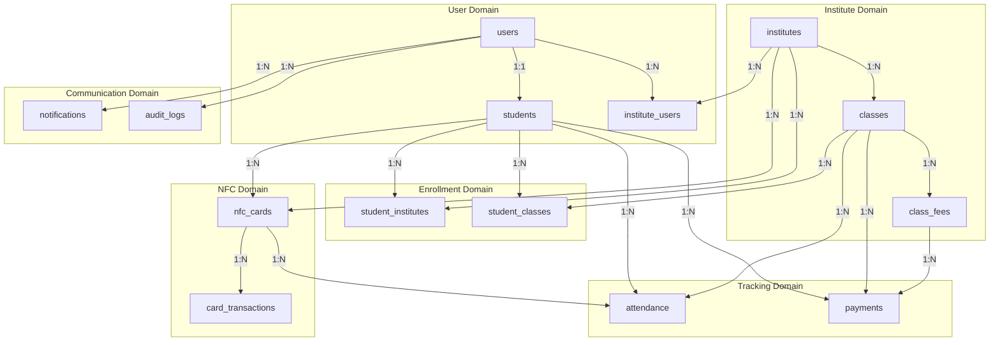

## 5. Indexes Strategy

### 5.1 Performance-Critical Indexes

```sql
-- Fast card lookup during check-in (most frequent operation)
CREATE INDEX CONCURRENTLY idx_nfc_cards_uid_active 
ON nfc_cards(card_uid) 
WHERE status = 'active';

-- Fast attendance check for duplicate prevention
CREATE INDEX CONCURRENTLY idx_attendance_lookup 
ON attendance(class_id, student_id, attendance_date);

-- Payment status lookup for a student
CREATE INDEX CONCURRENTLY idx_payments_student_period 
ON payments(student_id, for_year, for_month);

-- Active students in a class
CREATE INDEX CONCURRENTLY idx_student_classes_active 
ON student_classes(class_id) 
WHERE status = 'enrolled';
```

### 5.2 Full-Text Search Indexes

```sql
-- Student search
CREATE INDEX idx_students_search ON students 
USING gin(to_tsvector('english', 
    coalesce(student_code, '') || ' ' || 
    coalesce(guardian_name, '')));

-- Class search
CREATE INDEX idx_classes_search ON classes 
USING gin(to_tsvector('english', 
    name || ' ' || coalesce(description, '')));
```

## 6. Views for Common Queries

### 6.1 Student Dashboard View

```sql
CREATE VIEW vw_student_dashboard AS
SELECT 
    s.id AS student_id,
    s.student_code,
    u.first_name,
    u.last_name,
    u.email,
    i.id AS institute_id,
    i.name AS institute_name,
    nc.card_uid,
    nc.status AS card_status,
    COUNT(DISTINCT sc.class_id) AS enrolled_classes,
    (
        SELECT COUNT(*) 
        FROM attendance a 
        WHERE a.student_id = s.id 
        AND a.attendance_date >= DATE_TRUNC('month', CURRENT_DATE)
    ) AS attendance_this_month
FROM students s
JOIN users u ON s.user_id = u.id
JOIN student_institutes si ON s.id = si.student_id
JOIN institutes i ON si.institute_id = i.id
LEFT JOIN nfc_cards nc ON s.id = nc.student_id AND i.id = nc.institute_id
LEFT JOIN student_classes sc ON s.id = sc.student_id AND sc.status = 'enrolled'
WHERE si.status = 'active'
GROUP BY s.id, s.student_code, u.first_name, u.last_name, u.email,
         i.id, i.name, nc.card_uid, nc.status;
```

### 6.2 Class Attendance Summary View

```sql
CREATE VIEW vw_class_attendance_summary AS
SELECT 
    c.id AS class_id,
    c.name AS class_name,
    c.institute_id,
    a.attendance_date,
    COUNT(*) FILTER (WHERE a.status = 'present') AS present_count,
    COUNT(*) FILTER (WHERE a.status = 'late') AS late_count,
    COUNT(*) FILTER (WHERE a.status = 'absent') AS absent_count,
    COUNT(*) FILTER (WHERE a.status = 'excused') AS excused_count,
    COUNT(*) AS total_records
FROM classes c
LEFT JOIN attendance a ON c.id = a.class_id
GROUP BY c.id, c.name, c.institute_id, a.attendance_date;
```

### 6.3 Payment Status View

```sql
CREATE VIEW vw_payment_status AS
SELECT 
    s.id AS student_id,
    s.student_code,
    u.first_name || ' ' || u.last_name AS student_name,
    c.id AS class_id,
    c.name AS class_name,
    cf.id AS fee_id,
    cf.name AS fee_name,
    cf.amount AS fee_amount,
    cf.frequency,
    EXTRACT(MONTH FROM CURRENT_DATE)::INTEGER AS current_month,
    EXTRACT(YEAR FROM CURRENT_DATE)::INTEGER AS current_year,
    COALESCE(
        (SELECT SUM(p.amount) 
         FROM payments p 
         WHERE p.student_id = s.id 
         AND p.class_id = c.id 
         AND p.for_month = EXTRACT(MONTH FROM CURRENT_DATE)
         AND p.for_year = EXTRACT(YEAR FROM CURRENT_DATE)
         AND p.status = 'completed'),
        0
    ) AS paid_amount,
    cf.amount - COALESCE(
        (SELECT SUM(p.amount) 
         FROM payments p 
         WHERE p.student_id = s.id 
         AND p.class_id = c.id 
         AND p.for_month = EXTRACT(MONTH FROM CURRENT_DATE)
         AND p.for_year = EXTRACT(YEAR FROM CURRENT_DATE)
         AND p.status = 'completed'),
        0
    ) AS due_amount
FROM students s
JOIN users u ON s.user_id = u.id
JOIN student_classes sc ON s.id = sc.student_id
JOIN classes c ON sc.class_id = c.id
JOIN class_fees cf ON c.id = cf.class_id
WHERE sc.status = 'enrolled' AND cf.is_active = true;
```

## 7. Database Functions

### 7.1 Trigger for Updated Timestamp

```sql
CREATE OR REPLACE FUNCTION update_updated_at_column()
RETURNS TRIGGER AS $$
BEGIN
    NEW.updated_at = CURRENT_TIMESTAMP;
    RETURN NEW;
END;
$$ language 'plpgsql';

-- Apply to tables
CREATE TRIGGER update_institutes_updated_at 
    BEFORE UPDATE ON institutes 
    FOR EACH ROW EXECUTE FUNCTION update_updated_at_column();

CREATE TRIGGER update_users_updated_at 
    BEFORE UPDATE ON users 
    FOR EACH ROW EXECUTE FUNCTION update_updated_at_column();

CREATE TRIGGER update_students_updated_at 
    BEFORE UPDATE ON students 
    FOR EACH ROW EXECUTE FUNCTION update_updated_at_column();

CREATE TRIGGER update_classes_updated_at 
    BEFORE UPDATE ON classes 
    FOR EACH ROW EXECUTE FUNCTION update_updated_at_column();
```

### 7.2 Function to Check Duplicate Attendance

```sql
CREATE OR REPLACE FUNCTION check_duplicate_attendance()
RETURNS TRIGGER AS $$
BEGIN
    IF EXISTS (
        SELECT 1 FROM attendance 
        WHERE student_id = NEW.student_id 
        AND class_id = NEW.class_id 
        AND attendance_date = NEW.attendance_date
    ) THEN
        RAISE EXCEPTION 'Attendance already recorded for this student in this class today';
    END IF;
    RETURN NEW;
END;
$$ language 'plpgsql';

CREATE TRIGGER prevent_duplicate_attendance
    BEFORE INSERT ON attendance
    FOR EACH ROW EXECUTE FUNCTION check_duplicate_attendance();
```

## 8. Migration Strategy

```mermaid
graph LR
    subgraph "Phase 1: Core"
        M1[institutes]
        M2[users]
        M3[institute_users]
    end
    
    subgraph "Phase 2: Students"
        M4[students]
        M5[student_institutes]
    end
    
    subgraph "Phase 3: Classes"
        M6[classes]
        M7[student_classes]
        M8[class_fees]
    end
    
    subgraph "Phase 4: NFC"
        M9[nfc_cards]
        M10[card_transactions]
    end
    
    subgraph "Phase 5: Operations"
        M11[attendance]
        M12[payments]
    end
    
    subgraph "Phase 6: Support"
        M13[notifications]
        M14[audit_logs]
    end
    
    M1 --> M2 --> M3 --> M4 --> M5 --> M6 --> M7 --> M8 --> M9 --> M10 --> M11 --> M12 --> M13 --> M14
```

---

**Previous:** [System Architecture](./system-architecture.md) | **Next:** [API Design](./api-design.md)


<div style="page-break-after: always;"></div>

# 🔐 Security Architecture

> Security design and implementation guidelines for the Attendance Management System

## 1. Security Overview

The AMS implements a defense-in-depth security strategy with multiple layers of protection to safeguard sensitive student data, payment information, and system integrity.

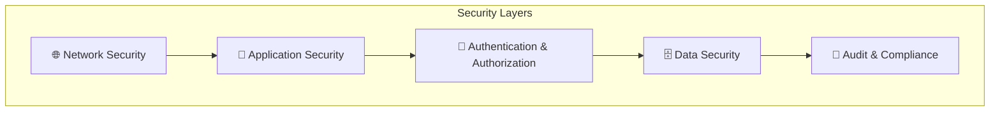

## 2. Authentication Architecture

### 2.1 Authentication Flow

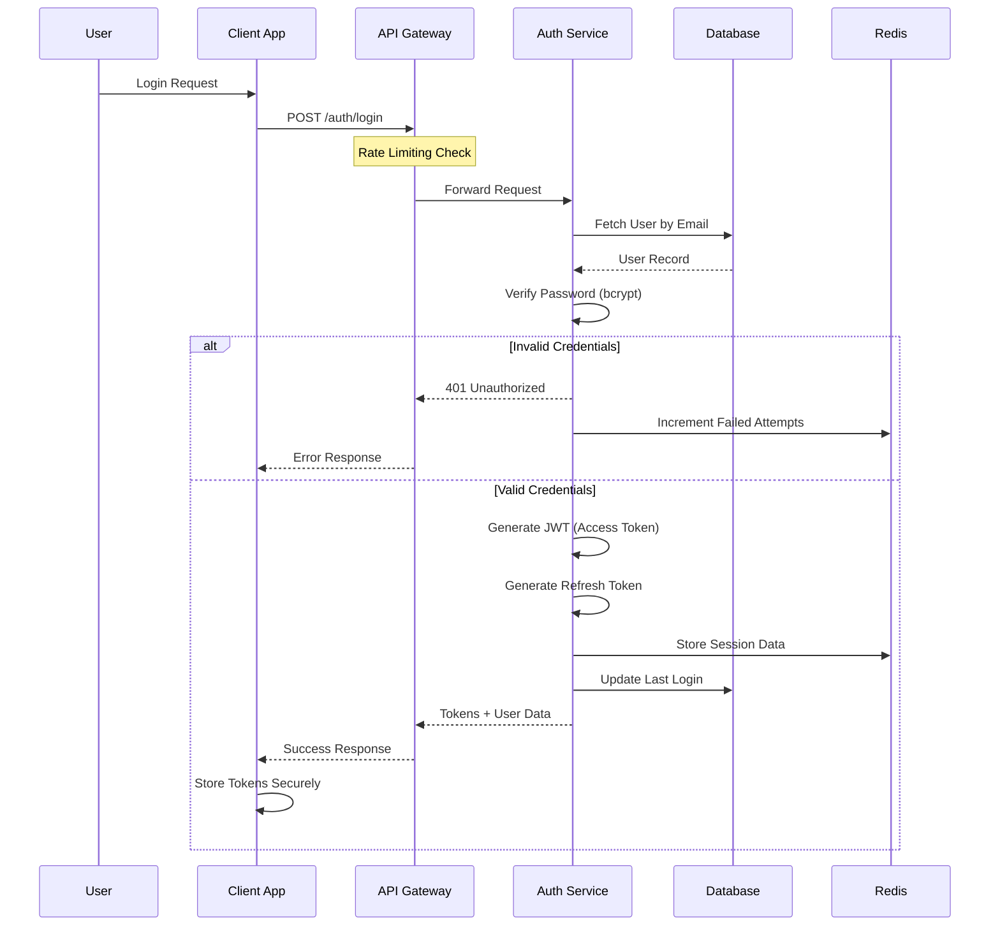

### 2.2 JWT Token Structure

```json
{
  "header": {
    "alg": "RS256",
    "typ": "JWT"
  },
  "payload": {
    "sub": "user_uuid",
    "email": "user@example.com",
    "role": "institute_admin",
    "institutes": ["institute_uuid_1", "institute_uuid_2"],
    "permissions": ["read:students", "write:attendance"],
    "iat": 1644847200,
    "exp": 1644850800,
    "iss": "ams-auth-service",
    "aud": "ams-api"
  }
}
```

### 2.3 Token Management

| Token Type | Lifetime | Storage | Refresh |
|------------|----------|---------|---------|
| Access Token | 1 hour | Memory only | Via refresh token |
| Refresh Token | 7 days | HttpOnly cookie | Re-authenticate |
| Session | 24 hours | Redis | Sliding expiration |

## 3. Authorization Model

### 3.1 Role-Based Access Control (RBAC)

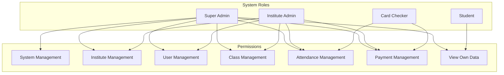

### 3.2 Permission Matrix

| Permission | Super Admin | Institute Admin | Card Checker | Student |
|------------|:-----------:|:---------------:|:------------:|:-------:|
| Create Institute | ✅ | ❌ | ❌ | ❌ |
| Manage Institute | ✅ | ✅* | ❌ | ❌ |
| Manage Users | ✅ | ✅* | ❌ | ❌ |
| Manage Classes | ✅ | ✅* | ❌ | ❌ |
| Register Students | ✅ | ✅* | ❌ | ❌ |
| Issue NFC Cards | ✅ | ✅* | ❌ | ❌ |
| Record Attendance | ✅ | ✅* | ✅* | ❌ |
| Record Payments | ✅ | ✅* | ✅* | ❌ |
| View Reports | ✅ | ✅* | ✅* | ❌ |
| View Own Attendance | ✅ | ✅ | ✅ | ✅ |
| View Own Payments | ✅ | ✅ | ✅ | ✅ |

*Restricted to assigned institute(s)/class(es)

### 3.3 Multi-Tenancy Security

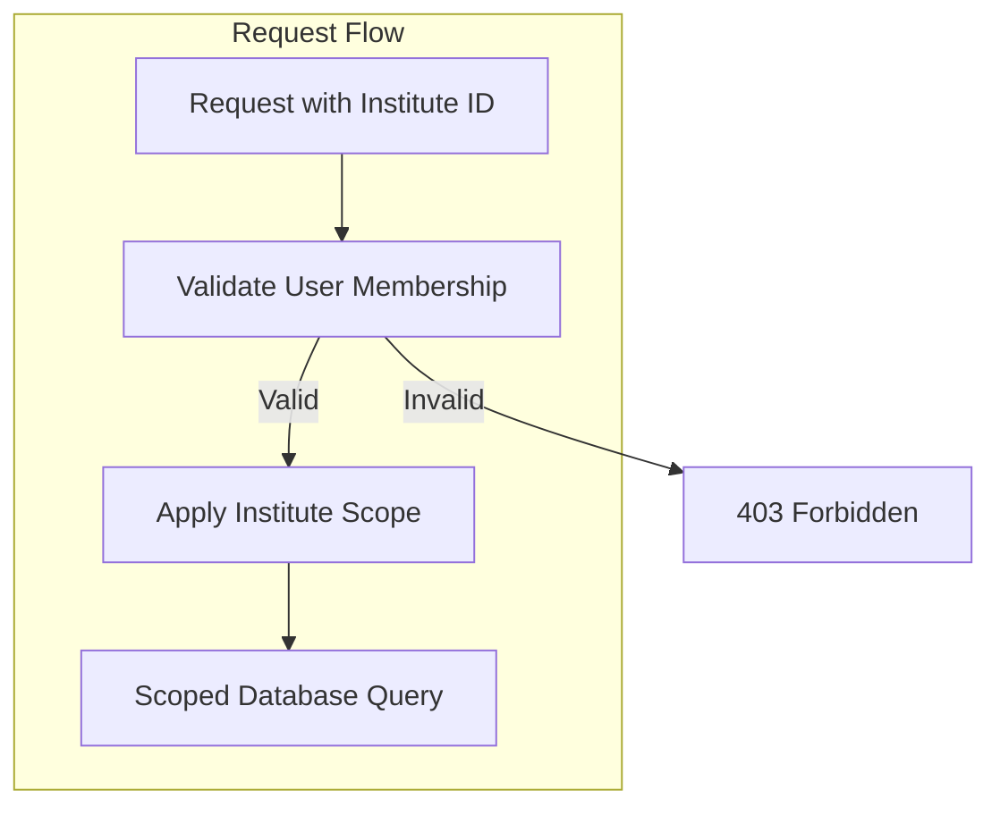

**Implementation:**
```typescript
// Middleware for institute scope validation
async function validateInstituteAccess(req, res, next) {
  const { instituteId } = req.headers['x-institute-id'] || req.params;
  const userId = req.user.id;
  
  // Super admins have access to all institutes
  if (req.user.role === 'super_admin') {
    return next();
  }
  
  // Verify user belongs to institute
  const membership = await InstituteUser.findOne({
    where: { userId, instituteId, isActive: true }
  });
  
  if (!membership) {
    return res.status(403).json({ error: 'Access denied to this institute' });
  }
  
  req.instituteRole = membership.role;
  next();
}
```

## 4. Data Security

### 4.1 Encryption Strategy

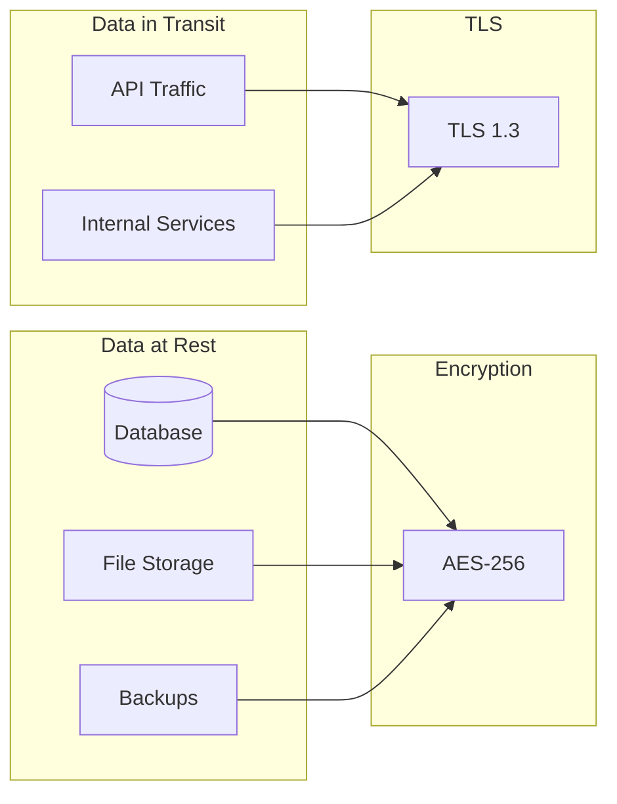

### 4.2 Sensitive Data Handling

| Data Type | Storage | Encryption | Access |
|-----------|---------|------------|--------|
| Passwords | Database | bcrypt (cost 12) | Never exposed |
| NFC Card UIDs | Database | AES-256 | Authenticated only |
| Student PII | Database | Column-level encryption | Role-based |
| Payment Data | Database | AES-256 | Role-based |
| Session Data | Redis | At-rest encryption | System only |

### 4.3 Data Masking

```typescript
// PII masking for logs and non-privileged responses
const maskEmail = (email: string): string => {
  const [local, domain] = email.split('@');
  return `${local.slice(0, 2)}***@${domain}`;
};

const maskPhone = (phone: string): string => {
  return phone.slice(0, 3) + '****' + phone.slice(-2);
};

const maskCardUid = (uid: string): string => {
  return uid.slice(0, 5) + '***' + uid.slice(-2);
};
```

## 5. API Security

### 5.1 Security Headers

```typescript
// Security headers middleware
app.use(helmet({
  contentSecurityPolicy: {
    directives: {
      defaultSrc: ["'self'"],
      scriptSrc: ["'self'"],
      styleSrc: ["'self'", "'unsafe-inline'"],
      imgSrc: ["'self'", "data:", "https:"],
      connectSrc: ["'self'", "https://api.ams.com"],
      frameSrc: ["'none'"],
      objectSrc: ["'none'"]
    }
  },
  hsts: {
    maxAge: 31536000,
    includeSubDomains: true,
    preload: true
  },
  referrerPolicy: { policy: 'strict-origin-when-cross-origin' },
  noSniff: true,
  xssFilter: true,
  frameguard: { action: 'deny' }
}));
```

### 5.2 Input Validation

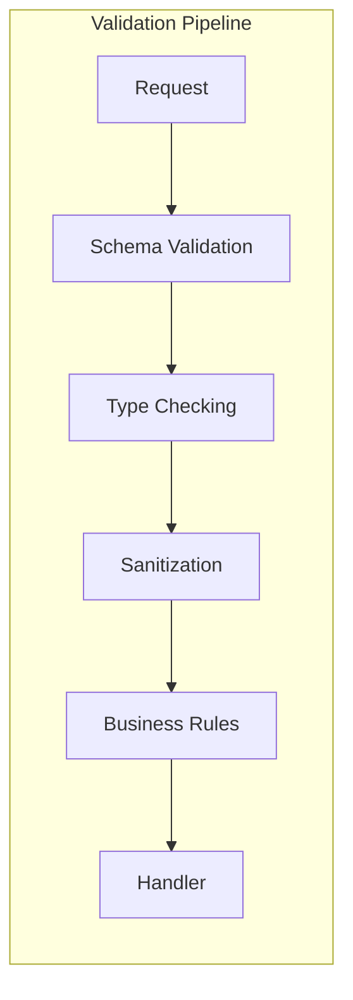

**Validation Example:**
```typescript
// Using Joi for validation
const studentRegistrationSchema = Joi.object({
  firstName: Joi.string().min(2).max(100).required()
    .pattern(/^[a-zA-Z\s'-]+$/),
  lastName: Joi.string().min(2).max(100).required()
    .pattern(/^[a-zA-Z\s'-]+$/),
  email: Joi.string().email().required(),
  phone: Joi.string().pattern(/^\+?[\d\s-]{10,15}$/),
  dateOfBirth: Joi.date().max('now').min('1900-01-01'),
  instituteId: Joi.string().uuid().required(),
  classIds: Joi.array().items(Joi.string().uuid()).min(1)
});
```

### 5.3 Rate Limiting Configuration

```typescript
const rateLimitConfig = {
  // General API rate limit
  api: {
    windowMs: 60 * 1000, // 1 minute
    max: 100, // requests per window
    message: 'Too many requests, please try again later'
  },
  
  // Authentication endpoints
  auth: {
    windowMs: 15 * 60 * 1000, // 15 minutes
    max: 5, // login attempts
    message: 'Too many login attempts, please try again later'
  },
  
  // NFC card validation (high frequency)
  cardValidation: {
    windowMs: 60 * 1000,
    max: 60, // per device
    keyGenerator: (req) => req.headers['x-device-id']
  },
  
  // Password reset
  passwordReset: {
    windowMs: 60 * 60 * 1000, // 1 hour
    max: 3,
    message: 'Too many password reset attempts'
  }
};
```

### 5.4 SQL Injection Prevention

```typescript
// Always use parameterized queries
// ❌ Bad - vulnerable to SQL injection
const badQuery = `SELECT * FROM users WHERE email = '${email}'`;

// ✅ Good - parameterized query
const goodQuery = await db.query(
  'SELECT * FROM users WHERE email = $1',
  [email]
);

// ✅ Good - using ORM
const user = await User.findOne({
  where: { email: email }
});
```

## 6. NFC Security

### 6.1 Card Authentication Flow

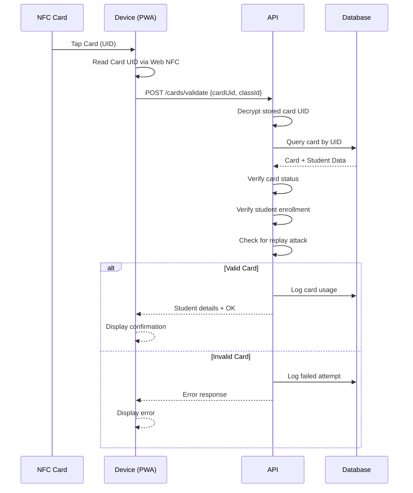

### 6.2 Card Security Measures

| Measure | Implementation |
|---------|----------------|
| UID Encryption | AES-256 encryption of stored UIDs |
| Replay Prevention | Timestamp + rate limiting |
| Card Binding | One card per student per institute |
| Status Tracking | Active, blocked, lost, expired states |
| Audit Trail | All card transactions logged |

### 6.3 Card Cloning Prevention

```typescript
// Detect potential card cloning
async function detectSuspiciousActivity(cardUid: string, deviceInfo: DeviceInfo) {
  const recentUsage = await CardTransaction.findAll({
    where: {
      cardUid,
      createdAt: { [Op.gte]: new Date(Date.now() - 5 * 60 * 1000) } // Last 5 mins
    }
  });
  
  // Check for usage from multiple locations
  const uniqueDevices = new Set(recentUsage.map(u => u.deviceId));
  if (uniqueDevices.size > 1) {
    await alertSecurityTeam({
      type: 'POTENTIAL_CARD_CLONE',
      cardUid,
      devices: Array.from(uniqueDevices)
    });
    return true;
  }
  
  // Check for unusually high frequency
  if (recentUsage.length > 5) {
    await alertSecurityTeam({
      type: 'HIGH_FREQUENCY_USAGE',
      cardUid,
      count: recentUsage.length
    });
    return true;
  }
  
  return false;
}
```

## 7. Session Security

### 7.1 Session Management

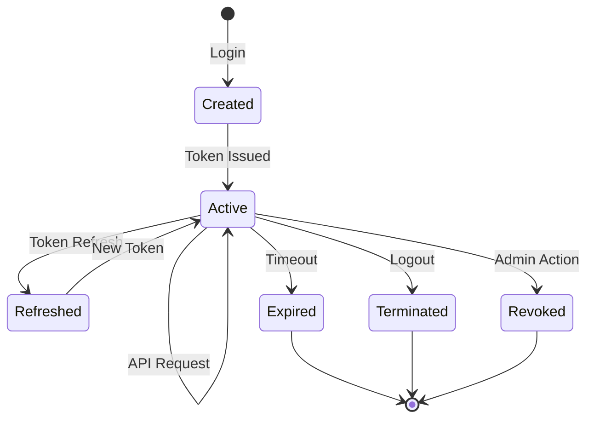

### 7.2 Session Configuration

```typescript
const sessionConfig = {
  // Session timeout
  maxAge: 24 * 60 * 60 * 1000, // 24 hours
  
  // Idle timeout
  idleTimeout: 30 * 60 * 1000, // 30 minutes
  
  // Maximum concurrent sessions
  maxConcurrentSessions: 3,
  
  // Session storage
  store: new RedisStore({
    client: redisClient,
    prefix: 'sess:',
    ttl: 86400
  }),
  
  // Cookie settings
  cookie: {
    secure: true,
    httpOnly: true,
    sameSite: 'strict',
    domain: '.ams.com'
  }
};
```

## 8. Audit & Logging

### 8.1 Audit Events

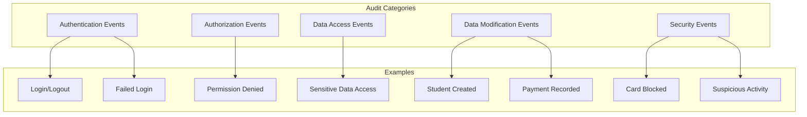

### 8.2 Audit Log Structure

```typescript
interface AuditLog {
  id: string;
  timestamp: Date;
  userId: string;
  userEmail: string;
  action: string;
  entityType: string;
  entityId: string;
  oldValue?: object;
  newValue?: object;
  ipAddress: string;
  userAgent: string;
  requestId: string;
  result: 'success' | 'failure';
  metadata?: object;
}

// Example audit log entry
{
  id: "audit_123",
  timestamp: "2026-02-14T10:30:00Z",
  userId: "user_456",
  userEmail: "admin@abc.edu",
  action: "PAYMENT_RECORDED",
  entityType: "payment",
  entityId: "payment_789",
  oldValue: null,
  newValue: {
    studentId: "student_101",
    amount: 5000,
    classId: "class_202"
  },
  ipAddress: "192.168.1.100",
  userAgent: "Mozilla/5.0...",
  requestId: "req_abc123",
  result: "success",
  metadata: {
    instituteId: "inst_303"
  }
}
```

### 8.3 Security Monitoring

```typescript
// Real-time security alerts
const securityAlerts = [
  {
    name: 'Multiple Failed Logins',
    condition: 'failedLogins > 5 in 15 minutes',
    action: 'lockAccount + notifyAdmin'
  },
  {
    name: 'Suspicious Card Activity',
    condition: 'cardUsage from multiple devices in 5 minutes',
    action: 'blockCard + notifyAdmin'
  },
  {
    name: 'Unusual Data Access',
    condition: 'bulk data export by non-admin',
    action: 'alert + requireVerification'
  },
  {
    name: 'After Hours Access',
    condition: 'admin access between 11PM-6AM',
    action: 'logAndAlert'
  }
];
```

## 9. Compliance & Privacy

### 9.1 Data Protection Principles

| Principle | Implementation |
|-----------|----------------|
| Data Minimization | Collect only necessary data |
| Purpose Limitation | Use data only for stated purposes |
| Storage Limitation | Retention policies enforced |
| Accuracy | Regular data validation |
| Integrity | Audit trails, checksums |
| Confidentiality | Encryption, access controls |

### 9.2 Data Retention Policy

```mermaid
graph LR
    subgraph "Retention Periods"
        A[Attendance Records] -->|7 years| AR[Archive/Delete]
        B[Payment Records] -->|10 years| PR[Archive/Delete]
        C[Audit Logs] -->|5 years| AL[Archive/Delete]
        D[Session Data] -->|30 days| SD[Delete]
        E[Inactive Accounts] -->|2 years| IA[Anonymize]
    end
```

### 9.3 Data Subject Rights

```typescript
// GDPR-style data export
async function exportStudentData(studentId: string): Promise<DataExport> {
  return {
    personalInfo: await Student.findById(studentId),
    enrollments: await StudentInstitute.findAll({ studentId }),
    classes: await StudentClass.findAll({ studentId }),
    attendance: await Attendance.findAll({ studentId }),
    payments: await Payment.findAll({ studentId }),
    cards: await NFCCard.findAll({ studentId }),
    auditLogs: await AuditLog.findAll({ 
      entityType: 'student',
      entityId: studentId
    })
  };
}

// Data deletion (right to be forgotten)
async function deleteStudentData(studentId: string): Promise<void> {
  await db.transaction(async (t) => {
    // Anonymize rather than delete for audit purposes
    await Student.update(
      { 
        firstName: 'DELETED',
        lastName: 'USER',
        email: `deleted_${studentId}@deleted.com`,
        phone: null,
        address: null
      },
      { where: { id: studentId }, transaction: t }
    );
    
    // Deactivate cards
    await NFCCard.update(
      { status: 'blocked' },
      { where: { studentId }, transaction: t }
    );
    
    // Log deletion
    await AuditLog.create({
      action: 'DATA_DELETION_REQUEST',
      entityType: 'student',
      entityId: studentId
    }, { transaction: t });
  });
}
```

## 10. Security Checklist

### 10.1 Development Security

- [ ] Input validation on all endpoints
- [ ] Parameterized database queries
- [ ] Secure password hashing (bcrypt)
- [ ] JWT with appropriate expiration
- [ ] HTTPS everywhere
- [ ] Security headers configured
- [ ] Dependencies regularly updated
- [ ] Code review for security issues

### 10.2 Deployment Security

- [ ] Environment variables for secrets
- [ ] Firewall rules configured
- [ ] Database access restricted
- [ ] Logging enabled
- [ ] Monitoring alerts configured
- [ ] Backup encryption enabled
- [ ] SSL certificates valid
- [ ] DDoS protection enabled

### 10.3 Operational Security

- [ ] Regular security audits
- [ ] Penetration testing (quarterly)
- [ ] Incident response plan
- [ ] Security training for staff
- [ ] Access review (monthly)
- [ ] Vulnerability scanning
- [ ] Log review (weekly)
- [ ] Backup restoration testing

---

**Previous:** [API Design](./api-design.md) | **Next:** [User Management Module](../modules/user-management.md)


<div style="page-break-after: always;"></div>

# 🏗️ System Architecture

> Comprehensive architectural design for the Attendance Management System

## 1. Architecture Overview

The AMS follows a **microservices-inspired modular monolith** architecture, designed to be scalable, maintainable, and secure. This approach provides the benefits of service separation while maintaining operational simplicity for the MVP phase.

### 1.1 High-Level Architecture Diagram

```mermaid
graph TB
    subgraph "Frontend Layer"
        direction LR
        PWA[📱 PWA<br/>Card Checker App]
        AdminUI[🖥️ Admin Portal<br/>React SPA]
        StudentUI[👨‍🎓 Student Portal<br/>React SPA]
    end

    subgraph "CDN & Load Balancer"
        CDN[☁️ CDN]
        LB[⚖️ Load Balancer]
    end

    subgraph "API Layer"
        APIGateway[🔐 API Gateway<br/>Authentication & Rate Limiting]
    end

    subgraph "Application Services"
        direction TB
        subgraph "Core Services"
            AuthSvc[🔑 Authentication<br/>Service]
            InstituteSvc[🏫 Institute<br/>Service]
            StudentSvc[👤 Student<br/>Service]
            ClassSvc[📚 Class<br/>Service]
        end
        
        subgraph "Business Services"
            NFCSvc[💳 NFC Card<br/>Service]
            AttendanceSvc[✅ Attendance<br/>Service]
            PaymentSvc[💰 Payment<br/>Service]
        end
        
        subgraph "Support Services"
            NotificationSvc[📧 Notification<br/>Service]
            ReportSvc[📊 Reporting<br/>Service]
            AuditSvc[📝 Audit<br/>Service]
        end
    end

    subgraph "Data Layer"
        PrimaryDB[(🐘 PostgreSQL<br/>Primary DB)]
        ReadReplica[(📖 PostgreSQL<br/>Read Replica)]
        CacheLayer[(⚡ Redis<br/>Cache & Sessions)]
        FileStorage[📁 Object Storage<br/>S3/MinIO]
    end

    subgraph "External Integrations"
        SMSProvider[📱 SMS Gateway<br/>Twilio/Local Provider]
        EmailProvider[📧 Email Service<br/>SendGrid/SES]
        NFCProvider[💳 NFC Hardware<br/>Integration]
    end

    subgraph "DevOps & Monitoring"
        Logs[📋 Centralized<br/>Logging]
        Metrics[📈 Metrics &<br/>Monitoring]
        Alerts[🚨 Alerting<br/>System]
    end

    PWA --> CDN
    AdminUI --> CDN
    StudentUI --> CDN
    CDN --> LB
    LB --> APIGateway

    APIGateway --> AuthSvc
    APIGateway --> InstituteSvc
    APIGateway --> StudentSvc
    APIGateway --> ClassSvc
    APIGateway --> NFCSvc
    APIGateway --> AttendanceSvc
    APIGateway --> PaymentSvc
    APIGateway --> ReportSvc

    AuthSvc --> PrimaryDB
    AuthSvc --> CacheLayer
    InstituteSvc --> PrimaryDB
    StudentSvc --> PrimaryDB
    ClassSvc --> PrimaryDB
    NFCSvc --> PrimaryDB
    AttendanceSvc --> PrimaryDB
    PaymentSvc --> PrimaryDB
    ReportSvc --> ReadReplica
    AuditSvc --> PrimaryDB

    PaymentSvc --> NotificationSvc
    AttendanceSvc --> NotificationSvc
    NotificationSvc --> SMSProvider
    NotificationSvc --> EmailProvider

    AuthSvc --> Logs
    InstituteSvc --> Logs
    StudentSvc --> Logs
    Logs --> Metrics
    Metrics --> Alerts
```

## 2. Component Architecture

### 2.1 Frontend Applications

```mermaid
graph LR
    subgraph "PWA - Card Checker App"
        PWAShell[App Shell]
        NFCReader[NFC Reader Module]
        AttendanceUI[Attendance UI]
        PaymentUI[Payment UI]
        OfflineSync[Offline Sync]
        ServiceWorker[Service Worker]
    end

    subgraph "Admin Portal"
        Dashboard[Dashboard]
        InstMgmt[Institute Management]
        UserMgmt[User Management]
        ClassMgmt[Class Management]
        Reports[Reports & Analytics]
        Settings[Settings]
    end

    subgraph "Student Portal"
        StudentDash[Dashboard]
        AttendanceHistory[Attendance History]
        PaymentHistory[Payment History]
        Profile[Profile Management]
    end
```

#### 2.1.1 PWA (Progressive Web App) Features

| Feature | Description | Technology |
|---------|-------------|------------|
| **Offline Support** | Works without internet connection | Service Workers, IndexedDB |
| **NFC Reading** | Read NFC cards via Web NFC API | Web NFC API |
| **Push Notifications** | Real-time updates | Web Push API |
| **Installable** | Add to home screen | Web App Manifest |
| **Background Sync** | Sync data when online | Background Sync API |

### 2.2 Backend Service Architecture

```mermaid
graph TB
    subgraph "API Gateway Layer"
        Gateway[API Gateway]
        RateLimiter[Rate Limiter]
        AuthMiddleware[Auth Middleware]
        RequestValidator[Request Validator]
    end

    subgraph "Authentication Service"
        JWTHandler[JWT Handler]
        SessionMgr[Session Manager]
        RoleMgr[Role Manager]
        PasswordHandler[Password Handler]
    end

    subgraph "Institute Service"
        InstCRUD[Institute CRUD]
        InstConfig[Configuration]
        InstUsers[User Assignment]
    end

    subgraph "Student Service"
        StudentCRUD[Student CRUD]
        Enrollment[Enrollment Manager]
        StudentSearch[Search & Filter]
    end

    subgraph "Class Service"
        ClassCRUD[Class CRUD]
        Schedule[Schedule Manager]
        ClassEnrollment[Class Enrollment]
    end

    subgraph "NFC Card Service"
        CardProvisioning[Card Provisioning]
        CardValidation[Card Validation]
        CardLinking[Student Linking]
        CardStatus[Status Management]
    end

    subgraph "Attendance Service"
        AttendanceRecord[Attendance Recording]
        AttendanceQuery[Query & Reports]
        RealTimeTracking[Real-time Tracking]
    end

    subgraph "Payment Service"
        FeeManagement[Fee Management]
        PaymentRecording[Payment Recording]
        PaymentHistory[Payment History]
        DueCalculation[Due Calculation]
    end

    subgraph "Notification Service"
        SMSHandler[SMS Handler]
        EmailHandler[Email Handler]
        TemplateEngine[Template Engine]
        NotificationQueue[Message Queue]
    end

    Gateway --> RateLimiter
    RateLimiter --> AuthMiddleware
    AuthMiddleware --> RequestValidator
    
    RequestValidator --> JWTHandler
    RequestValidator --> InstCRUD
    RequestValidator --> StudentCRUD
    RequestValidator --> ClassCRUD
    RequestValidator --> CardProvisioning
    RequestValidator --> AttendanceRecord
    RequestValidator --> FeeManagement
```

## 3. Data Flow Architecture

### 3.1 Student Registration Flow

```mermaid
sequenceDiagram
    participant S as Student
    participant A as Admin Portal
    participant API as API Gateway
    participant IS as Institute Service
    participant SS as Student Service
    participant NFC as NFC Card Service
    participant NS as Notification Service
    participant DB as Database

    S->>A: Submit Registration
    A->>API: POST /api/students/register
    API->>API: Validate & Authenticate
    API->>IS: Verify Institute
    IS->>DB: Check Institute Exists
    DB-->>IS: Institute Data
    IS-->>API: Institute Verified
    
    API->>SS: Create Student
    SS->>DB: Insert Student Record
    DB-->>SS: Student Created
    SS-->>API: Student ID
    
    API->>NFC: Provision NFC Card
    NFC->>NFC: Generate Unique Card ID
    NFC->>DB: Create Card Record
    NFC->>DB: Link Card to Student & Institute
    DB-->>NFC: Card Linked
    NFC-->>API: Card Details
    
    API->>NS: Send Welcome Notification
    NS->>NS: Queue SMS & Email
    NS-->>API: Notification Queued
    
    API-->>A: Registration Complete
    A-->>S: Display Success + Card Info
```

### 3.2 Attendance Check-in Flow

```mermaid
sequenceDiagram
    participant St as Student
    participant NFC as NFC Card
    participant PWA as PWA App
    participant API as API Gateway
    participant CS as Card Service
    participant AS as Attendance Service
    participant DB as Database
    participant Cache as Redis Cache

    St->>NFC: Tap Card
    NFC->>PWA: Card Data (UID)
    PWA->>PWA: Read Card via Web NFC
    
    PWA->>API: POST /api/attendance/checkin
    Note over PWA,API: {cardUID, classId, timestamp}
    
    API->>Cache: Check Card in Cache
    alt Card in Cache
        Cache-->>API: Card Data (cached)
    else Card not in Cache
        API->>CS: Validate Card
        CS->>DB: Query Card Details
        DB-->>CS: Card + Student Data
        CS->>Cache: Cache Card Data
        CS-->>API: Validated Card Data
    end
    
    API->>AS: Record Attendance
    AS->>AS: Validate Class Schedule
    AS->>AS: Check Duplicate Entry
    AS->>DB: Insert Attendance Record
    DB-->>AS: Record Created
    AS-->>API: Attendance Confirmed
    
    API-->>PWA: Success Response
    PWA-->>St: ✅ Check-in Confirmed
    Note over PWA: Display Student Name & Photo
```

### 3.3 Payment Processing Flow

```mermaid
sequenceDiagram
    participant CC as Card Checker
    participant PWA as PWA App
    participant API as API Gateway
    participant PS as Payment Service
    participant NS as Notification Service
    participant DB as Database
    participant SMS as SMS Gateway
    participant Email as Email Service

    CC->>PWA: Initiate Payment
    PWA->>API: GET /api/payments/dues/{studentId}/{classId}
    API->>PS: Get Outstanding Dues
    PS->>DB: Query Payment Status
    DB-->>PS: Due Amount
    PS-->>API: Due Details
    API-->>PWA: Display Dues
    
    CC->>PWA: Record Payment
    PWA->>API: POST /api/payments/record
    Note over PWA,API: {studentId, classId, amount, method}
    
    API->>PS: Process Payment
    PS->>PS: Validate Amount
    PS->>DB: Create Payment Record
    PS->>DB: Update Payment Status
    DB-->>PS: Payment Recorded
    
    PS->>NS: Trigger Notifications
    
    par Send SMS
        NS->>SMS: Send Payment SMS
        SMS-->>NS: SMS Sent
    and Send Email
        NS->>Email: Send Payment Email
        Email-->>NS: Email Sent
    end
    
    NS-->>PS: Notifications Sent
    PS-->>API: Payment Complete
    API-->>PWA: Success + Receipt
    PWA-->>CC: Display Confirmation
```

## 4. Deployment Architecture

### 4.1 Cloud Deployment Diagram

```mermaid
graph TB
    subgraph "Internet"
        Users[👥 Users]
        Mobile[📱 Mobile Devices]
    end

    subgraph "Edge Layer"
        CloudFlare[☁️ CloudFlare CDN]
        WAF[🛡️ Web Application Firewall]
    end

    subgraph "Cloud Provider (AWS/GCP/Azure)"
        subgraph "Public Subnet"
            ALB[⚖️ Application Load Balancer]
        end
        
        subgraph "Private Subnet - App Tier"
            AppServer1[🖥️ App Server 1]
            AppServer2[🖥️ App Server 2]
            AppServerN[🖥️ App Server N]
        end
        
        subgraph "Private Subnet - Data Tier"
            RDSPrimary[(🐘 RDS Primary)]
            RDSReplica[(📖 RDS Replica)]
            ElastiCache[(⚡ ElastiCache Redis)]
            S3[📁 S3 Bucket]
        end
        
        subgraph "Management"
            Bastion[🔐 Bastion Host]
            CloudWatch[📊 CloudWatch]
            SNS[📧 SNS]
        end
    end

    subgraph "External Services"
        Twilio[📱 Twilio SMS]
        SendGrid[📧 SendGrid]
    end

    Users --> CloudFlare
    Mobile --> CloudFlare
    CloudFlare --> WAF
    WAF --> ALB
    ALB --> AppServer1
    ALB --> AppServer2
    ALB --> AppServerN
    
    AppServer1 --> RDSPrimary
    AppServer2 --> RDSPrimary
    AppServerN --> RDSPrimary
    
    AppServer1 --> ElastiCache
    AppServer2 --> ElastiCache
    AppServerN --> ElastiCache
    
    RDSPrimary --> RDSReplica
    
    AppServer1 --> S3
    AppServer1 --> Twilio
    AppServer1 --> SendGrid
    
    AppServer1 --> CloudWatch
    CloudWatch --> SNS
```

### 4.2 Container Architecture (Docker/Kubernetes)

```mermaid
graph TB
    subgraph "Kubernetes Cluster"
        subgraph "Ingress"
            Nginx[Nginx Ingress Controller]
        end
        
        subgraph "Application Namespace"
            subgraph "Frontend Pods"
                AdminPod[Admin Portal Pod]
                StudentPod[Student Portal Pod]
                PWAPod[PWA Pod]
            end
            
            subgraph "Backend Pods"
                APIPod1[API Pod 1]
                APIPod2[API Pod 2]
                APIPod3[API Pod 3]
            end
            
            subgraph "Worker Pods"
                NotificationWorker[Notification Worker]
                ReportWorker[Report Worker]
            end
        end
        
        subgraph "Data Namespace"
            PostgresPod[(PostgreSQL StatefulSet)]
            RedisPod[(Redis StatefulSet)]
        end
        
        subgraph "Monitoring Namespace"
            Prometheus[Prometheus]
            Grafana[Grafana]
            Loki[Loki]
        end
    end

    Nginx --> AdminPod
    Nginx --> StudentPod
    Nginx --> PWAPod
    Nginx --> APIPod1
    Nginx --> APIPod2
    Nginx --> APIPod3
    
    APIPod1 --> PostgresPod
    APIPod1 --> RedisPod
    APIPod2 --> PostgresPod
    APIPod2 --> RedisPod
    APIPod3 --> PostgresPod
    APIPod3 --> RedisPod
    
    NotificationWorker --> RedisPod
    ReportWorker --> PostgresPod
```

## 5. Security Architecture

### 5.1 Security Layers

```mermaid
graph TB
    subgraph "Perimeter Security"
        WAF[Web Application Firewall]
        DDoS[DDoS Protection]
        SSL[SSL/TLS Termination]
    end
    
    subgraph "Application Security"
        Auth[Authentication Layer]
        RBAC[Role-Based Access Control]
        InputVal[Input Validation]
        RateLimit[Rate Limiting]
    end
    
    subgraph "Data Security"
        Encryption[Data Encryption at Rest]
        TLS[Data Encryption in Transit]
        Masking[Data Masking]
        Backup[Encrypted Backups]
    end
    
    subgraph "Infrastructure Security"
        VPC[VPC Isolation]
        SG[Security Groups]
        IAM[IAM Policies]
        Audit[Audit Logging]
    end
    
    WAF --> Auth
    DDoS --> Auth
    SSL --> Auth
    
    Auth --> Encryption
    RBAC --> Encryption
    InputVal --> Encryption
    RateLimit --> Encryption
    
    Encryption --> VPC
    TLS --> VPC
    Masking --> VPC
    Backup --> VPC
```

### 5.2 Authentication Flow

```mermaid
sequenceDiagram
    participant U as User
    participant C as Client App
    participant AG as API Gateway
    participant AS as Auth Service
    participant DB as Database
    participant R as Redis

    U->>C: Enter Credentials
    C->>AG: POST /auth/login
    AG->>AS: Validate Credentials
    AS->>DB: Query User
    DB-->>AS: User Data
    AS->>AS: Verify Password (bcrypt)
    
    alt Valid Credentials
        AS->>AS: Generate JWT Token
        AS->>AS: Generate Refresh Token
        AS->>R: Store Session
        AS-->>AG: Tokens + User Info
        AG-->>C: 200 OK + Tokens
        C->>C: Store Tokens Securely
        C-->>U: Login Success
    else Invalid Credentials
        AS-->>AG: Authentication Failed
        AG-->>C: 401 Unauthorized
        C-->>U: Login Failed
    end
```

## 6. Integration Architecture

### 6.1 External Service Integration

```mermaid
graph LR
    subgraph "AMS Core"
        NS[Notification Service]
        PS[Payment Service]
        RS[Reporting Service]
    end
    
    subgraph "SMS Providers"
        Twilio[Twilio]
        LocalSMS[Local SMS Provider]
    end
    
    subgraph "Email Providers"
        SendGrid[SendGrid]
        SES[AWS SES]
    end
    
    subgraph "Analytics"
        GA[Google Analytics]
        Mixpanel[Mixpanel]
    end
    
    NS -->|Primary| Twilio
    NS -->|Fallback| LocalSMS
    NS -->|Primary| SendGrid
    NS -->|Fallback| SES
    
    RS --> GA
    RS --> Mixpanel
```

## 7. Scalability Considerations

### 7.1 Horizontal Scaling Strategy

| Component | Scaling Strategy | Trigger |
|-----------|------------------|---------|
| API Servers | Auto-scaling group | CPU > 70% |
| Database | Read replicas | Read load > threshold |
| Cache | Redis Cluster | Memory > 80% |
| Workers | Queue-based scaling | Queue depth |

### 7.2 Performance Targets

| Metric | Target | Maximum |
|--------|--------|---------|
| API Response Time | < 200ms | 500ms |
| NFC Tap to Confirm | < 1s | 2s |
| Concurrent Users | 1000 | 5000 |
| Transactions/second | 100 | 500 |

## 8. Technology Stack Summary

| Layer | Technology | Justification |
|-------|------------|---------------|
| Frontend | React + TypeScript | Type safety, ecosystem |
| PWA | Workbox + Web NFC | Offline support, NFC |
| Backend | Node.js + Express | Performance, ecosystem |
| Database | PostgreSQL | ACID, JSON support |
| Cache | Redis | Speed, pub/sub |
| Queue | Bull (Redis) | Reliable job processing |
| Auth | JWT + bcrypt | Stateless, secure |
| Deployment | Docker + K8s | Scalability, portability |

---

**Next:** [Database Design](./database-design.md) | [API Design](./api-design.md)


<div style="page-break-after: always;"></div>

# 🏫 Admin Guide

> Institute administrator guide for AMS

## 1. Getting Started

### 1.1 Accessing Admin Portal
1. Go to `https://admin.ams.com`
2. Login with admin credentials
3. Select your institute

## 2. Dashboard Overview

```mermaid
graph TB
    subgraph "Admin Dashboard"
        Stats[Statistics]
        Students[Student Management]
        Classes[Class Management]
        Cards[Card Management]
        Reports[Reports]
        Settings[Settings]
    end
```

## 3. Student Management

### 3.1 Registering a New Student

```mermaid
sequenceDiagram
    participant A as Admin
    participant S as System
    
    A->>S: Click "Add Student"
    A->>S: Fill student details
    A->>S: Select classes
    S->>S: Create student account
    S->>S: Generate student code
    A->>S: Issue NFC card
    S->>S: Send welcome message
```

**Required Information:**
- First name, Last name
- Email, Phone
- Date of birth
- Guardian name and contact
- Address
- Classes to enroll

### 3.2 Managing Students
- View all students
- Edit student information
- Manage class enrollment
- View attendance/payment history
- Deactivate student

## 4. Class Management

### 4.1 Creating a Class
1. Go to Classes > Create Class
2. Enter class details:
   - Name and code
   - Description
   - Schedule (days and times)
   - Instructor
   - Room/Location
   - Capacity

### 4.2 Setting Up Fees
1. Open class settings
2. Go to "Fees" tab
3. Add fee structure:
   - Fee name
   - Amount
   - Frequency (monthly, etc.)
   - Due day

### 4.3 Managing Enrollment
- Add students to class
- Remove students
- View enrolled students
- Transfer students

## 5. NFC Card Management

### 5.1 Issuing Cards
1. Go to Cards > Issue Card
2. Select student
3. Tap new NFC card to reader
4. Confirm card details
5. Activate card

### 5.2 Card Operations
| Action | When to Use |
|--------|-------------|
| **Block** | Security concern |
| **Unblock** | Issue resolved |
| **Replace** | Lost/damaged card |
| **Deactivate** | Student left |

## 6. User Management

### 6.1 Adding Staff
1. Go to Users > Add User
2. Enter user details
3. Assign role:
   - Admin
   - Card Checker
   - Instructor

### 6.2 Managing Permissions
- View user list
- Edit user roles
- Deactivate users
- Reset passwords

## 7. Reports

### 7.1 Available Reports

| Report | Description |
|--------|-------------|
| **Attendance Summary** | Daily/weekly/monthly attendance |
| **Payment Collection** | Fee collection summary |
| **Outstanding Dues** | Pending payments |
| **Student Roster** | All enrolled students |
| **Card Inventory** | NFC card status |

### 7.2 Generating Reports
1. Go to Reports
2. Select report type
3. Choose filters (date range, class, etc.)
4. Click Generate
5. Export as PDF/CSV

## 8. Institute Settings

### 8.1 General Settings
- Institute name and logo
- Contact information
- Timezone and locale

### 8.2 Notification Settings
- SMS provider configuration
- Email settings
- Reminder schedules

### 8.3 Attendance Settings
- Late threshold (minutes)
- Allow manual entry
- Require notes for manual

### 8.4 Payment Settings
- Accepted payment methods
- Reminder days before due
- Receipt format

## 9. Common Tasks

### 9.1 Daily Tasks
- ✅ Review attendance summary
- ✅ Check payment collections
- ✅ Follow up on alerts

### 9.2 Weekly Tasks
- ✅ Generate attendance reports
- ✅ Review outstanding dues
- ✅ Send payment reminders

### 9.3 Monthly Tasks
- ✅ Full financial report
- ✅ User access review
- ✅ Card expiry check

## 10. Troubleshooting

### Common Issues

| Issue | Solution |
|-------|----------|
| Student can't login | Reset password |
| Card not working | Check card status, reissue if needed |
| Payment not showing | Check transaction logs |
| Report not generating | Try smaller date range |

---

**Back to:** [Documentation Home](../README.md)


<div style="page-break-after: always;"></div>

# 📋 Card Checker Guide

> How to use the AMS PWA for attendance and payment recording

## 1. Getting Started

### 1.1 Installing the PWA

1. Open Chrome on your Android device
2. Navigate to `https://checker.ams.com`
3. Login with your credentials
4. Click "Add to Home Screen" when prompted
5. The app will be installed on your device

### 1.2 Requirements

| Requirement | Details |
|-------------|---------|
| **Device** | Android phone with NFC |
| **Browser** | Chrome 89+ |
| **Permissions** | NFC, Notifications |

## 2. Main Interface

```mermaid
graph TB
    subgraph "PWA Interface"
        ClassSelect[Select Class]
        NFCReader[NFC Reader Area]
        AttendanceList[Attendance List]
        PaymentBtn[Payment Button]
    end
```

## 3. Recording Attendance

### 3.1 Setup
1. Open the PWA app
2. Select your institute (if multiple)
3. Select the class you're checking

### 3.2 Taking Attendance

```mermaid
sequenceDiagram
    participant S as Student
    participant A as App
    
    A->>A: Click "Start Scanner"
    Note over A: NFC reader active
    S->>A: Student taps card
    A->>A: Validates card
    A->>A: Shows student info
    A->>A: Records attendance
    Note over A: Ready for next student
```

### 3.3 Status Indicators

| Color | Status |
|-------|--------|
| 🟢 Green | Present (on time) |
| 🟡 Yellow | Late |
| 🔴 Red | Error/Invalid |

### 3.4 Manual Entry
If a student forgot their card:
1. Click "Manual Entry"
2. Search for the student
3. Select the student
4. Choose attendance status
5. Add a note (required)
6. Submit

## 4. Recording Payments

### 4.1 Payment Flow

1. Tap student's NFC card
2. Click "Record Payment"
3. View outstanding dues
4. Select fee to pay
5. Enter amount received
6. Select payment method
7. Submit payment
8. Student receives SMS/Email

### 4.2 Payment Methods

- Cash
- Card
- Bank Transfer
- Online

### 4.3 After Payment
- Show receipt to student
- Option to print/share receipt
- Notification sent automatically

## 5. Viewing Records

### 5.1 Today's Attendance
- Real-time attendance list
- Summary counts
- Filter by status

### 5.2 Payment Records
- Today's collections
- Total amount
- Payment breakdown

## 6. Offline Mode

### 6.1 Working Offline
The app works without internet:
1. Continue taking attendance
2. Data stored locally
3. Auto-syncs when online

### 6.2 Sync Status
- 🟢 Online - synced
- 🟡 Pending sync
- 🔴 Sync error

## 7. Troubleshooting

### 7.1 NFC Not Working
1. Ensure NFC is enabled in device settings
2. Check app has NFC permission
3. Hold card steady for 1-2 seconds
4. Try different card position

### 7.2 Card Not Recognized
- Card may be inactive
- Student may not be enrolled
- Contact administrator

### 7.3 App Issues
1. Try refreshing the app
2. Clear browser cache
3. Reinstall from website

## 8. Best Practices

### 8.1 Before Class
- ✅ Charge your device
- ✅ Test NFC reader
- ✅ Ensure app is updated
- ✅ Check internet connection

### 8.2 During Class
- ✅ Keep app open and active
- ✅ Maintain stable position for tapping
- ✅ Verify student name matches

### 8.3 After Class
- ✅ Review attendance list
- ✅ Ensure all payments recorded
- ✅ Check sync status

---

**Back to:** [Documentation Home](../README.md)


<div style="page-break-after: always;"></div>

# 👨‍🎓 Student Guide

> How to use the AMS Student Portal

## 1. Getting Started

### 1.1 Accessing the Portal

1. Open your web browser
2. Go to `https://student.ams.com`
3. Enter your credentials (email and password)
4. Click "Login"

### 1.2 First Login

When logging in for the first time:
1. Use the temporary password provided by your institute
2. You'll be prompted to change your password
3. Complete your profile information

## 2. Dashboard Overview

```mermaid
graph TB
    subgraph "Student Dashboard"
        Profile[Your Profile]
        Classes[Your Classes]
        Attendance[Attendance History]
        Payments[Payment History]
    end
```

### 2.1 Dashboard Features

| Section | Description |
|---------|-------------|
| **Overview** | Quick stats on attendance and payments |
| **Classes** | List of enrolled classes |
| **Attendance** | View your attendance records |
| **Payments** | View payment history and dues |
| **Profile** | Update your personal information |

## 3. Viewing Attendance

### 3.1 Attendance Summary
- View overall attendance rate
- See attendance by class
- Check monthly breakdown

### 3.2 Detailed Records
- Filter by class and date range
- See check-in times
- View attendance status (Present/Late/Absent)

## 4. Payment History

### 4.1 Viewing Payments
- See all past payments
- Download receipts
- View payment details

### 4.2 Outstanding Dues
- Check current dues
- See due dates
- View payment reminders

## 5. Your NFC Card

### 5.1 Card Information
- View card status
- See card expiry date
- Report lost card

### 5.2 Using Your Card
1. Bring your card to class
2. Tap on the NFC reader when prompted
3. Wait for confirmation beep/message
4. Your attendance is recorded!

## 6. Profile Management

### 6.1 Update Profile
- Change password
- Update contact information
- Set notification preferences

## 7. Getting Help

Contact your institute administrator for:
- Password reset issues
- Card replacement
- Payment queries
- Attendance corrections

---

**Back to:** [Documentation Home](../README.md)


<div style="page-break-after: always;"></div>

# 👑 Super Admin Guide

> System-wide administration guide for AMS developers

## 1. Overview

The Super Admin role provides full system access for developers and system administrators to manage the entire AMS platform.

## 2. Access & Authentication

### 2.1 Super Admin Portal
- URL: `https://superadmin.ams.com`
- Requires 2FA authentication
- Audit logged for all actions

### 2.2 Capabilities

```mermaid
graph TB
    subgraph "Super Admin Access"
        Institutes[All Institutes]
        Users[All Users]
        System[System Config]
        Logs[Audit Logs]
        Monitoring[System Monitoring]
    end
```

## 3. Institute Management

### 3.1 Creating an Institute
1. Go to Institutes > Create
2. Fill in institute details:
   - Name and unique code
   - Contact information
   - Initial settings
3. Create first admin user
4. Activate institute

### 3.2 Institute Operations

| Operation | Description |
|-----------|-------------|
| **Create** | New institute setup |
| **Suspend** | Temporarily disable |
| **Reactivate** | Re-enable suspended |
| **Deactivate** | Permanently disable |
| **Delete** | Remove with data archival |

### 3.3 Institute Settings Override
- Override any institute setting
- Set global defaults
- Configure feature flags

## 4. User Management

### 4.1 Global User Search
- Search across all institutes
- View user's institute memberships
- Impersonate user (for debugging)

### 4.2 User Operations
- Reset any user's password
- Unlock locked accounts
- Revoke all sessions
- Delete user data (GDPR)

## 5. System Configuration

### 5.1 Global Settings
```yaml
# System configuration
system:
  maintenance_mode: false
  registration_enabled: true
  max_institutes: 100
  
notifications:
  global_sms_enabled: true
  global_email_enabled: true
  
security:
  max_login_attempts: 5
  lockout_duration_minutes: 30
  session_timeout_hours: 24
  require_2fa_for_admins: true
```

### 5.2 Feature Flags
| Flag | Description |
|------|-------------|
| `ENABLE_PWA` | PWA functionality |
| `ENABLE_OFFLINE_MODE` | Offline support |
| `ENABLE_SMS_NOTIFICATIONS` | SMS sending |
| `ENABLE_EMAIL_NOTIFICATIONS` | Email sending |
| `ENABLE_REPORTING` | Report generation |

## 6. Monitoring & Logs

### 6.1 System Health Dashboard
- Service status
- Database connections
- Queue depths
- Error rates

### 6.2 Audit Logs
- All admin actions logged
- User activity tracking
- Security events
- Data access logs

### 6.3 Search Audit Logs
```
Filter by:
- User
- Action type
- Entity type
- Date range
- Institute
```

## 7. Database Operations

### 7.1 Backup & Restore
- Schedule automated backups
- Trigger manual backup
- Restore from backup
- Export institute data

### 7.2 Data Maintenance
- Archive old records
- Clean up expired sessions
- Purge audit logs (>retention)

## 8. Integration Management

### 8.1 SMS Providers
- Configure Twilio credentials
- Set up local SMS providers
- Test SMS delivery
- Monitor delivery rates

### 8.2 Email Providers
- Configure SMTP/SendGrid
- Test email delivery
- Manage email templates

## 9. Security Management

### 9.1 Security Dashboard
- Failed login attempts
- Blocked IPs
- Suspicious activities
- Active threats

### 9.2 Security Actions
| Action | Use Case |
|--------|----------|
| Block IP | Malicious activity |
| Force logout all | Security breach |
| Disable 2FA | User locked out |
| Reset rate limits | Testing |

## 10. API Management

### 10.1 API Keys
- Generate API keys
- Set rate limits per key
- Revoke compromised keys
- Monitor API usage

### 10.2 Webhooks
- Configure webhook endpoints
- Test webhook delivery
- View webhook logs

## 11. Maintenance Operations

### 11.1 Maintenance Mode
```
Steps to enable:
1. Go to System > Maintenance
2. Set maintenance message
3. Enable maintenance mode
4. All users see maintenance page
```

### 11.2 System Updates
- View current version
- Check for updates
- Schedule update window
- Rollback if needed

## 12. Troubleshooting

### 12.1 Common Issues

| Issue | Investigation |
|-------|---------------|
| High error rates | Check logs, recent deployments |
| Slow performance | Database queries, cache hits |
| Failed notifications | Provider status, credentials |
| Login issues | Session store, auth service |

### 12.2 Debug Tools
- Request tracing
- Log aggregation
- Performance profiling
- Database query analysis

---

**Back to:** [Documentation Home](../README.md)


<div style="page-break-after: always;"></div>

# ✅ Attendance Module

> Class-wise attendance tracking and management for AMS

## 1. Module Overview

The Attendance Module enables real-time tracking of student attendance using NFC cards. Card checkers use the PWA application to record attendance when students tap their cards at the beginning of each class.

```mermaid
graph TB
    subgraph "Attendance Module"
        Record[Record Attendance]
        View[View Attendance]
        Reports[Reports & Analytics]
        Alerts[Attendance Alerts]
    end
    
    subgraph "Dependencies"
        NFC[NFC Card Module]
        Student[Student Module]
        Class[Class Module]
        Notification[Notification Module]
    end
    
    NFC --> Record
    Student --> Record
    Class --> Record
    Record --> View
    View --> Reports
    Reports --> Alerts
    Alerts --> Notification
```

## 2. Attendance Data Model

### 2.1 Attendance Entity

```typescript
interface Attendance {
  id: string;
  studentId: string;
  classId: string;
  nfcCardId: string;
  checkedBy: string;          // Card checker user ID
  
  attendanceDate: Date;       // Date portion only
  checkInTime: Date;          // Full timestamp
  checkOutTime?: Date;        // Optional checkout
  
  status: AttendanceStatus;
  deviceInfo: DeviceInfo;
  notes?: string;
  
  createdAt: Date;
  updatedAt: Date;
}

enum AttendanceStatus {
  PRESENT = 'present',
  LATE = 'late',
  EXCUSED = 'excused',
  ABSENT = 'absent'
}

interface DeviceInfo {
  deviceId: string;
  deviceType: string;         // 'mobile', 'tablet'
  browser: string;
  platform: string;
  ipAddress: string;
}
```

## 3. Attendance Recording Flow

### 3.1 NFC Check-in Flow

```mermaid
sequenceDiagram
    participant S as Student
    participant NFC as NFC Card
    participant PWA as PWA App
    participant API as API Server
    participant AS as Attendance Service
    participant DB as Database
    participant WS as WebSocket

    Note over PWA: Card checker has class selected
    
    S->>NFC: Tap Card
    NFC->>PWA: Card UID
    PWA->>API: POST /attendance/checkin
    Note over PWA,API: {cardUid, classId, deviceInfo}
    
    API->>AS: Process Check-in
    AS->>DB: Validate Card
    DB-->>AS: Card + Student Data
    
    AS->>AS: Check Class Schedule
    AS->>AS: Determine Status (Present/Late)
    
    AS->>DB: Check Duplicate
    alt Already Checked In
        AS-->>API: Duplicate Entry
        API-->>PWA: Already recorded
    end
    
    AS->>DB: Insert Attendance Record
    DB-->>AS: Record Created
    
    AS->>WS: Broadcast Update
    Note over WS: Real-time UI update
    
    AS-->>API: Attendance Recorded
    API-->>PWA: Success + Student Info
    PWA->>PWA: Display Confirmation
    PWA->>PWA: Play Success Sound
```

### 3.2 Late Detection Logic

```typescript
function determineAttendanceStatus(
  checkInTime: Date,
  classSchedule: ClassSchedule,
  instituteSettings: InstituteSettings
): AttendanceStatus {
  const classStartTime = parseTime(classSchedule.startTime);
  const lateThreshold = instituteSettings.attendance.lateThresholdMinutes;
  
  const checkInMinutes = getMinutesFromMidnight(checkInTime);
  const classStartMinutes = getMinutesFromMidnight(classStartTime);
  
  const minutesLate = checkInMinutes - classStartMinutes;
  
  if (minutesLate <= 0) {
    return AttendanceStatus.PRESENT;
  } else if (minutesLate <= lateThreshold) {
    return AttendanceStatus.LATE;
  } else {
    // Still mark as late but flag for review
    return AttendanceStatus.LATE;
  }
}
```

## 4. PWA Attendance Interface

### 4.1 Card Checker Dashboard

```mermaid
graph TB
    subgraph "PWA Dashboard"
        subgraph "Header"
            ClassSelect[Class Selector]
            DateTime[Current Date/Time]
        end
        
        subgraph "Main Area"
            NFCStatus[NFC Reader Status]
            LastCheckin[Last Check-in Display]
            StudentPhoto[Student Photo]
            StudentName[Student Name]
            CheckinStatus[Status: Present/Late]
        end
        
        subgraph "Sidebar"
            AttendanceCount[Attendance Count]
            PresentList[Present Students]
            AbsentList[Absent Students]
        end
        
        subgraph "Actions"
            ManualEntry[Manual Entry]
            MarkAbsent[Mark Absent]
            PaymentBtn[Record Payment]
        end
    end
```

### 4.2 Real-time Attendance List

```typescript
// React component for real-time attendance list
function AttendanceList({ classId }: { classId: string }) {
  const [attendance, setAttendance] = useState<AttendanceRecord[]>([]);
  const [summary, setSummary] = useState<AttendanceSummary | null>(null);

  // WebSocket for real-time updates
  useEffect(() => {
    const socket = connectWebSocket();
    
    socket.on('attendance:checkin', (data: AttendanceRecord) => {
      if (data.classId === classId) {
        setAttendance(prev => [data, ...prev]);
        updateSummary(data);
      }
    });

    return () => socket.disconnect();
  }, [classId]);

  // Initial load
  useEffect(() => {
    async function loadAttendance() {
      const response = await api.get(`/attendance/class/${classId}/today`);
      setAttendance(response.data.records);
      setSummary(response.data.summary);
    }
    loadAttendance();
  }, [classId]);

  return (
    <div className="attendance-list">
      <div className="summary">
        <div className="stat present">
          <span className="count">{summary?.present || 0}</span>
          <span className="label">Present</span>
        </div>
        <div className="stat late">
          <span className="count">{summary?.late || 0}</span>
          <span className="label">Late</span>
        </div>
        <div className="stat absent">
          <span className="count">{summary?.absent || 0}</span>
          <span className="label">Absent</span>
        </div>
      </div>

      <div className="list">
        {attendance.map(record => (
          <AttendanceCard key={record.id} record={record} />
        ))}
      </div>
    </div>
  );
}
```

## 5. Manual Attendance Entry

### 5.1 Manual Entry Flow

```mermaid
sequenceDiagram
    participant CC as Card Checker
    participant PWA as PWA App
    participant API as API Server
    participant AS as Attendance Service
    participant DB as Database

    CC->>PWA: Click Manual Entry
    PWA->>PWA: Show Student Search
    CC->>PWA: Search/Select Student
    
    PWA->>API: POST /attendance/manual
    Note over PWA,API: {studentId, classId, status, reason}
    
    API->>AS: Process Manual Entry
    AS->>AS: Verify Manual Entry Allowed
    AS->>AS: Verify Student Enrollment
    AS->>DB: Check Duplicate
    
    AS->>DB: Insert with Manual Flag
    AS-->>API: Attendance Recorded
    API-->>PWA: Success
    PWA-->>CC: Confirmation
```

### 5.2 Manual Entry Restrictions

| Setting | Default | Description |
|---------|---------|-------------|
| Allow Manual Entry | true | Enable/disable manual entry |
| Require Reason | true | Must provide reason for manual |
| Max Per Day | 5 | Limit manual entries per checker |
| Admin Override | true | Admins can always enter manually |

## 6. Attendance Reports

### 6.1 Daily Attendance Report

```typescript
interface DailyAttendanceReport {
  date: string;
  class: {
    id: string;
    name: string;
    scheduledTime: string;
  };
  summary: {
    enrolled: number;
    present: number;
    late: number;
    absent: number;
    excused: number;
    attendanceRate: number;
  };
  records: Array<{
    studentId: string;
    studentCode: string;
    studentName: string;
    checkInTime: string;
    status: AttendanceStatus;
    method: 'nfc' | 'manual';
  }>;
  absentStudents: Array<{
    studentId: string;
    studentCode: string;
    studentName: string;
    guardianPhone: string;
  }>;
}
```

### 6.2 Student Attendance Report

```typescript
interface StudentAttendanceReport {
  student: {
    id: string;
    studentCode: string;
    name: string;
  };
  period: {
    startDate: string;
    endDate: string;
  };
  summary: {
    totalClasses: number;
    present: number;
    late: number;
    absent: number;
    excused: number;
    attendanceRate: number;
    lateRate: number;
  };
  byClass: Array<{
    classId: string;
    className: string;
    totalSessions: number;
    attended: number;
    attendanceRate: number;
  }>;
  timeline: Array<{
    date: string;
    className: string;
    status: AttendanceStatus;
    checkInTime?: string;
  }>;
}
```

### 6.3 Attendance Trends

```mermaid
graph LR
    subgraph "Attendance Analytics"
        D[Daily Rates]
        W[Weekly Trends]
        M[Monthly Summary]
        C[Class Comparison]
        S[Student Patterns]
    end
```

## 7. Attendance Alerts

### 7.1 Alert Types

| Alert | Trigger | Action |
|-------|---------|--------|
| Low Attendance | Class attendance < 70% | Notify Admin |
| Chronic Absence | Student absent 3+ consecutive days | Notify Guardian |
| Late Pattern | Student late 5+ times in month | Flag for Review |
| No Show | Student enrolled but never attended | Admin Review |

### 7.2 Alert Configuration

```typescript
const attendanceAlertConfig = {
  lowAttendanceThreshold: 70,      // Percentage
  chronicAbsenceDays: 3,           // Consecutive days
  latePatternCount: 5,             // Times per month
  noShowDays: 7,                   // Days since enrollment
  
  notifications: {
    lowAttendance: {
      recipients: ['institute_admin'],
      channels: ['email', 'in_app']
    },
    chronicAbsence: {
      recipients: ['guardian', 'institute_admin'],
      channels: ['sms', 'email']
    },
    latePattern: {
      recipients: ['guardian'],
      channels: ['sms']
    }
  }
};
```

## 8. Offline Support

### 8.1 Offline Check-in Flow

```mermaid
sequenceDiagram
    participant S as Student
    participant PWA as PWA (Offline)
    participant IDB as IndexedDB
    participant SW as Service Worker
    participant API as API Server

    Note over PWA: Device is offline
    
    S->>PWA: Tap NFC Card
    PWA->>PWA: Read Card UID
    PWA->>IDB: Store Pending Attendance
    PWA->>PWA: Show Offline Confirmation
    
    Note over PWA,SW: Device comes online
    
    SW->>SW: Background Sync Triggered
    SW->>IDB: Get Pending Records
    IDB-->>SW: Pending Attendance
    
    SW->>API: POST /attendance/batch
    API-->>SW: Synced Successfully
    
    SW->>IDB: Clear Pending Records
    SW->>PWA: Update UI
```

### 8.2 Offline Storage Schema

```typescript
// IndexedDB schema for offline attendance
const offlineAttendanceSchema = {
  storeName: 'pendingAttendance',
  keyPath: 'localId',
  indexes: [
    { name: 'classId', keyPath: 'classId' },
    { name: 'timestamp', keyPath: 'timestamp' },
    { name: 'synced', keyPath: 'synced' }
  ]
};

interface PendingAttendance {
  localId: string;           // Local UUID
  cardUid: string;
  classId: string;
  timestamp: Date;
  deviceInfo: DeviceInfo;
  synced: boolean;
  syncAttempts: number;
  lastSyncAttempt?: Date;
  syncError?: string;
}
```

## 9. API Endpoints

| Endpoint | Method | Description | Access |
|----------|--------|-------------|--------|
| `/attendance/checkin` | POST | Record NFC check-in | Card Checker |
| `/attendance/manual` | POST | Manual attendance entry | Card Checker |
| `/attendance/batch` | POST | Sync offline records | Card Checker |
| `/attendance/class/:id/today` | GET | Today's attendance | Card Checker |
| `/attendance/class/:id` | GET | Class attendance history | Admin |
| `/attendance/student/:id` | GET | Student attendance | Admin/Student |
| `/attendance/:id` | PATCH | Update attendance | Admin |
| `/attendance/report` | GET | Generate report | Admin |

## 10. Best Practices

### 10.1 For Card Checkers

- ✅ Ensure PWA is updated before class starts
- ✅ Test NFC reader before students arrive
- ✅ Keep device charged during class
- ✅ Use offline mode if internet is unstable
- ✅ Review attendance list after class

### 10.2 For Administrators

- ✅ Configure late threshold appropriately
- ✅ Set up attendance alerts
- ✅ Review attendance reports weekly
- ✅ Follow up on chronic absences
- ✅ Train card checkers on manual entry

---

**Previous:** [NFC Card Management](./nfc-card-management.md) | **Next:** [Fee Management](./fee-management.md)


<div style="page-break-after: always;"></div>

# 💰 Fee Management Module

> Class-wise fee collection and payment tracking for AMS

## 1. Module Overview

The Fee Management Module handles all financial aspects of the AMS, including fee structure definition, payment recording, receipt generation, and SMS/email notifications for payment confirmations.

```mermaid
graph TB
    subgraph "Fee Management Module"
        FeeStructure[Fee Structure]
        PaymentRecord[Payment Recording]
        DueTracking[Due Tracking]
        Notifications[Payment Notifications]
        Reports[Financial Reports]
    end
    
    subgraph "Dependencies"
        Class[Class Module]
        Student[Student Module]
        NFC[NFC Card Module]
        Notification[Notification Service]
    end
    
    Class --> FeeStructure
    Student --> DueTracking
    NFC --> PaymentRecord
    PaymentRecord --> Notifications
    Notifications --> Notification
    DueTracking --> Reports
```

## 2. Fee Data Model

### 2.1 Class Fee Entity

```typescript
interface ClassFee {
  id: string;
  classId: string;
  name: string;                    // e.g., "Monthly Tuition", "Material Fee"
  description?: string;
  amount: number;
  frequency: FeeFrequency;
  dueDay: number;                  // Day of month (1-31)
  isActive: boolean;
  createdAt: Date;
  updatedAt: Date;
}

enum FeeFrequency {
  ONE_TIME = 'one_time',
  MONTHLY = 'monthly',
  QUARTERLY = 'quarterly',
  YEARLY = 'yearly'
}
```

### 2.2 Payment Entity

```typescript
interface Payment {
  id: string;
  studentId: string;
  classId: string;
  classFeeId: string;
  receivedBy: string;              // Card checker/admin user ID
  
  amount: number;
  paymentMethod: PaymentMethod;
  status: PaymentStatus;
  referenceNumber: string;         // Auto-generated receipt number
  
  paymentDate: Date;
  forMonth: number;                // 1-12
  forYear: number;
  
  notes?: string;
  receiptUrl?: string;
  
  createdAt: Date;
}

enum PaymentMethod {
  CASH = 'cash',
  CARD = 'card',
  BANK_TRANSFER = 'bank_transfer',
  ONLINE = 'online',
  OTHER = 'other'
}

enum PaymentStatus {
  PENDING = 'pending',
  COMPLETED = 'completed',
  FAILED = 'failed',
  REFUNDED = 'refunded'
}
```

## 3. Fee Structure Configuration

### 3.1 Fee Setup Flow

```mermaid
sequenceDiagram
    participant IA as Institute Admin
    participant UI as Admin Portal
    participant API as API Server
    participant DB as Database

    IA->>UI: Create/Edit Class
    UI->>UI: Open Fee Configuration
    
    IA->>UI: Add Fee Structure
    Note over UI: Name, Amount, Frequency, Due Day
    
    UI->>API: POST /classes/:id/fees
    API->>DB: Create Fee Record
    DB-->>API: Fee Created
    API-->>UI: Success
    
    Note over UI: Multiple fees can be added per class
    
    IA->>UI: Add Another Fee (Optional)
    UI->>API: POST /classes/:id/fees
    API->>DB: Create Second Fee
    DB-->>API: Created
    API-->>UI: Success
    
    UI-->>IA: Fee Structure Complete
```

### 3.2 Fee Calculation Logic

```typescript
function calculateDues(
  studentId: string,
  classId: string,
  asOfDate: Date = new Date()
): Promise<DueCalculation> {
  // Get all active fees for the class
  const fees = await ClassFee.findAll({
    where: { classId, isActive: true }
  });
  
  // Get enrollment date
  const enrollment = await StudentClass.findOne({
    where: { studentId, classId }
  });
  
  const dues: DueItem[] = [];
  
  for (const fee of fees) {
    switch (fee.frequency) {
      case 'one_time':
        const oneTimePaid = await Payment.findOne({
          where: { studentId, classFeeId: fee.id }
        });
        if (!oneTimePaid) {
          dues.push({
            feeId: fee.id,
            feeName: fee.name,
            amount: fee.amount,
            dueDate: enrollment.enrolledDate
          });
        }
        break;
        
      case 'monthly':
        const months = getMonthsBetween(enrollment.enrolledDate, asOfDate);
        for (const { month, year } of months) {
          const paid = await Payment.findOne({
            where: { studentId, classFeeId: fee.id, forMonth: month, forYear: year }
          });
          if (!paid) {
            dues.push({
              feeId: fee.id,
              feeName: fee.name,
              amount: fee.amount,
              forMonth: month,
              forYear: year,
              dueDate: new Date(year, month - 1, fee.dueDay)
            });
          }
        }
        break;
        
      // Similar logic for quarterly and yearly
    }
  }
  
  return {
    studentId,
    classId,
    totalDue: dues.reduce((sum, d) => sum + d.amount, 0),
    items: dues
  };
}
```

## 4. Payment Recording

### 4.1 Payment Flow (PWA)

```mermaid
sequenceDiagram
    participant CC as Card Checker
    participant PWA as PWA App
    participant API as API Server
    participant PS as Payment Service
    participant NS as Notification Service
    participant DB as Database

    CC->>PWA: Tap Student Card
    PWA->>API: Validate Card
    API-->>PWA: Student Details
    
    CC->>PWA: Click "Record Payment"
    PWA->>API: GET /payments/dues/:studentId
    API->>PS: Calculate Dues
    PS-->>API: Due Items
    API-->>PWA: Display Dues
    
    CC->>PWA: Select Fee & Enter Amount
    PWA->>PWA: Confirm Payment Details
    
    CC->>PWA: Submit Payment
    PWA->>API: POST /payments
    Note over PWA,API: {studentId, classId, feeId, amount, method}
    
    API->>PS: Process Payment
    PS->>PS: Generate Reference Number
    PS->>DB: Create Payment Record
    DB-->>PS: Payment Created
    
    PS->>NS: Queue Notifications
    NS->>NS: Send SMS
    NS->>NS: Send Email
    
    PS-->>API: Payment Complete
    API-->>PWA: Receipt Details
    PWA-->>CC: Show Confirmation
    
    Note over PWA: Print/Share Receipt Option
```

### 4.2 Payment Recording UI

```typescript
// React component for payment recording
function PaymentRecorder({ student, classId }: PaymentRecorderProps) {
  const [dues, setDues] = useState<DueItem[]>([]);
  const [selectedDue, setSelectedDue] = useState<DueItem | null>(null);
  const [amount, setAmount] = useState<number>(0);
  const [method, setMethod] = useState<PaymentMethod>('cash');
  const [processing, setProcessing] = useState(false);

  useEffect(() => {
    async function loadDues() {
      const response = await api.get(`/payments/dues/${student.id}?classId=${classId}`);
      setDues(response.data.items);
    }
    loadDues();
  }, [student.id, classId]);

  const handleSubmit = async () => {
    if (!selectedDue) return;
    
    setProcessing(true);
    try {
      const response = await api.post('/payments', {
        studentId: student.id,
        classId,
        classFeeId: selectedDue.feeId,
        amount,
        paymentMethod: method,
        forMonth: selectedDue.forMonth,
        forYear: selectedDue.forYear
      });
      
      // Show success and receipt
      showReceipt(response.data);
    } catch (error) {
      showError('Payment failed');
    } finally {
      setProcessing(false);
    }
  };

  return (
    <div className="payment-recorder">
      <div className="student-info">
        
        <h3>{student.name}</h3>
        <p>{student.studentCode}</p>
      </div>

      <div className="dues-list">
        <h4>Outstanding Dues</h4>
        {dues.map(due => (
          <div 
            key={`${due.feeId}-${due.forMonth}-${due.forYear}`}
            className={`due-item ${selectedDue === due ? 'selected' : ''}`}
            onClick={() => {
              setSelectedDue(due);
              setAmount(due.amount);
            }}
          >
            <span className="fee-name">{due.feeName}</span>
            {due.forMonth && (
              <span className="period">
                {getMonthName(due.forMonth)} {due.forYear}
              </span>
            )}
            <span className="amount">{formatCurrency(due.amount)}</span>
          </div>
        ))}
      </div>

      {selectedDue && (
        <div className="payment-form">
          <div className="field">
            <label>Amount</label>
            <input 
              type="number" 
              value={amount} 
              onChange={e => setAmount(Number(e.target.value))}
            />
          </div>

          <div className="field">
            <label>Payment Method</label>
            <select value={method} onChange={e => setMethod(e.target.value as PaymentMethod)}>
              <option value="cash">Cash</option>
              <option value="card">Card</option>
              <option value="bank_transfer">Bank Transfer</option>
            </select>
          </div>

          <button 
            className="submit-btn" 
            onClick={handleSubmit}
            disabled={processing}
          >
            {processing ? 'Processing...' : `Record Payment (${formatCurrency(amount)})`}
          </button>
        </div>
      )}
    </div>
  );
}
```

## 5. Payment Notifications

### 5.1 Notification Flow

```mermaid
sequenceDiagram
    participant PS as Payment Service
    participant NS as Notification Service
    participant Q as Message Queue
    participant SMS as SMS Provider
    participant Email as Email Provider
    participant DB as Database

    PS->>NS: Payment Recorded Event
    NS->>NS: Load Notification Templates
    NS->>NS: Prepare SMS Content
    NS->>NS: Prepare Email Content
    
    par SMS Notification
        NS->>Q: Queue SMS Job
        Q->>SMS: Send SMS
        SMS-->>Q: Delivery Status
        Q->>DB: Log SMS Notification
    and Email Notification
        NS->>Q: Queue Email Job
        Q->>Email: Send Email
        Email-->>Q: Delivery Status
        Q->>DB: Log Email Notification
    end
```

### 5.2 Notification Templates

```typescript
const paymentNotificationTemplates = {
  sms: {
    confirmation: `
Dear {guardianName},

Payment of {currency}{amount} received for {studentName}.
Class: {className}
Period: {period}
Receipt: {receiptNumber}

Thank you!
- {instituteName}
    `.trim(),
    
    reminder: `
Dear {guardianName},

Reminder: Payment of {currency}{amount} due for {studentName}.
Class: {className}
Due Date: {dueDate}

Please make payment at your earliest convenience.
- {instituteName}
    `.trim()
  },
  
  email: {
    confirmation: {
      subject: 'Payment Confirmation - {instituteName}',
      body: `
<!DOCTYPE html>
<html>
<head>
  <style>
    .receipt { border: 1px solid #ddd; padding: 20px; }
    .header { background: #f5f5f5; padding: 10px; }
    .amount { font-size: 24px; color: #2e7d32; }
  </style>
</head>
<body>
  <div class="receipt">
    <div class="header">
      <h2>{instituteName}</h2>
      <p>Payment Receipt</p>
    </div>
    <p><strong>Student:</strong> {studentName} ({studentCode})</p>
    <p><strong>Class:</strong> {className}</p>
    <p><strong>Period:</strong> {period}</p>
    <p><strong>Amount:</strong> <span class="amount">{currency}{amount}</span></p>
    <p><strong>Receipt No:</strong> {receiptNumber}</p>
    <p><strong>Date:</strong> {paymentDate}</p>
    <p><strong>Method:</strong> {paymentMethod}</p>
  </div>
</body>
</html>
      `
    }
  }
};
```

### 5.3 Notification Preferences

```typescript
interface NotificationPreferences {
  // Institute-level settings
  institute: {
    smsEnabled: boolean;
    emailEnabled: boolean;
    smsProvider: 'twilio' | 'local';
    emailFrom: string;
  };
  
  // Event-specific settings
  events: {
    paymentReceived: {
      sms: boolean;
      email: boolean;
      recipients: ('guardian' | 'student')[];
    };
    paymentReminder: {
      sms: boolean;
      email: boolean;
      daysBefore: number[];      // e.g., [7, 3, 1] days before due
    };
    paymentOverdue: {
      sms: boolean;
      email: boolean;
      daysAfter: number[];      // e.g., [1, 7, 14] days after due
    };
  };
}
```

## 6. Student Payment Portal

### 6.1 Payment History View

```mermaid
graph TB
    subgraph "Student Portal - Payments"
        subgraph "Overview"
            TotalPaid[Total Paid This Year]
            CurrentDues[Current Outstanding]
            NextDue[Next Due Date]
        end
        
        subgraph "Payment History"
            Filter[Filter by Class/Period]
            Table[Payment Records Table]
            Receipt[Download Receipt]
        end
        
        subgraph "Outstanding"
            DueList[Due Items List]
            DueAmount[Total Due Amount]
        end
    end
```

### 6.2 Student Payment History API Response

```json
{
  "student": {
    "id": "uuid",
    "name": "Jane Smith",
    "studentCode": "STU-2026-001"
  },
  "summary": {
    "totalPaidThisYear": 45000.00,
    "totalDue": 5000.00,
    "lastPaymentDate": "2026-02-10"
  },
  "classes": [
    {
      "classId": "uuid",
      "className": "Mathematics Grade 10",
      "fee": {
        "name": "Monthly Tuition",
        "amount": 5000.00,
        "frequency": "monthly"
      },
      "paymentStatus": {
        "currentMonthPaid": false,
        "lastPaidMonth": "January 2026",
        "dueAmount": 5000.00
      }
    }
  ],
  "recentPayments": [
    {
      "id": "uuid",
      "referenceNumber": "PAY-2026-0001234",
      "amount": 5000.00,
      "paymentDate": "2026-02-10",
      "className": "Mathematics Grade 10",
      "period": "January 2026",
      "method": "cash",
      "receiptUrl": "https://..."
    }
  ],
  "outstandingDues": [
    {
      "classId": "uuid",
      "className": "Mathematics Grade 10",
      "feeName": "Monthly Tuition",
      "amount": 5000.00,
      "forMonth": 2,
      "forYear": 2026,
      "dueDate": "2026-02-05",
      "daysOverdue": 9
    }
  ]
}
```

## 7. Financial Reports

### 7.1 Collection Summary Report

```typescript
interface CollectionSummaryReport {
  period: {
    startDate: string;
    endDate: string;
  };
  institute: {
    id: string;
    name: string;
  };
  summary: {
    totalCollected: number;
    totalExpected: number;
    collectionRate: number;
    transactionCount: number;
  };
  byPaymentMethod: Array<{
    method: PaymentMethod;
    amount: number;
    count: number;
    percentage: number;
  }>;
  byClass: Array<{
    classId: string;
    className: string;
    collected: number;
    expected: number;
    collectionRate: number;
  }>;
  dailyTrend: Array<{
    date: string;
    amount: number;
    count: number;
  }>;
}
```

### 7.2 Outstanding Dues Report

```typescript
interface OutstandingDuesReport {
  asOfDate: string;
  institute: {
    id: string;
    name: string;
  };
  summary: {
    totalOutstanding: number;
    studentsWithDues: number;
    averageDuePerStudent: number;
  };
  byClass: Array<{
    classId: string;
    className: string;
    totalDue: number;
    studentCount: number;
  }>;
  studentList: Array<{
    studentId: string;
    studentCode: string;
    studentName: string;
    guardianPhone: string;
    totalDue: number;
    oldestDueDate: string;
    daysOverdue: number;
    classes: Array<{
      className: string;
      dueAmount: number;
    }>;
  }>;
}
```

### 7.3 Receipt Generation

```mermaid
graph LR
    subgraph "Receipt Generation"
        P[Payment Record] --> T[Template Engine]
        T --> PDF[Generate PDF]
        PDF --> S3[Store in S3]
        S3 --> URL[Return URL]
    end
```

## 8. Payment Reminders

### 8.1 Automated Reminder System

```typescript
// Scheduled job for payment reminders
async function sendPaymentReminders() {
  const institutes = await Institute.findAll({ where: { isActive: true } });
  
  for (const institute of institutes) {
    const settings = institute.settings.payment;
    const reminderDays = settings.reminderDaysBefore || [3, 7];
    
    for (const daysBefore of reminderDays) {
      const dueDate = addDays(new Date(), daysBefore);
      
      const studentsDue = await getStudentsWithDueOn(institute.id, dueDate);
      
      for (const student of studentsDue) {
        await sendReminderNotification({
          studentId: student.id,
          guardianPhone: student.guardianPhone,
          guardianEmail: student.guardianEmail,
          dueAmount: student.dueAmount,
          dueDate: dueDate,
          instituteName: institute.name
        });
      }
    }
  }
}

// Run daily at 9 AM
schedule.scheduleJob('0 9 * * *', sendPaymentReminders);
```

## 9. API Endpoints

| Endpoint | Method | Description | Access |
|----------|--------|-------------|--------|
| `/classes/:id/fees` | GET | List class fees | Admin |
| `/classes/:id/fees` | POST | Create class fee | Admin |
| `/classes/:id/fees/:feeId` | PUT | Update fee | Admin |
| `/payments` | POST | Record payment | Card Checker |
| `/payments` | GET | List payments | Admin |
| `/payments/:id` | GET | Get payment details | Admin/Student |
| `/payments/:id/receipt` | GET | Get receipt | All |
| `/payments/:id/refund` | POST | Process refund | Admin |
| `/payments/dues/:studentId` | GET | Get student dues | Card Checker |
| `/payments/reports/collection` | GET | Collection report | Admin |
| `/payments/reports/outstanding` | GET | Outstanding report | Admin |

## 10. Best Practices

### 10.1 For Card Checkers

- ✅ Always confirm amount with student before recording
- ✅ Provide receipt immediately after payment
- ✅ Record partial payments if applicable
- ✅ Note payment method correctly
- ✅ Handle cash carefully and reconcile daily

### 10.2 For Administrators

- ✅ Review collection reports weekly
- ✅ Follow up on overdue payments
- ✅ Configure appropriate reminder schedules
- ✅ Keep fee structures up to date
- ✅ Reconcile payments with bank statements

---

**Previous:** [Attendance Module](./attendance-module.md) | **Next:** [Notification Service](./notification-service.md)


<div style="page-break-after: always;"></div>

# 🏫 Institute Management Module

> Multi-institute support and configuration management for AMS

## 1. Module Overview

The Institute Management module enables the AMS to support multiple educational institutes on a single platform, each with its own configuration, users, classes, and students.

```mermaid
graph TB
    subgraph "Institute Management"
        Create[Institute Creation]
        Config[Configuration]
        Users[User Assignment]
        Classes[Class Management]
        Reports[Institute Reports]
    end
    
    subgraph "Related Entities"
        Students[Students]
        Cards[NFC Cards]
        Payments[Payments]
        Attendance[Attendance]
    end
    
    Create --> Config
    Config --> Users
    Users --> Classes
    Classes --> Students
    Classes --> Attendance
    Classes --> Payments
    Students --> Cards
```

## 2. Institute Data Model

### 2.1 Institute Entity

```typescript
interface Institute {
  id: string;
  name: string;
  code: string;           // Unique identifier (e.g., "ABC001")
  address: string;
  phone: string;
  email: string;
  logoUrl?: string;
  website?: string;
  
  settings: InstituteSettings;
  
  isActive: boolean;
  createdAt: Date;
  updatedAt: Date;
}

interface InstituteSettings {
  // General
  timezone: string;
  dateFormat: string;
  currency: string;
  
  // Branding
  primaryColor: string;
  secondaryColor: string;
  
  // Notifications
  notifications: {
    smsEnabled: boolean;
    emailEnabled: boolean;
    smsProvider?: string;
    emailFromAddress?: string;
    emailFromName?: string;
  };
  
  // Attendance
  attendance: {
    lateThresholdMinutes: number;
    allowManualEntry: boolean;
    requirePhoto: boolean;
  };
  
  // Payment
  payment: {
    acceptedMethods: PaymentMethod[];
    reminderDaysBefore: number;
    autoGenerateReceipts: boolean;
  };
  
  // Cards
  cards: {
    autoExpireMonths: number;
    allowReplacement: boolean;
    requirePhotoOnCard: boolean;
  };
}
```

## 3. Institute Lifecycle

### 3.1 Institute Creation Flow

```mermaid
sequenceDiagram
    participant SA as Super Admin
    participant UI as Admin Portal
    participant API as API Server
    participant DB as Database
    participant NS as Notification Service

    SA->>UI: Create New Institute
    UI->>API: POST /institutes
    
    API->>API: Validate Institute Data
    API->>DB: Check Code Uniqueness
    DB-->>API: Code Available
    
    API->>DB: Create Institute
    DB-->>API: Institute Created
    
    SA->>UI: Assign First Admin
    UI->>API: POST /users/admin
    API->>DB: Create Admin User
    API->>DB: Link User to Institute
    DB-->>API: Admin Created
    
    API->>NS: Send Onboarding Email
    NS-->>API: Queued
    
    API-->>UI: Institute Ready
    UI-->>SA: Display Details
```

### 3.2 Institute States

```mermaid
stateDiagram-v2
    [*] --> Created: Super Admin Creates
    Created --> Active: Configuration Complete
    Active --> Suspended: Admin Action
    Suspended --> Active: Reactivated
    Active --> Deactivated: Contract End
    Deactivated --> [*]: Data Archived
```

## 4. Multi-Tenancy Architecture

### 4.1 Data Isolation

```mermaid
graph TB
    subgraph "Tenant Isolation Strategy"
        subgraph "Shared Database - Separate Schemas"
            DB[(PostgreSQL)]
            S1[public schema]
            S2[inst_abc schema]
            S3[inst_xyz schema]
        end
        
        subgraph "Row-Level Security"
            RLS[Institute ID Filter]
        end
    end
    
    DB --> S1
    DB --> S2
    DB --> S3
    S1 --> RLS
```

### 4.2 Institute Scoping

```typescript
// Middleware for institute scoping
async function instituteScope(req: Request, res: Response, next: NextFunction) {
  const instituteId = req.headers['x-institute-id'] as string;
  
  if (!instituteId) {
    // Check if endpoint requires institute scope
    if (requiresInstituteScope(req.path)) {
      return res.status(400).json({ error: 'Institute ID required' });
    }
    return next();
  }
  
  // Validate institute exists and is active
  const institute = await Institute.findOne({
    where: { id: instituteId, isActive: true }
  });
  
  if (!institute) {
    return res.status(404).json({ error: 'Institute not found' });
  }
  
  // Verify user has access to this institute
  if (req.user.role !== 'super_admin') {
    const membership = await InstituteUser.findOne({
      where: { userId: req.user.id, instituteId, isActive: true }
    });
    
    if (!membership) {
      return res.status(403).json({ error: 'Access denied' });
    }
    
    req.instituteRole = membership.role;
  }
  
  req.institute = institute;
  next();
}
```

## 5. Institute Configuration

### 5.1 Settings Categories

```mermaid
graph LR
    subgraph "Institute Settings"
        G[General Settings]
        N[Notification Settings]
        A[Attendance Settings]
        P[Payment Settings]
        C[Card Settings]
        B[Branding Settings]
    end
```

### 5.2 Default Configuration

```typescript
const defaultInstituteSettings: InstituteSettings = {
  timezone: 'Asia/Colombo',
  dateFormat: 'DD/MM/YYYY',
  currency: 'LKR',
  
  primaryColor: '#1976D2',
  secondaryColor: '#424242',
  
  notifications: {
    smsEnabled: true,
    emailEnabled: true,
    smsProvider: 'twilio',
    emailFromAddress: 'noreply@ams.com',
    emailFromName: 'AMS Notification'
  },
  
  attendance: {
    lateThresholdMinutes: 15,
    allowManualEntry: true,
    requirePhoto: false
  },
  
  payment: {
    acceptedMethods: ['cash', 'card', 'bank_transfer'],
    reminderDaysBefore: 3,
    autoGenerateReceipts: true
  },
  
  cards: {
    autoExpireMonths: 12,
    allowReplacement: true,
    requirePhotoOnCard: true
  }
};
```

## 6. Institute User Management

### 6.1 User Roles within Institute

```mermaid
graph TD
    subgraph "Institute Roles"
        IA[Institute Admin]
        CC[Card Checker]
        IN[Instructor]
        ST[Staff]
    end
    
    subgraph "Permissions"
        P1[Full Institute Access]
        P2[Attendance & Payment]
        P3[Class View Only]
        P4[Limited Access]
    end
    
    IA --> P1
    CC --> P2
    IN --> P3
    ST --> P4
```

### 6.2 User Assignment Flow

```mermaid
sequenceDiagram
    participant IA as Institute Admin
    participant UI as Admin Portal
    participant API as API Server
    participant DB as Database
    participant NS as Notification Service

    IA->>UI: Add User to Institute
    UI->>API: POST /institutes/:id/users
    
    API->>DB: Check if User Exists
    
    alt New User
        API->>DB: Create User Account
        API->>DB: Link to Institute
    else Existing User
        API->>DB: Link to Institute
    end
    
    DB-->>API: User Linked
    API->>NS: Send Invitation Email
    NS-->>API: Queued
    
    API-->>UI: User Added
    UI-->>IA: Display Confirmation
```

## 7. Institute Dashboard

### 7.1 Dashboard Components

```mermaid
graph TB
    subgraph "Institute Dashboard"
        subgraph "Overview Cards"
            C1[Total Students]
            C2[Active Classes]
            C3[Today's Attendance]
            C4[This Month's Collections]
        end
        
        subgraph "Charts"
            CH1[Attendance Trend]
            CH2[Payment Trend]
            CH3[Class Distribution]
        end
        
        subgraph "Quick Actions"
            A1[Register Student]
            A2[Create Class]
            A3[View Reports]
        end
        
        subgraph "Alerts"
            AL1[Pending Payments]
            AL2[Card Expirations]
            AL3[Low Attendance]
        end
    end
```

### 7.2 Statistics API Response

```json
{
  "institute": {
    "id": "uuid",
    "name": "ABC Institute"
  },
  "overview": {
    "totalStudents": 450,
    "activeStudents": 425,
    "newStudentsThisMonth": 15,
    "totalClasses": 25,
    "activeClasses": 22
  },
  "attendance": {
    "today": {
      "total": 350,
      "present": 320,
      "late": 20,
      "absent": 10,
      "rate": 91.43
    },
    "thisWeek": {
      "averageRate": 89.5
    },
    "thisMonth": {
      "averageRate": 88.2
    }
  },
  "payments": {
    "thisMonth": {
      "collected": 1250000.00,
      "expected": 1500000.00,
      "pending": 250000.00,
      "collectionRate": 83.33
    },
    "trend": [
      { "month": "January", "amount": 1400000 },
      { "month": "February", "amount": 1250000 }
    ]
  },
  "alerts": [
    {
      "type": "payment_overdue",
      "count": 35,
      "message": "35 students have overdue payments"
    },
    {
      "type": "card_expiring",
      "count": 12,
      "message": "12 cards expiring in 30 days"
    }
  ]
}
```

## 8. Institute Reports

### 8.1 Available Reports

| Report | Description | Access Level |
|--------|-------------|--------------|
| Student Roster | All enrolled students | Admin |
| Attendance Summary | Daily/Weekly/Monthly attendance | Admin, Instructor |
| Payment Summary | Collection reports | Admin |
| Outstanding Dues | Pending payments list | Admin |
| Class Performance | Per-class statistics | Admin, Instructor |
| Card Status | NFC card inventory | Admin |

### 8.2 Report Generation Flow

```mermaid
sequenceDiagram
    participant U as User
    participant UI as Admin Portal
    participant API as API Server
    participant RS as Report Service
    participant DB as Database
    participant S3 as File Storage

    U->>UI: Request Report
    UI->>API: POST /reports/generate
    API->>RS: Queue Report Job
    RS-->>API: Job ID
    API-->>UI: Processing Started
    
    RS->>DB: Fetch Data
    DB-->>RS: Raw Data
    RS->>RS: Process & Format
    RS->>S3: Store Report File
    S3-->>RS: File URL
    RS->>API: Report Ready
    API->>UI: Notify (WebSocket)
    
    U->>UI: Download Report
    UI->>S3: Fetch File
    S3-->>UI: Report File
```

## 9. Institute API Endpoints

| Endpoint | Method | Description | Access |
|----------|--------|-------------|--------|
| `/institutes` | GET | List all institutes | Super Admin |
| `/institutes` | POST | Create institute | Super Admin |
| `/institutes/:id` | GET | Get institute details | Admin |
| `/institutes/:id` | PUT | Update institute | Admin |
| `/institutes/:id` | DELETE | Deactivate institute | Super Admin |
| `/institutes/:id/settings` | GET | Get settings | Admin |
| `/institutes/:id/settings` | PUT | Update settings | Admin |
| `/institutes/:id/users` | GET | List users | Admin |
| `/institutes/:id/users` | POST | Add user | Admin |
| `/institutes/:id/stats` | GET | Get statistics | Admin |
| `/institutes/:id/reports` | GET | List reports | Admin |

## 10. Best Practices

### 10.1 Institute Setup Checklist

- [ ] Basic information configured
- [ ] Logo and branding uploaded
- [ ] Timezone and locale set
- [ ] Notification settings configured
- [ ] At least one admin assigned
- [ ] Payment methods configured
- [ ] Card settings reviewed
- [ ] First class created
- [ ] Test student registered

### 10.2 Ongoing Management

- [ ] Regular user access review
- [ ] Monthly report generation
- [ ] Payment collection monitoring
- [ ] Card expiration tracking
- [ ] Settings review (quarterly)

---

**Previous:** [User Management](./user-management.md) | **Next:** [NFC Card Management](./nfc-card-management.md)


<div style="page-break-after: always;"></div>

# 💳 NFC Card Management Module

> NFC card provisioning, validation, and lifecycle management for AMS

## 1. Module Overview

The NFC Card Management module handles the complete lifecycle of NFC cards used for student identification, from issuance to retirement. Each student receives a unique NFC card per institute they're enrolled in.

```mermaid
graph TB
    subgraph "NFC Card Module"
        Provision[Card Provisioning]
        Validate[Card Validation]
        Manage[Card Management]
        Track[Usage Tracking]
    end
    
    subgraph "Integrations"
        Student[Student Module]
        Attendance[Attendance Module]
        Payment[Payment Module]
        Security[Security Module]
    end
    
    Student --> Provision
    Provision --> Validate
    Validate --> Attendance
    Validate --> Payment
    Manage --> Track
    Track --> Security
```

## 2. NFC Technology Overview

### 2.1 Supported NFC Standards

| Standard | Description | Use Case |
|----------|-------------|----------|
| **NFC-A (ISO 14443A)** | Most common, MIFARE compatible | Primary support |
| **NFC-B (ISO 14443B)** | Alternative protocol | Secondary support |
| **NFC-F (FeliCa)** | Sony's standard | Regional support |
| **NFC-V (ISO 15693)** | Vicinity cards | Extended range |

### 2.2 Card Data Structure

```mermaid
graph LR
    subgraph "NFC Card"
        UID[Unique ID<br/>7-10 bytes]
        MEM[Memory Sectors]
    end
    
    subgraph "AMS Uses"
        UID --> |Read Only| Identify[Card Identification]
        MEM --> |Not Used| NA[Security Measure]
    end
```

> **Security Note:** AMS only uses the card's hardware UID for identification. No sensitive data is written to the card, preventing card cloning from compromising student information.

## 3. Card Data Model

### 3.1 Card Entity

```typescript
interface NFCCard {
  id: string;
  cardUid: string;           // Hardware UID (encrypted at rest)
  studentId: string;
  instituteId: string;
  
  status: CardStatus;
  issuedDate: Date;
  expiryDate?: Date;
  lastUsed?: Date;
  
  issuedBy: string;          // User ID who issued
  notes?: string;
  
  createdAt: Date;
  updatedAt: Date;
}

enum CardStatus {
  PENDING = 'pending',       // Created but not activated
  ACTIVE = 'active',         // Ready for use
  INACTIVE = 'inactive',     // Temporarily disabled
  BLOCKED = 'blocked',       // Permanently blocked
  LOST = 'lost',             // Reported lost
  EXPIRED = 'expired',       // Past expiry date
  REPLACED = 'replaced'      // Replaced by new card
}
```

### 3.2 Card Transaction Log

```typescript
interface CardTransaction {
  id: string;
  nfcCardId: string;
  transactionType: TransactionType;
  performedBy: string;
  details: Record<string, any>;
  createdAt: Date;
}

enum TransactionType {
  ISSUED = 'issued',
  ACTIVATED = 'activated',
  DEACTIVATED = 'deactivated',
  BLOCKED = 'blocked',
  UNBLOCKED = 'unblocked',
  REPLACED = 'replaced',
  EXPIRED = 'expired',
  USED_ATTENDANCE = 'used_attendance',
  USED_PAYMENT = 'used_payment'
}
```

## 4. Card Lifecycle

### 4.1 Lifecycle States

```mermaid
stateDiagram-v2
    [*] --> Pending: Card Created
    Pending --> Active: Activated
    Active --> Inactive: Temp Disable
    Inactive --> Active: Reactivated
    Active --> Blocked: Security Issue
    Active --> Lost: Reported Lost
    Active --> Expired: Expiry Date Reached
    Blocked --> Active: Unblocked
    Lost --> Replaced: New Card Issued
    Expired --> Replaced: Renewed
    Replaced --> [*]
    Blocked --> [*]: Permanently Blocked
```

### 4.2 Card Issuance Flow

```mermaid
sequenceDiagram
    participant IA as Institute Admin
    participant UI as Admin Portal
    participant API as API Server
    participant CS as Card Service
    participant DB as Database

    IA->>UI: Register New Student
    UI->>API: POST /students/register
    API->>DB: Create Student Record
    DB-->>API: Student Created
    
    IA->>UI: Issue NFC Card
    Note over UI: Admin taps physical card to reader
    UI->>UI: Read Card UID via Web NFC
    
    UI->>API: POST /cards
    Note over UI,API: {studentId, instituteId, cardUid}
    
    API->>CS: Provision Card
    CS->>DB: Check UID Uniqueness
    DB-->>CS: UID Available
    CS->>CS: Encrypt Card UID
    CS->>DB: Create Card Record
    CS->>DB: Log Transaction (ISSUED)
    DB-->>CS: Card Created
    
    CS-->>API: Card Details
    API-->>UI: Card Issued Successfully
    UI-->>IA: Display Card Info
    
    IA->>UI: Activate Card
    UI->>API: PATCH /cards/:id/activate
    API->>CS: Activate Card
    CS->>DB: Update Status to ACTIVE
    CS->>DB: Log Transaction (ACTIVATED)
    DB-->>CS: Activated
    CS-->>API: Card Active
    API-->>UI: Card Ready for Use
```

### 4.3 Card Replacement Flow

```mermaid
sequenceDiagram
    participant IA as Institute Admin
    participant UI as Admin Portal
    participant API as API Server
    participant CS as Card Service
    participant DB as Database
    participant NS as Notification Service

    IA->>UI: Request Card Replacement
    UI->>API: POST /cards/:oldCardId/replace
    Note over UI,API: {newCardUid, reason}
    
    API->>CS: Process Replacement
    CS->>DB: Get Old Card Details
    DB-->>CS: Old Card Data
    
    CS->>DB: Mark Old Card as REPLACED
    CS->>DB: Log Transaction (REPLACED)
    
    CS->>DB: Check New UID Uniqueness
    DB-->>CS: UID Available
    
    CS->>DB: Create New Card Record
    CS->>DB: Link to Same Student
    CS->>DB: Log Transaction (ISSUED)
    DB-->>CS: New Card Created
    
    CS->>NS: Notify Student
    NS-->>CS: Queued
    
    CS-->>API: Replacement Complete
    API-->>UI: New Card Details
    UI-->>IA: Confirm Replacement
```

## 5. Card Validation

### 5.1 Validation Flow (PWA Check-in)

```mermaid
sequenceDiagram
    participant S as Student
    participant NFC as NFC Card
    participant PWA as PWA App
    participant API as API Server
    participant CS as Card Service
    participant Cache as Redis Cache
    participant DB as Database

    S->>NFC: Tap Card
    NFC->>PWA: Card UID
    PWA->>PWA: Read via Web NFC API
    
    PWA->>API: POST /cards/validate
    Note over PWA,API: {cardUid, classId}
    
    API->>CS: Validate Card
    
    CS->>Cache: Check Card Cache
    alt Card Cached
        Cache-->>CS: Card Data
    else Not Cached
        CS->>DB: Query Card
        DB-->>CS: Card Record
        CS->>Cache: Cache Card (5 min TTL)
    end
    
    CS->>CS: Decrypt & Verify UID
    CS->>CS: Check Card Status
    
    alt Status != Active
        CS-->>API: Invalid Card Status
        API-->>PWA: Error: Card Inactive
    end
    
    CS->>CS: Check Expiry Date
    
    alt Card Expired
        CS-->>API: Card Expired
        API-->>PWA: Error: Card Expired
    end
    
    CS->>DB: Verify Student Enrollment
    DB-->>CS: Enrollment Status
    
    alt Not Enrolled in Class
        CS-->>API: Not Enrolled
        API-->>PWA: Error: Not Enrolled
    end
    
    CS->>DB: Update Last Used Time
    CS-->>API: Valid Card + Student Data
    API-->>PWA: Student Details + OK
    PWA-->>S: ✅ Confirmed
```

### 5.2 Validation Response

```typescript
interface CardValidationResponse {
  valid: boolean;
  
  // On success
  student?: {
    id: string;
    studentCode: string;
    firstName: string;
    lastName: string;
    photoUrl?: string;
  };
  
  card?: {
    id: string;
    status: CardStatus;
    expiresAt?: Date;
  };
  
  enrollment?: {
    classId: string;
    className: string;
    status: 'enrolled' | 'dropped';
  };
  
  paymentStatus?: {
    currentMonthPaid: boolean;
    dueAmount: number;
  };
  
  // On failure
  error?: {
    code: string;
    message: string;
  };
}
```

## 6. Web NFC Integration (PWA)

### 6.1 Web NFC API Usage

```typescript
// PWA NFC Reader Service
class NFCReaderService {
  private ndef: NDEFReader | null = null;
  private abortController: AbortController | null = null;

  async checkSupport(): Promise<boolean> {
    if (!('NDEFReader' in window)) {
      console.log('Web NFC not supported');
      return false;
    }
    return true;
  }

  async startReading(onRead: (uid: string) => void): Promise<void> {
    if (!await this.checkSupport()) {
      throw new Error('Web NFC not supported on this device');
    }

    try {
      this.ndef = new NDEFReader();
      this.abortController = new AbortController();

      await this.ndef.scan({ signal: this.abortController.signal });

      this.ndef.addEventListener('reading', (event: NDEFReadingEvent) => {
        const serialNumber = event.serialNumber;
        if (serialNumber) {
          // Format UID as hex string
          const uid = serialNumber.toUpperCase();
          onRead(uid);
        }
      });

      this.ndef.addEventListener('readingerror', () => {
        console.error('Error reading NFC tag');
      });

    } catch (error) {
      if ((error as Error).name === 'NotAllowedError') {
        throw new Error('NFC permission denied');
      }
      throw error;
    }
  }

  stopReading(): void {
    if (this.abortController) {
      this.abortController.abort();
      this.abortController = null;
    }
  }
}
```

### 6.2 PWA Check-in Component

```typescript
// React component for NFC check-in
function NFCCheckIn({ classId }: { classId: string }) {
  const [status, setStatus] = useState<'idle' | 'reading' | 'processing' | 'success' | 'error'>('idle');
  const [student, setStudent] = useState<StudentInfo | null>(null);
  const [error, setError] = useState<string | null>(null);
  
  const nfcReader = useRef(new NFCReaderService());

  const handleCardRead = async (cardUid: string) => {
    setStatus('processing');
    
    try {
      const response = await api.post('/cards/validate', {
        cardUid,
        classId
      });
      
      if (response.data.valid) {
        setStudent(response.data.student);
        setStatus('success');
        
        // Record attendance
        await api.post('/attendance/checkin', {
          cardUid,
          classId
        });
        
        // Reset after 3 seconds
        setTimeout(() => {
          setStudent(null);
          setStatus('reading');
        }, 3000);
      } else {
        setError(response.data.error.message);
        setStatus('error');
      }
    } catch (err) {
      setError('Failed to validate card');
      setStatus('error');
    }
  };

  const startScanning = async () => {
    try {
      await nfcReader.current.startReading(handleCardRead);
      setStatus('reading');
    } catch (err) {
      setError((err as Error).message);
      setStatus('error');
    }
  };

  return (
    <div className="nfc-checkin">
      {status === 'idle' && (
        <button onClick={startScanning}>Start NFC Scanner</button>
      )}
      
      {status === 'reading' && (
        <div className="waiting">
          <NFCIcon className="pulse" />
          <p>Tap student card to check in...</p>
        </div>
      )}
      
      {status === 'processing' && (
        <div className="processing">
          <Spinner />
          <p>Processing...</p>
        </div>
      )}
      
      {status === 'success' && student && (
        <div className="success">
          <CheckIcon />
          
          <h2>{student.firstName} {student.lastName}</h2>
          <p>Checked in successfully!</p>
        </div>
      )}
      
      {status === 'error' && (
        <div className="error">
          <ErrorIcon />
          <p>{error}</p>
          <button onClick={() => setStatus('reading')}>Try Again</button>
        </div>
      )}
    </div>
  );
}
```

## 7. Card Security

### 7.1 Security Measures

```mermaid
graph TB
    subgraph "Card Security Layers"
        L1[UID Encryption at Rest]
        L2[Rate Limiting per Device]
        L3[Duplicate Detection]
        L4[Suspicious Activity Alerts]
        L5[Audit Logging]
    end
    
    L1 --> L2 --> L3 --> L4 --> L5
```

### 7.2 Fraud Detection

```typescript
// Suspicious activity detection
async function detectCardFraud(cardUid: string, deviceId: string): Promise<boolean> {
  const recentUsage = await CardTransaction.findAll({
    where: {
      cardUid,
      createdAt: { [Op.gte]: subMinutes(new Date(), 5) }
    },
    order: [['createdAt', 'DESC']]
  });

  // Check 1: Multiple devices using same card
  const uniqueDevices = new Set(recentUsage.map(u => u.details.deviceId));
  if (uniqueDevices.size > 1) {
    await createSecurityAlert({
      type: 'MULTIPLE_DEVICES',
      cardUid,
      severity: 'high'
    });
    return true;
  }

  // Check 2: Rapid successive taps (potential replay attack)
  if (recentUsage.length > 10) {
    await createSecurityAlert({
      type: 'RAPID_USAGE',
      cardUid,
      count: recentUsage.length,
      severity: 'medium'
    });
    return true;
  }

  // Check 3: Usage from impossible locations
  const locations = recentUsage
    .filter(u => u.details.location)
    .map(u => u.details.location);
  
  if (hasImpossibleTravel(locations)) {
    await createSecurityAlert({
      type: 'IMPOSSIBLE_TRAVEL',
      cardUid,
      severity: 'critical'
    });
    return true;
  }

  return false;
}
```

## 8. Card Management API

### 8.1 Endpoints

| Endpoint | Method | Description | Access |
|----------|--------|-------------|--------|
| `/cards` | POST | Issue new card | Admin |
| `/cards/:id` | GET | Get card details | Admin |
| `/cards/validate` | POST | Validate card | Card Checker |
| `/cards/:id/activate` | PATCH | Activate card | Admin |
| `/cards/:id/deactivate` | PATCH | Deactivate card | Admin |
| `/cards/:id/block` | PATCH | Block card | Admin |
| `/cards/:id/unblock` | PATCH | Unblock card | Admin |
| `/cards/:id/replace` | POST | Replace card | Admin |
| `/cards/:id/transactions` | GET | Get card history | Admin |
| `/cards/student/:studentId` | GET | Get student's cards | Admin |

### 8.2 Issue Card Request

```json
POST /cards
{
  "studentId": "uuid",
  "instituteId": "uuid",
  "cardUid": "04:A2:B3:C4:D5:E6:F7",
  "expiryDate": "2027-02-14",
  "notes": "Initial card issuance"
}
```

### 8.3 Validate Card Request

```json
POST /cards/validate
{
  "cardUid": "04:A2:B3:C4:D5:E6:F7",
  "classId": "uuid"
}
```

## 9. Card Reports

### 9.1 Card Inventory Report

```typescript
interface CardInventoryReport {
  institute: {
    id: string;
    name: string;
  };
  summary: {
    total: number;
    active: number;
    inactive: number;
    blocked: number;
    lost: number;
    expired: number;
    expiringIn30Days: number;
  };
  cards: Array<{
    cardUid: string;
    studentName: string;
    status: CardStatus;
    issuedDate: Date;
    expiryDate?: Date;
    lastUsed?: Date;
  }>;
}
```

### 9.2 Usage Analytics

```mermaid
graph LR
    subgraph "Card Usage Metrics"
        M1[Daily Tap Count]
        M2[Peak Usage Hours]
        M3[Cards Never Used]
        M4[Most Active Cards]
        M5[Failed Validations]
    end
```

## 10. Best Practices

### 10.1 Card Handling

- ✅ Store cards securely before issuance
- ✅ Verify student identity before issuing
- ✅ Record card UID immediately after reading
- ✅ Test card after activation
- ✅ Document any physical damage

### 10.2 Security Guidelines

- ✅ Never share card UIDs in logs/displays
- ✅ Implement rate limiting on validation
- ✅ Monitor for suspicious patterns
- ✅ Regular audit of card transactions
- ✅ Immediate blocking on fraud detection

---

**Previous:** [Institute Management](./institute-management.md) | **Next:** [Attendance Module](./attendance-module.md)


<div style="page-break-after: always;"></div>

# 📧 Notification Service

> SMS and Email notification management for AMS

## 1. Module Overview

The Notification Service handles all outbound communications including SMS messages for payment confirmations, email notifications, and in-app alerts.

```mermaid
graph TB
    subgraph "Notification Service"
        Queue[Message Queue]
        SMS[SMS Handler]
        Email[Email Handler]
        Push[Push Handler]
        Templates[Template Engine]
    end
    
    subgraph "External Providers"
        Twilio[Twilio SMS]
        SendGrid[SendGrid Email]
        FCM[Firebase Cloud Messaging]
    end
    
    subgraph "Triggers"
        Payment[Payment Events]
        Attendance[Attendance Events]
        System[System Alerts]
    end
    
    Payment --> Queue
    Attendance --> Queue
    System --> Queue
    
    Queue --> Templates
    Templates --> SMS
    Templates --> Email
    Templates --> Push
    
    SMS --> Twilio
    Email --> SendGrid
    Push --> FCM
```

## 2. Notification Types

### 2.1 Notification Categories

| Category | Triggers | Channels |
|----------|----------|----------|
| Payment Confirmation | Payment recorded | SMS, Email |
| Payment Reminder | Days before due date | SMS, Email |
| Payment Overdue | Days after due date | SMS, Email |
| Attendance Alert | Low attendance pattern | Email, In-app |
| Card Status | Card blocked/expired | SMS, Email |
| System Alert | Security events | Email, In-app |

### 2.2 Notification Entity

```typescript
interface Notification {
  id: string;
  userId?: string;
  type: NotificationType;
  channel: NotificationChannel;
  recipient: string;           // Phone number or email
  subject?: string;            // For emails
  content: string;
  status: NotificationStatus;
  metadata: Record<string, any>;
  
  retryCount: number;
  sentAt?: Date;
  deliveredAt?: Date;
  errorMessage?: string;
  
  createdAt: Date;
}

enum NotificationType {
  PAYMENT_CONFIRMATION = 'payment_confirmation',
  PAYMENT_REMINDER = 'payment_reminder',
  PAYMENT_OVERDUE = 'payment_overdue',
  ATTENDANCE_ALERT = 'attendance_alert',
  CARD_STATUS = 'card_status',
  SYSTEM_ALERT = 'system_alert',
  GENERAL = 'general'
}

enum NotificationChannel {
  SMS = 'sms',
  EMAIL = 'email',
  PUSH = 'push',
  IN_APP = 'in_app'
}

enum NotificationStatus {
  PENDING = 'pending',
  SENT = 'sent',
  DELIVERED = 'delivered',
  FAILED = 'failed',
  CANCELLED = 'cancelled'
}
```

## 3. SMS Integration

### 3.1 SMS Architecture

```mermaid
graph LR
    subgraph "SMS Flow"
        Event[Event Trigger]
        Service[Notification Service]
        Queue[(Message Queue)]
        Worker[SMS Worker]
        Provider[SMS Provider]
    end
    
    subgraph "Providers"
        Twilio[Twilio]
        Local[Local Provider]
    end
    
    Event --> Service
    Service --> Queue
    Queue --> Worker
    Worker --> Provider
    Provider --> Twilio
    Provider --> Local
```

### 3.2 SMS Service Implementation

```typescript
class SMSService {
  private providers: Map<string, SMSProvider> = new Map();
  private defaultProvider: string;

  constructor(config: SMSConfig) {
    // Initialize Twilio
    if (config.twilio) {
      this.providers.set('twilio', new TwilioProvider(config.twilio));
    }
    
    // Initialize local provider
    if (config.localProvider) {
      this.providers.set('local', new LocalSMSProvider(config.localProvider));
    }
    
    this.defaultProvider = config.defaultProvider || 'twilio';
  }

  async send(message: SMSMessage): Promise<SMSResult> {
    const provider = this.providers.get(this.defaultProvider);
    
    if (!provider) {
      throw new Error('SMS provider not configured');
    }

    try {
      const result = await provider.send({
        to: message.to,
        body: message.body,
        from: message.from
      });

      await this.logNotification({
        type: message.type,
        channel: 'sms',
        recipient: message.to,
        content: message.body,
        status: 'sent',
        metadata: { providerId: result.id }
      });

      return result;
    } catch (error) {
      await this.logNotification({
        type: message.type,
        channel: 'sms',
        recipient: message.to,
        content: message.body,
        status: 'failed',
        errorMessage: error.message
      });

      // Try fallback provider
      if (this.providers.has('local') && this.defaultProvider !== 'local') {
        return this.sendWithFallback(message, 'local');
      }

      throw error;
    }
  }
}
```

### 3.3 SMS Templates

```typescript
const smsTemplates = {
  payment_confirmation: {
    template: `[{instituteName}] Payment received!
Student: {studentName}
Amount: {currency}{amount}
Class: {className}
Receipt: {receiptNumber}
Thank you!`,
    maxLength: 160,
    variables: ['instituteName', 'studentName', 'amount', 'currency', 'className', 'receiptNumber']
  },

  payment_reminder: {
    template: `[{instituteName}] Reminder
Fee due for {studentName}
Amount: {currency}{amount}
Due: {dueDate}
Class: {className}`,
    maxLength: 160,
    variables: ['instituteName', 'studentName', 'amount', 'currency', 'dueDate', 'className']
  },

  payment_overdue: {
    template: `[{instituteName}] OVERDUE
Fee overdue for {studentName}
Amount: {currency}{amount}
Days overdue: {daysOverdue}
Please pay immediately.`,
    maxLength: 160,
    variables: ['instituteName', 'studentName', 'amount', 'currency', 'daysOverdue']
  }
};
```

## 4. Email Integration

### 4.1 Email Service Implementation

```typescript
class EmailService {
  private transporter: nodemailer.Transporter;
  private templateEngine: Handlebars;

  constructor(config: EmailConfig) {
    this.transporter = nodemailer.createTransport({
      host: config.smtp.host,
      port: config.smtp.port,
      secure: config.smtp.secure,
      auth: {
        user: config.smtp.user,
        pass: config.smtp.password
      }
    });

    this.templateEngine = Handlebars.create();
    this.loadTemplates();
  }

  async send(email: EmailMessage): Promise<EmailResult> {
    const template = this.templates.get(email.template);
    
    if (!template) {
      throw new Error(`Email template not found: ${email.template}`);
    }

    const html = this.templateEngine.compile(template.html)(email.data);
    const text = this.templateEngine.compile(template.text)(email.data);

    try {
      const result = await this.transporter.sendMail({
        from: email.from || this.defaultFrom,
        to: email.to,
        subject: this.templateEngine.compile(template.subject)(email.data),
        html,
        text,
        attachments: email.attachments
      });

      await this.logNotification({
        type: email.type,
        channel: 'email',
        recipient: email.to,
        subject: template.subject,
        content: text,
        status: 'sent',
        metadata: { messageId: result.messageId }
      });

      return { success: true, messageId: result.messageId };
    } catch (error) {
      await this.logNotification({
        type: email.type,
        channel: 'email',
        recipient: email.to,
        status: 'failed',
        errorMessage: error.message
      });

      throw error;
    }
  }
}
```

### 4.2 Email Templates

```html
<!-- Payment Confirmation Email Template -->
<!DOCTYPE html>
<html>
<head>
  <meta charset="utf-8">
  <style>
    body {
      font-family: Arial, sans-serif;
      line-height: 1.6;
      color: #333;
    }
    .container {
      max-width: 600px;
      margin: 0 auto;
      padding: 20px;
    }
    .header {
      background: #1976D2;
      color: white;
      padding: 20px;
      text-align: center;
    }
    .receipt {
      background: #f5f5f5;
      padding: 20px;
      margin: 20px 0;
      border-radius: 8px;
    }
    .amount {
      font-size: 28px;
      color: #2e7d32;
      font-weight: bold;
    }
    .footer {
      text-align: center;
      color: #666;
      font-size: 12px;
      margin-top: 30px;
    }
  </style>
</head>
<body>
  <div class="container">
    <div class="header">
      <h1>{{instituteName}}</h1>
      <p>Payment Confirmation</p>
    </div>
    
    <p>Dear {{guardianName}},</p>
    
    <p>We have received your payment. Here are the details:</p>
    
    <div class="receipt">
      <table width="100%">
        <tr>
          <td><strong>Student:</strong></td>
          <td>{{studentName}} ({{studentCode}})</td>
        </tr>
        <tr>
          <td><strong>Class:</strong></td>
          <td>{{className}}</td>
        </tr>
        <tr>
          <td><strong>Period:</strong></td>
          <td>{{period}}</td>
        </tr>
        <tr>
          <td><strong>Amount:</strong></td>
          <td class="amount">{{currency}}{{amount}}</td>
        </tr>
        <tr>
          <td><strong>Receipt No:</strong></td>
          <td>{{receiptNumber}}</td>
        </tr>
        <tr>
          <td><strong>Date:</strong></td>
          <td>{{paymentDate}}</td>
        </tr>
        <tr>
          <td><strong>Method:</strong></td>
          <td>{{paymentMethod}}</td>
        </tr>
      </table>
    </div>
    
    <p>Thank you for your prompt payment!</p>
    
    <div class="footer">
      <p>This is an automated message from {{instituteName}}.</p>
      <p>If you have questions, please contact us at {{instituteEmail}}</p>
    </div>
  </div>
</body>
</html>
```

## 5. Message Queue System

### 5.1 Queue Architecture

```mermaid
graph TB
    subgraph "Message Queue System"
        Producer[Event Producers]
        Queue[(Redis Queue)]
        subgraph "Workers"
            W1[SMS Worker 1]
            W2[SMS Worker 2]
            W3[Email Worker 1]
            W4[Email Worker 2]
        end
        DLQ[(Dead Letter Queue)]
    end
    
    Producer --> Queue
    Queue --> W1
    Queue --> W2
    Queue --> W3
    Queue --> W4
    
    W1 -->|Failed| DLQ
    W2 -->|Failed| DLQ
    W3 -->|Failed| DLQ
    W4 -->|Failed| DLQ
```

### 5.2 Queue Implementation (Bull)

```typescript
import Bull from 'bull';

// Create queues
const smsQueue = new Bull('sms', {
  redis: redisConfig,
  defaultJobOptions: {
    attempts: 3,
    backoff: {
      type: 'exponential',
      delay: 2000
    },
    removeOnComplete: true,
    removeOnFail: false
  }
});

const emailQueue = new Bull('email', {
  redis: redisConfig,
  defaultJobOptions: {
    attempts: 3,
    backoff: {
      type: 'exponential',
      delay: 5000
    }
  }
});

// Process SMS jobs
smsQueue.process(async (job) => {
  const { to, body, type, metadata } = job.data;
  
  const smsService = new SMSService(smsConfig);
  await smsService.send({ to, body, type, metadata });
  
  return { success: true };
});

// Process Email jobs
emailQueue.process(async (job) => {
  const { to, template, data, type } = job.data;
  
  const emailService = new EmailService(emailConfig);
  await emailService.send({ to, template, data, type });
  
  return { success: true };
});

// Handle failures
smsQueue.on('failed', async (job, error) => {
  console.error(`SMS job ${job.id} failed:`, error.message);
  
  if (job.attemptsMade >= job.opts.attempts) {
    // Move to dead letter queue for manual review
    await deadLetterQueue.add({
      originalQueue: 'sms',
      jobData: job.data,
      error: error.message,
      failedAt: new Date()
    });
  }
});
```

## 6. Notification Scheduling

### 6.1 Scheduled Notifications

```typescript
// Payment reminder scheduler
class PaymentReminderScheduler {
  async scheduleReminders(): Promise<void> {
    const institutes = await Institute.findAll({ where: { isActive: true } });
    
    for (const institute of institutes) {
      const settings = institute.settings.notifications;
      
      if (!settings.paymentReminder) continue;
      
      const reminderDays = settings.paymentReminder.daysBefore;
      
      for (const daysBefore of reminderDays) {
        const targetDate = addDays(new Date(), daysBefore);
        const studentsWithDues = await this.getStudentsWithDuesOn(
          institute.id, 
          targetDate
        );
        
        for (const student of studentsWithDues) {
          await this.queueReminder(student, institute, targetDate);
        }
      }
    }
  }

  private async queueReminder(
    student: StudentWithDues, 
    institute: Institute, 
    dueDate: Date
  ): Promise<void> {
    const template = smsTemplates.payment_reminder;
    
    const content = this.renderTemplate(template.template, {
      instituteName: institute.name,
      studentName: student.name,
      amount: student.dueAmount,
      currency: institute.settings.currency,
      dueDate: formatDate(dueDate),
      className: student.className
    });
    
    await smsQueue.add({
      to: student.guardianPhone,
      body: content,
      type: 'payment_reminder',
      metadata: {
        studentId: student.id,
        instituteId: institute.id
      }
    });
  }
}

// Run daily at 9 AM
schedule.scheduleJob('0 9 * * *', async () => {
  const scheduler = new PaymentReminderScheduler();
  await scheduler.scheduleReminders();
});
```

## 7. Notification Preferences

### 7.1 User Notification Settings

```typescript
interface UserNotificationPreferences {
  userId: string;
  
  channels: {
    sms: boolean;
    email: boolean;
    push: boolean;
    inApp: boolean;
  };
  
  types: {
    paymentConfirmation: boolean;
    paymentReminder: boolean;
    paymentOverdue: boolean;
    attendanceAlert: boolean;
    cardStatus: boolean;
    systemAlert: boolean;
  };
  
  quietHours?: {
    enabled: boolean;
    startTime: string;  // "22:00"
    endTime: string;    // "08:00"
  };
}
```

### 7.2 Preference-aware Sending

```typescript
async function sendNotificationWithPreferences(
  notification: NotificationRequest
): Promise<void> {
  const user = await User.findById(notification.userId);
  const preferences = await UserNotificationPreferences.findOne({
    where: { userId: user.id }
  });
  
  // Check if notification type is enabled
  if (preferences && !preferences.types[notification.type]) {
    console.log(`User ${user.id} has disabled ${notification.type} notifications`);
    return;
  }
  
  // Check quiet hours
  if (preferences?.quietHours?.enabled && isQuietHours(preferences.quietHours)) {
    // Queue for later
    const sendAt = getNextActiveTime(preferences.quietHours);
    await notificationQueue.add(notification, { delay: sendAt.getTime() - Date.now() });
    return;
  }
  
  // Send through enabled channels
  const promises = [];
  
  if (preferences?.channels.sms !== false && notification.phone) {
    promises.push(smsQueue.add({ ...notification, channel: 'sms' }));
  }
  
  if (preferences?.channels.email !== false && notification.email) {
    promises.push(emailQueue.add({ ...notification, channel: 'email' }));
  }
  
  await Promise.all(promises);
}
```

## 8. Delivery Tracking

### 8.1 Delivery Status Flow

```mermaid
stateDiagram-v2
    [*] --> Pending: Created
    Pending --> Queued: Added to Queue
    Queued --> Processing: Worker Picks Up
    Processing --> Sent: Provider Accepted
    Processing --> Failed: Provider Rejected
    Sent --> Delivered: Delivery Confirmed
    Sent --> Failed: Delivery Failed
    Failed --> Queued: Retry
    Failed --> DeadLetter: Max Retries
    Delivered --> [*]
    DeadLetter --> [*]
```

### 8.2 Delivery Webhooks (Twilio)

```typescript
// Twilio delivery status webhook
app.post('/webhooks/twilio/status', async (req, res) => {
  const { MessageSid, MessageStatus, To, ErrorCode, ErrorMessage } = req.body;
  
  const notification = await Notification.findOne({
    where: { 'metadata.providerId': MessageSid }
  });
  
  if (!notification) {
    return res.status(404).send('Notification not found');
  }
  
  let status: NotificationStatus;
  
  switch (MessageStatus) {
    case 'delivered':
      status = NotificationStatus.DELIVERED;
      break;
    case 'failed':
    case 'undelivered':
      status = NotificationStatus.FAILED;
      break;
    default:
      status = notification.status;
  }
  
  await notification.update({
    status,
    deliveredAt: status === NotificationStatus.DELIVERED ? new Date() : null,
    errorMessage: ErrorMessage || null,
    metadata: {
      ...notification.metadata,
      twilioStatus: MessageStatus,
      errorCode: ErrorCode
    }
  });
  
  res.status(200).send('OK');
});
```

## 9. API Endpoints

| Endpoint | Method | Description | Access |
|----------|--------|-------------|--------|
| `/notifications` | GET | List notifications | User |
| `/notifications/:id` | GET | Get notification details | User |
| `/notifications/send` | POST | Send notification | Admin |
| `/notifications/preferences` | GET | Get preferences | User |
| `/notifications/preferences` | PUT | Update preferences | User |
| `/notifications/templates` | GET | List templates | Admin |
| `/notifications/stats` | GET | Delivery statistics | Admin |

## 10. Monitoring & Alerting

### 10.1 Notification Metrics

```typescript
const notificationMetrics = {
  // Delivery rates
  deliveryRate: {
    sms: 0,
    email: 0
  },
  
  // Average delivery time
  avgDeliveryTime: {
    sms: 0, // milliseconds
    email: 0
  },
  
  // Failure rates
  failureRate: {
    sms: 0,
    email: 0
  },
  
  // Queue depth
  queueDepth: {
    sms: 0,
    email: 0
  }
};

// Prometheus metrics
const smsDeliveryCounter = new Counter({
  name: 'sms_delivery_total',
  help: 'Total SMS deliveries',
  labelNames: ['status', 'type']
});

const emailDeliveryCounter = new Counter({
  name: 'email_delivery_total',
  help: 'Total email deliveries',
  labelNames: ['status', 'type']
});
```

---

**Previous:** [Fee Management](./fee-management.md) | **Next:** [Technology Stack](../technical/technology-stack.md)


<div style="page-break-after: always;"></div>

# 👤 User Management Module

> User registration, authentication, and role management for AMS

## 1. Module Overview

The User Management module handles all user-related operations including authentication, authorization, profile management, and role assignments across the system.

```mermaid
graph TB
    subgraph "User Management Module"
        Auth[Authentication]
        Profile[Profile Management]
        Roles[Role Management]
        Password[Password Management]
    end
    
    subgraph "Related Modules"
        Institute[Institute Module]
        Student[Student Module]
        Notification[Notification Module]
    end
    
    Auth --> Profile
    Profile --> Roles
    Roles --> Institute
    Profile --> Student
    Password --> Notification
```

## 2. User Types & Roles

### 2.1 System Roles Hierarchy

```mermaid
graph TD
    SA[👑 Super Admin]
    IA[🏫 Institute Admin]
    CC[📋 Card Checker]
    IN[👨‍🏫 Instructor]
    ST[👨‍🎓 Student]
    
    SA -->|manages| IA
    IA -->|manages| CC
    IA -->|manages| IN
    IA -->|manages| ST
    
    subgraph "Access Levels"
        L1[Full System Access]
        L2[Institute-Level Access]
        L3[Class-Level Access]
        L4[Personal Access]
    end
    
    SA --> L1
    IA --> L2
    CC --> L3
    IN --> L3
    ST --> L4
```

### 2.2 Role Definitions

| Role | Description | Key Responsibilities |
|------|-------------|---------------------|
| **Super Admin** | System-level administrator | System configuration, institute management, global reporting |
| **Institute Admin** | Institute-level administrator | Manage institute settings, users, classes, students |
| **Card Checker** | Attendance and payment staff | Record attendance, process payments |
| **Instructor** | Class teacher/instructor | View class attendance, student progress |
| **Student** | End user | View personal attendance and payment history |

## 3. User Registration Flows

### 3.1 Admin User Registration

```mermaid
sequenceDiagram
    participant SA as Super Admin
    participant UI as Admin Portal
    participant API as API Server
    participant DB as Database
    participant NS as Notification Service
    participant Email as Email Service

    SA->>UI: Create Institute Admin
    UI->>API: POST /users/admin
    API->>API: Validate Request
    API->>API: Generate Temp Password
    API->>DB: Create User Record
    DB-->>API: User Created
    API->>DB: Create Institute-User Link
    DB-->>API: Link Created
    API->>NS: Send Welcome Email
    NS->>Email: Deliver Email
    Email-->>NS: Sent
    API-->>UI: Success Response
    UI-->>SA: Display Credentials
```

### 3.2 Student User Registration

```mermaid
sequenceDiagram
    participant IA as Institute Admin
    participant UI as Admin Portal
    participant API as API Server
    participant DB as Database
    participant SS as Student Service
    participant NS as Notification Service

    IA->>UI: Register New Student
    UI->>API: POST /students/register
    
    API->>DB: Check Email Uniqueness
    DB-->>API: Email Available
    
    API->>API: Generate Student Code
    API->>API: Hash Temp Password
    
    API->>DB: Create User Record
    DB-->>API: User ID
    
    API->>SS: Create Student Profile
    SS->>DB: Insert Student Data
    SS->>DB: Create Institute Enrollment
    DB-->>SS: Student Created
    SS-->>API: Student Details
    
    API->>NS: Send Welcome Package
    NS-->>API: Queued
    
    API-->>UI: Registration Complete
    UI-->>IA: Display Student Info
```

## 4. Authentication

### 4.1 Login Flow

```mermaid
stateDiagram-v2
    [*] --> LoginPage
    LoginPage --> Validating: Submit Credentials
    Validating --> Checking: Valid Format
    Validating --> LoginPage: Invalid Format
    
    Checking --> MFARequired: 2FA Enabled
    Checking --> GenerateTokens: No 2FA
    
    MFARequired --> MFAValidation: Enter Code
    MFAValidation --> GenerateTokens: Valid Code
    MFAValidation --> MFARequired: Invalid Code
    
    GenerateTokens --> StoreSession
    StoreSession --> Dashboard
    Dashboard --> [*]
```

### 4.2 Password Requirements

```typescript
const passwordPolicy = {
  minLength: 8,
  maxLength: 128,
  requireUppercase: true,
  requireLowercase: true,
  requireNumber: true,
  requireSpecialChar: true,
  specialChars: '!@#$%^&*()_+-=[]{}|;:,.<>?',
  preventCommonPasswords: true,
  preventUserInfoInPassword: true,
  historyCount: 5, // Cannot reuse last 5 passwords
  maxAge: 90 // Days before forced change
};
```

### 4.3 Password Reset Flow

```mermaid
sequenceDiagram
    participant U as User
    participant UI as Login Page
    participant API as API Server
    participant DB as Database
    participant R as Redis
    participant Email as Email Service

    U->>UI: Click "Forgot Password"
    UI->>API: POST /auth/password/reset-request
    API->>DB: Find User by Email
    
    alt User Exists
        DB-->>API: User Found
        API->>API: Generate Reset Token
        API->>R: Store Token (15 min TTL)
        API->>Email: Send Reset Link
        Email-->>API: Sent
    else User Not Found
        DB-->>API: Not Found
        Note over API: Still return success (security)
    end
    
    API-->>UI: Check your email
    
    U->>Email: Click Reset Link
    Email->>UI: Open Reset Page
    
    U->>UI: Enter New Password
    UI->>API: POST /auth/password/reset-confirm
    API->>R: Validate Token
    R-->>API: Token Valid
    API->>API: Hash New Password
    API->>DB: Update Password
    API->>R: Invalidate Token
    API->>DB: Invalidate All Sessions
    API-->>UI: Password Changed
```

## 5. Profile Management

### 5.1 User Profile Structure

```typescript
interface UserProfile {
  id: string;
  email: string;
  firstName: string;
  lastName: string;
  phone?: string;
  avatarUrl?: string;
  role: UserRole;
  isActive: boolean;
  emailVerified: boolean;
  lastLogin?: Date;
  
  // Settings
  preferences: {
    language: string;
    timezone: string;
    notifications: {
      email: boolean;
      sms: boolean;
      push: boolean;
    };
  };
  
  // Institute associations
  institutes: InstituteAssociation[];
  
  // Metadata
  createdAt: Date;
  updatedAt: Date;
}

interface InstituteAssociation {
  instituteId: string;
  instituteName: string;
  role: InstituteRole;
  isActive: boolean;
  joinedAt: Date;
}
```

### 5.2 Profile Update Rules

| Field | Self-Update | Admin Update | Requires Verification |
|-------|:-----------:|:------------:|:--------------------:|
| First Name | ✅ | ✅ | ❌ |
| Last Name | ✅ | ✅ | ❌ |
| Email | ✅ | ✅ | ✅ |
| Phone | ✅ | ✅ | ✅ |
| Avatar | ✅ | ✅ | ❌ |
| Role | ❌ | ✅ | ❌ |
| Active Status | ❌ | ✅ | ❌ |
| Password | ✅ | ❌ | ✅ (current) |

## 6. Session Management

### 6.1 Session Lifecycle

```mermaid
graph LR
    subgraph "Session States"
        A[Created] --> B[Active]
        B --> C[Idle]
        C --> B
        C --> D[Expired]
        B --> E[Terminated]
        B --> F[Revoked]
    end
    
    subgraph "Triggers"
        T1[Login] --> A
        T2[API Request] --> B
        T3[No Activity] --> C
        T4[Timeout] --> D
        T5[Logout] --> E
        T6[Admin Action] --> F
    end
```

### 6.2 Concurrent Session Handling

```typescript
const sessionPolicy = {
  maxConcurrentSessions: 3,
  
  // When limit exceeded
  onLimitExceeded: 'terminate_oldest', // or 'deny_new'
  
  // Session identification
  identifyBy: ['userId', 'deviceId', 'ipAddress'],
  
  // Device trust
  trustedDevices: {
    enabled: true,
    maxDevices: 5,
    requireVerification: true
  }
};
```

## 7. Access Control Implementation

### 7.1 Permission Checking

```typescript
// Permission decorator for endpoints
@RequirePermission('students:write')
@RequireInstitute()
async createStudent(req: Request, res: Response) {
  // Only executes if user has permission
}

// Permission checking middleware
async function checkPermission(
  userId: string,
  permission: string,
  instituteId?: string
): Promise<boolean> {
  const user = await User.findById(userId);
  
  // Super admin has all permissions
  if (user.role === 'super_admin') return true;
  
  // Check institute-specific permissions
  if (instituteId) {
    const membership = await InstituteUser.findOne({
      userId,
      instituteId,
      isActive: true
    });
    
    if (!membership) return false;
    
    return hasRolePermission(membership.role, permission);
  }
  
  return hasRolePermission(user.role, permission);
}
```

### 7.2 Role-Permission Mapping

```typescript
const rolePermissions = {
  super_admin: ['*'], // All permissions
  
  institute_admin: [
    'institutes:read',
    'institutes:update',
    'users:*',
    'students:*',
    'classes:*',
    'attendance:*',
    'payments:*',
    'reports:*',
    'cards:*'
  ],
  
  card_checker: [
    'students:read',
    'classes:read',
    'attendance:read',
    'attendance:write',
    'payments:read',
    'payments:write',
    'cards:validate'
  ],
  
  instructor: [
    'students:read',
    'classes:read',
    'attendance:read',
    'reports:read'
  ],
  
  student: [
    'profile:read',
    'profile:update',
    'attendance:read:own',
    'payments:read:own'
  ]
};
```

## 8. User Activity Tracking

### 8.1 Tracked Activities

| Activity | Logged Data | Retention |
|----------|-------------|-----------|
| Login | IP, Device, Time, Result | 1 year |
| Logout | Time, Reason | 1 year |
| Profile Update | Changed Fields | 5 years |
| Password Change | Time, IP | 5 years |
| Permission Change | Old/New Values | 5 years |
| Failed Login | IP, Email Attempted | 90 days |

### 8.2 Activity Dashboard

```mermaid
graph TB
    subgraph "User Activity Dashboard"
        subgraph "Recent Activity"
            A1[Last Login]
            A2[Recent Actions]
            A3[Active Sessions]
        end
        
        subgraph "Security"
            S1[Failed Logins]
            S2[Password History]
            S3[Trusted Devices]
        end
        
        subgraph "Access"
            AC1[Institute Access]
            AC2[Permission Summary]
            AC3[Last Access by Module]
        end
    end
```

## 9. User Management API Summary

| Endpoint | Method | Description | Access |
|----------|--------|-------------|--------|
| `/users` | GET | List users | Admin |
| `/users/:id` | GET | Get user details | Admin/Self |
| `/users/:id` | PUT | Update user | Admin/Self |
| `/users/:id` | DELETE | Deactivate user | Admin |
| `/users/:id/roles` | PUT | Update roles | Admin |
| `/users/:id/sessions` | GET | List sessions | Admin/Self |
| `/users/:id/sessions` | DELETE | Revoke sessions | Admin/Self |
| `/users/:id/activity` | GET | Activity log | Admin/Self |

## 10. Best Practices

### 10.1 User Onboarding

1. ✅ Send welcome email with temporary password
2. ✅ Force password change on first login
3. ✅ Guide through profile completion
4. ✅ Provide role-specific documentation
5. ✅ Enable 2FA for admin accounts

### 10.2 User Offboarding

1. ✅ Deactivate account (don't delete)
2. ✅ Revoke all active sessions
3. ✅ Remove from all institutes
4. ✅ Deactivate associated NFC cards
5. ✅ Archive user data per retention policy

---

**Previous:** [Security Architecture](../architecture/security-architecture.md) | **Next:** [Institute Management](./institute-management.md)


<div style="page-break-after: always;"></div>


<div style="page-break-after: always;"></div>

